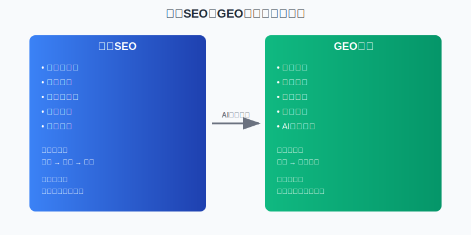
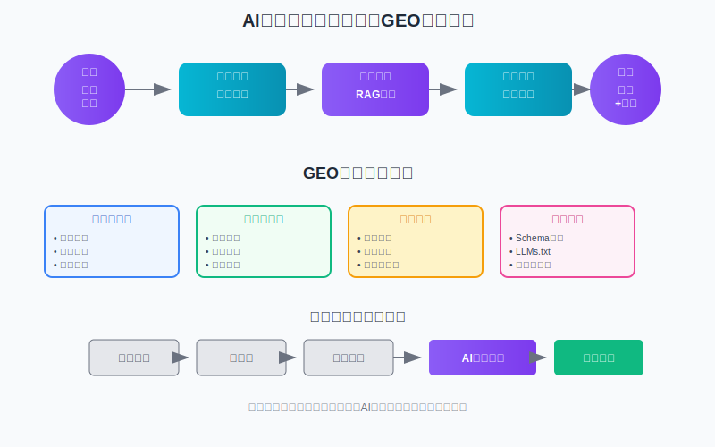
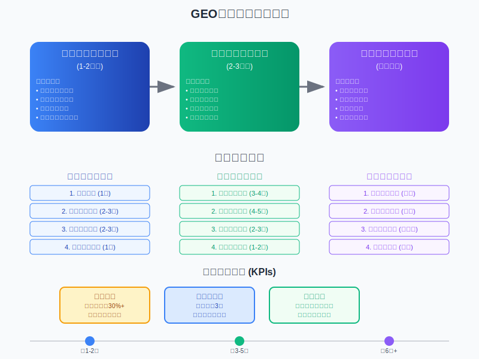
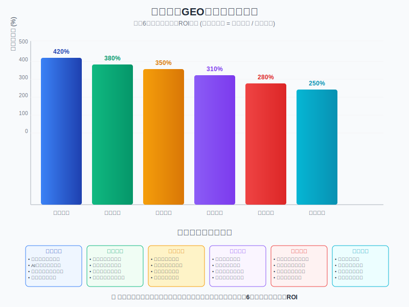

# GEO（生成式引擎优化）基础教程

**作者：** MiniMax Agent  
**更新时间：** 2025年9月6日  
**适用对象：** 零基础学习者、营销人员、内容创作者  
**学习时长：** 2-3小时  

---

## 📖 教程概览

欢迎来到GEO（Generative Engine Optimization，生成式引擎优化）的世界！本教程将带您从零开始，全面了解这个正在重塑数字营销格局的前沿领域。

### 🎯 您将学到什么

- **基础概念**：什么是GEO，为什么它如此重要
- **技术原理**：AI搜索引擎如何工作，与传统搜索的区别  
- **实践方法**：9种经过验证的GEO优化技巧
- **实战案例**：真实企业如何通过GEO实现业务突破
- **行动指南**：如何开始您的第一个GEO项目

### 📚 学前须知

- **无需技术背景**：本教程用通俗语言解释所有概念
- **建议准备**：纸笔记录要点，电脑练习操作
- **学习建议**：按章节顺序学习，每节后进行实践

---

## 第一章：GEO是什么？为什么很重要？

### 1.1 GEO的定义：新时代的内容优化

想象一下，当您问ChatGPT"什么是最好的项目管理软件"时，它会推荐哪些品牌？这个答案背后的逻辑，就是GEO要解决的问题。

**GEO（Generative Engine Optimization）是一种全新的内容优化策略，目标是让您的内容在AI驱动的搜索引擎（如ChatGPT、Google AI、Perplexity）生成的答案中被推荐和引用。**

### 1.2 一个简单的例子

**传统SEO时代：**
- 用户搜索："北京最好的咖啡店"
- 搜索引擎显示：10个蓝色链接
- 用户需要：点击多个链接，自己比较判断

**GEO时代：**
- 用户问AI："北京最好的咖啡店有哪些？"
- AI直接回答："根据评价和专业推荐，北京最受欢迎的咖啡店包括：1. 蓝杯咖啡... 2. 星巴克臻选... 3. 瑞幸咖啡..."
- 用户获得：直接、综合的答案和建议

在第二种场景中，能被AI推荐的咖啡店，就是GEO优化成功的结果。

### 1.3 GEO的发展历程：从概念到现实

#### 🌱 萌芽期（2001-2020）：技术基础建立
- **2001年**：万维网之父提出"语义网"概念
- **2012年**：Google发布知识图谱
- **2018年**：Google推出BERT，AI开始"理解"人类语言

#### 🚀 爆发期（2020-2022）：AI大语言模型崛起  
- **2020年**：GPT-3发布，展示强大的文本生成能力
- **2022年11月**：ChatGPT发布，2个月内用户破1亿

#### 📈 成熟期（2023-至今）：GEO正式诞生
- **2023年11月**：普林斯顿大学发布首篇GEO学术论文
- **2024年**：各大企业开始大规模采用GEO策略
- **2025年**：GEO成为数字营销的必备技能

### 1.4 为什么GEO如此重要？

#### 💰 商业价值惊人

让我们看看一些真实数据：

- **转化率奇迹**：AI来源访客转化率达到**27%**，而传统搜索仅为2.1%
- **流量爆发**：成功案例中，企业实现了**4,162%**的流量增长
- **质量提升**：AI带来的销售线索质量评分达到8.2/10，比传统渠道高出9.2%

#### 📊 市场规模巨大

- **AI搜索市场**：预计从2024年的162.8亿美元增长到2033年的508.8亿美元
- **GEO服务市场**：预计2031年达到73亿美元，年复合增长率34%
- **用户采用速度**：79%的消费者预计未来一年会频繁使用AI搜索


*图6展示了GEO相关市场从2024年到2033年的预期增长轨迹，显示出巨大的商业机会。*


*图7对比了GEO市场与其他数字营销领域的复合年增长率，突出了GEO的高增长潜力。*

#### ⏰ 竞争窗口有限

专家估计，建立GEO先发优势的窗口期仅剩**12-18个月**。AI系统倾向于持续信任和引用早期建立权威的内容源，这意味着现在行动的企业将获得长期竞争优势。

---

## 第二章：GEO与传统SEO：同与不同

### 2.1 核心区别：从"点击经济"到"引用经济"

传统SEO和GEO最大的区别，在于底层商业逻辑的改变：

#### 🎯 目标对比

| 方面 | 传统SEO | GEO |
|------|---------|-----|
| **核心目标** | 在搜索结果中排名靠前 | 在AI答案中被直接引用 |
| **成功指标** | 点击率、排名位置 | 引用频率、推荐质量 |
| **用户体验** | 用户需要点击链接获取信息 | 用户直接获得综合答案 |
| **商业模式** | 流量变现 | 权威建立 |

#### 🔍 查询方式对比

**传统搜索查询特点：**
- 平均长度：4个关键词
- 查询方式："北京 咖啡店 推荐"
- 用户期望：相关链接列表

**AI搜索查询特点：**
- 平均长度：23个词的自然语言
- 查询方式："我想在北京找一家适合商务会谈的安静咖啡店，价位中等，有WiFi和插座"
- 用户期望：具体、可执行的建议

### 2.2 相同之处：内容质量始终为王

尽管存在差异，GEO和传统SEO仍有重要的共同点：

#### ✅ 共同基础

1. **高质量内容至关重要**：无论SEO还是GEO，优质内容都是基础
2. **技术健康必不可少**：网站速度、移动友好性、安全性依然重要
3. **权威性建设相似**：外部链接、专家认可、品牌声誉对两者都有价值
4. **用户体验优先**：为用户创造价值的内容在任何时代都会获得认可

#### 🔄 SEO向GEO的自然演进

GEO并非要完全取代SEO，而是SEO在AI时代的自然演进。许多SEO的最佳实践，如创建权威内容、建立专业声誉等，在GEO中同样适用，只是实现方式需要调整。



*图2清晰对比了传统SEO时代和GEO时代在用户行为、技术架构和商业模式上的根本性差异。*

### 2.3 实际案例：同一家公司的双重策略

让我们看看Broworks公司如何同时运用SEO和GEO：

#### 传统SEO策略：
- 关键词研究："Webflow SEO服务"
- 内容创建：围绕"Webflow SEO最佳实践"的博客文章
- 链接建设：从行业网站获得反向链接
- 结果：在Google搜索"Webflow SEO"排名第3位

#### GEO策略：
- 问题映射："如何为Webflow网站做SEO优化？"
- 内容优化：创建详细的步骤指南，包含具体数据和引用来源
- 权威建设：在内容中引用官方数据和专家观点
- 结果：当用户问ChatGPT相关问题时，Broworks被作为权威来源引用

#### 综合效果：
- AI流量占比从0.3%增长到10%（3,233%增长）
- AI来源访客转化率达到27%，比传统搜索高12倍
- 90天内实现全面转型，获得双重流量来源

---

## 第三章：AI搜索引擎如何工作？

### 3.1 核心技术：RAG架构详解

要做好GEO，首先要理解AI搜索引擎的工作原理。现代AI搜索引擎几乎都基于**RAG（检索增强生成）**技术架构。

#### 🔧 RAG工作流程

让我们用一个简单的例子来说明：

**用户问题：** "什么是最好的CRM软件？"

**第一步：理解（Understanding）**
- AI分析问题意图：用户想要CRM软件推荐
- 识别关键要素：软件类型、评价标准、目标用户

**第二步：检索（Retrieval）**
- AI在互联网上搜索相关信息
- 找到各种来源：官方网站、评测文章、用户评论、专家报告
- 收集候选信息：Salesforce、HubSpot、Pipedrive等软件信息

**第三步：增强（Augmentation）**
- 将检索到的信息整合成"知识库"
- 评估信息的可信度和相关性
- 识别权威来源和一致性观点

**第四步：生成（Generation）**
- 基于整合的知识库生成回答
- 引用可信来源支持观点
- 提供具体、可执行的建议

#### 🎯 GEO的关键洞察

从RAG流程可以看出，GEO成功的关键在于：
1. **在"检索"阶段被找到** - 确保内容可被AI发现
2. **在"增强"阶段被信任** - 建立内容的权威性和可信度
3. **在"生成"阶段被引用** - 成为AI回答的信息来源



*图1展示了AI搜索引擎基于RAG架构的完整工作流程，以及GEO优化在各个阶段的重点任务。*

### 3.2 主要AI搜索平台对比

不同的AI搜索平台有不同的特点，需要针对性优化：

#### 🤖 ChatGPT（市场份额：60.4%）
**特点：**
- 基于GPT-4模型，对话能力强
- 网页浏览功能依赖Bing搜索
- 偏好教育性、中立客观的内容

**优化策略：**
- 创建维基百科风格的教育内容
- 优化Google精选摘要作为桥梁
- 使用结构化、易于理解的格式

#### 🔍 Perplexity（市场份额：6.5%，增长最快）
**特点：**
- 专注于实时信息搜索
- 重视社区驱动内容，特别是Reddit
- 善于处理事实性查询

**优化策略：**
- 在Reddit相关社区积极参与
- 创建实时性强的内容
- 保持信息的准确性和时效性

#### 🌟 Google Gemini（市场份额：13.5%）
**特点：**
- 深度整合Google搜索数据
- 支持多模态内容（文本、图像、视频）
- 保留传统搜索结果展示

**优化策略：**
- 维护传统SEO基础
- 创建多媒体丰富的内容
- 利用Google生态系统优势

### 3.3 AI搜索与传统搜索的技术差异

#### ⚙️ 信息处理方式

**传统搜索引擎：**
```
用户查询 → 关键词匹配 → 相关性排序 → 链接列表
```

**AI搜索引擎：**
```
用户问题 → 语义理解 → 多源检索 → 信息整合 → 生成答案 → 引用来源
```

#### 🧠 内容理解能力

**传统搜索：**
- 主要依靠关键词匹配
- 理解页面结构和链接关系
- 评估页面权威性和相关性

**AI搜索：**
- 深度理解语义含义
- 整合多个信息源
- 评估信息的逻辑一致性
- 生成个性化回答

---

## 第四章：GEO核心概念和术语

### 4.1 基础概念词汇表

#### 🔤 核心术语

**生成式引擎优化（GEO）**
- 定义：优化内容以提高在AI驱动搜索引擎答案中的可见性和引用频率
- 例句：我们需要调整内容策略来改善GEO表现

**引用经济（Citation Economy）**
- 定义：基于被AI系统引用和推荐而产生价值的商业模式
- 对比：传统的"点击经济"依赖用户点击，引用经济依赖AI推荐

**AI引用（AI Citation）**
- 定义：AI在生成答案时将特定内容作为信息来源进行引用
- 衡量：引用频率、引用质量、引用上下文

**可见性（Visibility）**
- 定义：内容在AI搜索结果中出现和被推荐的频率
- 计算：（被引用次数 ÷ 相关查询总数）× 100%

#### 🎯 技术术语


*图8展示了从语义网到现代GEO技术的发展历程，帮助理解技术演进脉络。*

**RAG架构（Retrieval-Augmented Generation）**
- 定义：结合信息检索和文本生成的AI技术架构
- 作用：让AI能够基于实时信息生成准确答案

**LLMs.txt**
- 定义：为AI系统提供网站内容摘要的标准格式文件
- 位置：网站根目录下的纯文本文件
- 作用：帮助AI快速理解网站内容结构

**Schema标记**
- 定义：帮助搜索引擎理解网页内容的结构化数据标记
- 重要性：在GEO中比传统SEO更加重要
- 格式：JSON-LD、Microdata、RDFa

#### 📊 评估指标

**声音份额（Share of Voice）**
- 定义：品牌在相关AI搜索回答中被提及的比例
- 计算：品牌提及次数 ÷ 行业总提及次数

**引用质量分数**
- 定义：评估AI引用内容时的上下文质量
- 评级：正面推荐(+2)、中性提及(0)、负面提及(-1)

**转化归因**
- 定义：从AI搜索渠道获得的用户转化情况
- 挑战：零点击环境下的转化追踪

### 4.2 重要概念深入解析

#### 💡 答案优先架构（Answer-First Architecture）

这是GEO内容创作的核心理念。

**传统内容结构：**
```
标题 → 引言 → 背景介绍 → 详细分析 → 结论
```

**答案优先结构：**
```
直接答案 → 支撑数据 → 详细解释 → 相关信息 → 引用来源
```

**实际例子：**

❌ **传统写法：**
"随着企业数字化转型的深入，客户关系管理变得越来越重要。在众多CRM解决方案中，选择合适的工具需要考虑多个因素...（300字后才提到具体产品）"

✅ **GEO优化写法：**
"最适合中小企业的CRM软件是HubSpot CRM，它提供免费版本，支持1,000,000个联系人，并具备强大的销售管道管理功能。根据2024年Capterra调查，92%的用户对其易用性表示满意[引用来源]。"

#### 🎨 段落级优化（Paragraph-Level Optimization）

AI系统通常索引100-200字的内容块，而不是完整页面。

**优化原则：**
1. **独立完整**：每个段落能独立回答一个问题
2. **语义丰富**：包含关键信息和上下文
3. **结构清晰**：使用标题、列表、数据等格式化元素

**实践示例：**

✅ **优化段落：**
"Slack的企业版定价为每用户每月12.50美元（年付），包含无限消息历史、访客账户、双因素认证和99.99%运行时间保证。据IDC 2024年研究，使用Slack的企业平均提高团队协作效率31%，减少邮件使用47%[来源：IDC企业协作工具研究报告]。"

这个段落独立包含了价格、功能、权威数据和引用来源，AI可以直接使用。

#### 🏗️ E-E-A-T信号建设

E-E-A-T（经验、专业知识、权威性、可信度）在GEO中比传统SEO更加重要。

**经验（Experience）：**
- 展示实际使用或实施经验
- 包含具体的操作步骤和结果数据
- 分享真实的案例和故事

**专业知识（Expertise）：**
- 作者的专业背景和资质
- 内容的技术深度和准确性
- 使用行业专业术语和概念

**权威性（Authoritativeness）：**
- 被其他专家和媒体引用
- 拥有相关认证和奖项
- 在行业中的知名度和声誉

**可信度（Trustworthiness）：**
- 透明的联系方式和背景信息
- 准确的事实和数据引用
- 定期更新和纠错机制

---

## 第五章：GEO基本实施原则和方法

### 5.1 九种核心优化方法

基于普林斯顿大学的权威研究，以下九种方法按效果分为三个等级：


*图3展示了九种GEO优化方法的实际效果对比，其中引用语句、统计数据和引用来源是效果最显著的三种方法。*

#### 🏆 高效方法（可见性提升30-40%）

**1. 引用语句（Quotation Addition）**
- **原理**：在内容中整合专家、权威报告或知名人士的直接引述
- **效果**：可见性提升高达42%
- **实践示例**：

❌ **优化前：**
"云计算可以降低企业IT成本。"

✅ **优化后：**
"'云计算平均可以为企业节省20-25%的IT成本，' AWS首席经济学家Tim Bray在2024年云计算峰会上表示。"

**2. 统计数据添加（Statistics Addition）**
- **原理**：用具体、有来源的量化数据替换模糊的定性描述
- **效果**：可见性提升约40%
- **实践示例**：

❌ **优化前：**
"很多公司都在使用Salesforce。"

✅ **优化后：**
"截至2024年，Salesforce拥有超过150,000家企业客户，其中包括95%的财富100强公司（来源：Salesforce 2024年年报）。"

**3. 引用来源（Cite Sources）**
- **原理**：为关键论断和数据添加明确的、可验证的参考文献
- **效果**：可见性提升约29%
- **实践示例**：

✅ **正确格式：**
"据Gartner 2024年CRM魔力象限报告，Salesforce连续第16年位居领导者象限[1]。"
```
[1] Gartner Magic Quadrant for CRM Customer Engagement Center, 2024
```

**4. 流畅性优化（Fluency Optimization）**
- **原理**：改进文本的语法、风格和逻辑流程
- **要点**：使用自然的语言节奏，避免生硬的表达

❌ **优化前：**
"CRM系统，它是客户关系管理，对企业很重要，可以管理客户数据。"

✅ **优化后：**
"CRM系统是企业管理客户关系的核心工具，它能够统一存储客户信息、跟踪销售流程，并提供数据分析来改善客户体验。"

**5. 易于理解（Easy-to-Understand）**
- **原理**：使用简洁明了的语言，降低理解门槛
- **技巧**：避免行话，使用类比和实例

❌ **优化前：**
"该SaaS解决方案通过云原生架构实现多租户部署，支持水平扩展和微服务治理。"

✅ **优化后：**
"这个软件采用云服务架构，就像一栋公寓楼可以住很多家庭一样，多个企业可以同时使用，并能根据需要随时扩容。"

#### ⭐ 中等效果方法（15-30%提升）

**6. 技术术语（Technical Terms）**
- **原理**：在适当上下文中使用行业认可的专业术语
- **注意**：要平衡专业性和可理解性

**7. 独特词汇（Unique Words）**
- **原理**：使用具有辨识度的词汇增加内容独特性
- **方法**：创造性地表达常见概念

#### ⚠️ 低效或有害方法

**8. 权威性语调（Authoritative Tone）**
- **问题**：仅在语气上显得权威，缺乏实质内容
- **AI反应**：几乎没有积极效果

**9. 关键词堆砌（Keyword Stuffing）**
- **问题**：不自然地重复关键词
- **负面影响**：在Perplexity等平台可能导致10%的可见性下降

### 5.2 技术实施三阶段流程

#### 🔧 第一阶段：技术基础建设

**Schema标记部署**

Schema标记是告诉AI"这个内容是什么"的结构化语言。

**必须实施的Schema类型：**
1. **Article Schema** - 文章内容
2. **Organization Schema** - 公司信息  
3. **Product Schema** - 产品信息
4. **FAQ Schema** - 常见问题
5. **Review Schema** - 评论和评分

**Article Schema示例：**
```json
{
  "@context": "https://schema.org",
  "@type": "Article",
  "headline": "2024年最佳CRM软件完整指南",
  "author": {
    "@type": "Person",
    "name": "张三",
    "jobTitle": "CRM专家"
  },
  "datePublished": "2024-03-15",
  "publisher": {
    "@type": "Organization",
    "name": "技术评测网"
  }
}
```

**网站技术健康度检查清单：**
- [ ] HTTPS安全协议
- [ ] 页面加载速度 < 3秒
- [ ] 移动设备友好性
- [ ] Core Web Vitals优化
- [ ] XML网站地图
- [ ] Robots.txt配置

**LLMs.txt文件创建**

在网站根目录创建`llms.txt`文件：
```
# 公司名称 - AI系统内容摘要

## 公司简介
我们是一家专业的CRM咨询服务商，成立于2015年，服务过500+企业客户。

## 主要服务
- CRM系统选型咨询
- 实施与集成服务  
- 培训与支持服务
- 数据迁移服务

## 核心优势
- 8年行业经验
- 认证专家团队
- 98%客户满意度
- 24/7技术支持

## 联系方式
官网：https://example.com
邮箱：info@example.com
电话：400-123-4567
```

#### 📝 第二阶段：内容优化与重构

**答案优先架构实践**

以"什么是最好的项目管理工具"为例：

**传统结构：**
```
标题：项目管理工具选择指南
1. 项目管理的重要性
2. 市场上的主要工具介绍
3. 选择标准分析
4. 工具对比
5. 推荐结论
```

**GEO优化结构：**
```
标题：2024年最佳项目管理工具：专家推荐与详细对比

直接回答：
对于大多数团队，我们推荐Asana作为最佳项目管理工具。
根据2024年G2报告，Asana在易用性方面评分4.4/5，
用户满意度达到90%[引用来源]。

详细分析：
1. Asana优势分析（具体功能和数据）
2. 其他优秀选择（Trello、Monday.com、Jira）
3. 选择建议（不同团队规模和需求）
4. 实施指南（步骤和最佳实践）
```

**可引用内容块创建**

将重要信息制作成独立的、易于AI抓取的内容块：

✅ **优秀的可引用块：**
"**Asana定价概览**：Asana提供免费版本（最多15人团队），付费版本起价每用户每月10.99美元。据IDC研究，使用Asana的团队平均提高项目交付速度32%，减少邮件沟通45%（来源：IDC 2024项目管理工具效果研究）。"

这个内容块包含：
- 明确的主题标识
- 具体的数据信息
- 权威的引用来源
- 完整的价值信息

#### 📊 第三阶段：监控、分析与迭代



*图4详细展示了GEO实施的三个阶段，每个阶段的核心任务和预期效果时间线。*

**建立GEO KPI体系**

**核心指标：**
1. **AI引用次数**：内容被AI系统引用的频率
2. **AI流量占比**：来自AI平台的访问流量百分比
3. **转化率**：AI流量的转化表现
4. **声音份额**：在行业相关查询中的品牌提及比例
5. **引用质量**：被引用时的上下文情感（正面/中性/负面）

**推荐监控工具：**

**免费工具：**
- Google Analytics 4（设置AI流量追踪）
- Google Search Console（监控搜索表现）
- 手动测试（定期在各AI平台搜索相关问题）

**付费工具：**
- Ahrefs Brand Radar（AI提及监控）
- Semrush Brand Monitoring（品牌声音份额）
- Profound（专业GEO分析平台）

**监控实践示例：**

**每周检查清单：**
- [ ] 测试5个核心问题在ChatGPT中的答案
- [ ] 测试5个核心问题在Perplexity中的答案
- [ ] 检查品牌在Google AI Overviews中的出现
- [ ] 分析AI流量的转化数据
- [ ] 记录竞争对手的AI引用情况

**月度分析报告：**
- AI引用次数变化趋势
- 不同平台的表现对比
- 内容优化前后的效果对比
- ROI计算和预算调整建议

---

## 第六章：入门案例分析和实战指导

### 6.1 成功案例深度分析

#### 🚀 案例一：Broworks的90天GEO转型

**公司背景：**
- 行业：B2B SaaS Webflow开发服务
- 规模：中小型服务商
- 挑战：在竞争激烈的市场中获得客户

**GEO实施策略：**

**第一个月：技术基础建设**
```
✅ 已完成任务：
- 全面部署Schema标记（Article, Service, Organization）
- 创建llms.txt文件
- 网站速度优化（从4.2秒优化到1.8秒）
- 实施HTTPS和安全优化
```

**第二个月：内容策略转型**
```
✅ 内容优化重点：
- 将"Webflow SEO服务"重构为回答"如何优化Webflow网站SEO？"
- 每个服务页面采用答案优先架构
- 添加具体的项目数据和客户评价引用
- 创建FAQ页面回答常见技术问题
```

**第三个月：AI可发现性优化**
```
✅ 多平台优化：
- 在Stack Overflow回答Webflow相关技术问题
- 在Reddit参与Web开发社区讨论
- 发布包含技术细节的案例研究
- 建立行业专家认可和引用
```

**量化成果分析：**

| 指标 | 实施前 | 实施后 | 增长率 |
|------|--------|--------|--------|
| AI流量占比 | 0.3% | 10% | +3,233% |
| AI访客转化率 | 2.1% | 27% | +1,186% |
| 平均会话时长 | 2分15秒 | 3分24秒 | +51% |
| 销售线索质量 | 6.8/10 | 8.4/10 | +24% |

**成功关键因素：**
1. **系统性执行**：严格按照90天计划执行，不跳步骤
2. **技术内容深度**：提供真正有价值的技术洞察
3. **社区参与真实性**：在技术社区真诚地帮助他人
4. **数据驱动优化**：每周分析数据并调整策略

#### 🏆 案例二：财富500强金融公司的6周突破

**公司背景：**
- 行业：全球金融服务
- 规模：大型企业
- 目标：获取高净值客户

**GEO策略特点：**

**合规优先的内容策略**
```
内容主题选择：
✅ "如何选择投资顾问" - 教育性内容
✅ "资产配置基础知识" - 专业知识分享
✅ "财务规划最佳实践" - 行业洞察
❌ 避免具体产品推广
❌ 避免收益承诺
```

**权威性建设**
```
专家引用策略：
- 引用CEO在知名媒体的观点
- 引用公司研究报告的权威数据
- 展示行业认证和奖项
- 包含监管合规信息
```

**闪电效果分析：**
- **实施周期**：仅6周
- **核心成果**：32%的高质量销售线索来自AI平台
- **客户特征**：平均资产规模比传统渠道高出67%
- **转化速度**：销售周期缩短23%

**可复制经验：**
1. **行业特色适应**：在严格合规框架内实施GEO
2. **权威性为王**：金融行业中，权威性比创意更重要
3. **教育性内容**：通过教育建立信任，比直接推销更有效
4. **数据说话**：用具体数据和案例证明专业能力

### 6.2 不同行业的GEO应用模式

#### 💼 B2B SaaS行业

**特点：** 决策周期长，注重功能对比

**优化重点：**
- 创建详细的功能对比表格
- 提供具体的ROI计算案例
- 展示客户成功故事和数据

**内容示例主题：**
- "Slack vs Teams：企业协作工具详细对比"
- "如何计算CRM系统的投资回报率"
- "SaaS安全性评估：企业必知的10个要点"

#### 🛒 电商零售行业

**特点：** 决策快速，重视价格和评价

**优化重点：**
- 产品对比和推荐列表
- 价格信息和优惠详情
- 用户评价和专业评测

**内容示例主题：**
- "2024年最佳智能手机：专家评测与用户推荐"
- "双十一购物指南：值得买的数码产品清单"
- "iPhone vs Android：详细对比帮你选择"

#### 🏥 专业服务行业

**特点：** 注重专业性和信任度

**优化重点：**
- 展示专业资质和经验
- 提供教育性内容
- 建立权威专家形象

**内容示例主题：**
- "如何选择合适的律师：专业指南"
- "企业财务审计流程详解"
- "医疗保险理赔：您需要知道的一切"

### 6.3 新手实践指导：第一个GEO项目

#### 🎯 第一周：现状评估

**任务清单：**

**Day 1-2: AI可见性测试**
```
测试问题示例：
1. "什么是最好的[您的产品类型]？"
2. "如何选择[您的服务领域]服务商？"
3. "2024年[您的行业]发展趋势如何？"

在以下平台测试：
□ ChatGPT
□ Google Gemini  
□ Perplexity
□ Claude

记录结果：
- 您的品牌是否被提及？
- 提及的上下文是什么？
- 竞争对手的表现如何？
```

**Day 3-4: 网站技术检查**
```
使用免费工具检查：
□ Google PageSpeed Insights（页面速度）
□ Google Mobile-Friendly Test（移动友好性）
□ SSL Server Test（安全性检查）
□ Schema Markup Validator（结构化数据验证）

创建问题清单：
- 需要修复的技术问题
- 缺失的Schema标记类型
- 页面加载速度问题
```

**Day 5-7: 竞争对手分析**
```
分析维度：
1. 他们在AI搜索中的表现如何？
2. 他们使用什么内容策略？
3. 他们的权威性建设方式？
4. 可以学习的最佳实践？

记录发现：
□ 竞争对手优势
□ 市场空白机会  
□ 内容灵感来源
□ 差异化定位思路
```

#### 🛠️ 第二周：基础优化

**技术优化任务：**

**Schema标记实施**
```html
<!-- Article Schema 示例 -->
<script type="application/ld+json">
{
  "@context": "https://schema.org",
  "@type": "Article",
  "headline": "您的文章标题",
  "description": "文章描述",
  "author": {
    "@type": "Person", 
    "name": "作者姓名",
    "jobTitle": "职位"
  },
  "datePublished": "2024-03-15",
  "publisher": {
    "@type": "Organization",
    "name": "公司名称",
    "url": "https://yoursite.com"
  }
}
</script>
```

**创建LLMs.txt文件**
```
# 您的公司名称

## 公司简介  
[用2-3句话介绍公司和核心价值]

## 主要服务/产品
- 服务1：具体描述和优势
- 服务2：具体描述和优势
- 服务3：具体描述和优势

## 核心数据
- 成立时间：X年
- 服务客户：X+家企业  
- 团队规模：X人
- 客户满意度：X%

## 专业认证
- 认证1：颁发机构和时间
- 认证2：颁发机构和时间

## 联系信息
- 官网：https://yoursite.com
- 邮箱：contact@yoursite.com
- 电话：您的电话号码
```

#### 📝 第三周：内容优化

**选择5个核心页面进行优化：**

**页面1：主页**
```
优化重点：
□ 清晰的价值主张（一句话说明你做什么）
□ 具体的数据支撑（客户数量、成功案例）
□ 权威性证明（认证、奖项、媒体报道）
□ 联系方式和信任信号

答案优先格式：
"[公司名称]是专业的[服务领域]服务商，
自2015年以来服务过500+企业客户，
客户满意度达98%，获得[行业认证]认证。"
```

**页面2-3：核心服务页面**
```
每个服务页面包含：
□ 直接回答"什么是X服务"
□ 具体的服务流程（步骤化）
□ 真实的案例和数据
□ 客户评价和推荐
□ 定价信息（如果合适）

可引用内容块示例：
"我们的[服务名称]服务包括X、Y、Z三个阶段，
平均实施周期为X周，帮助客户提升X%的效率。
据客户反馈，95%的企业在实施后3个月内
看到明显的业务改善（基于50+客户调研）。"
```

**页面4-5：常见问题和资源页面**
```
FAQ页面优化：
□ 选择10个最常被问的问题
□ 每个答案独立完整
□ 包含具体数据和步骤
□ 添加相关链接和资源

资源页面内容：
□ 行业报告和白皮书
□ 实用工具和模板
□ 案例研究和成功故事
□ 专家观点和趋势分析
```

#### 📊 第四周：监控与调整

**建立监控体系：**

**每日检查（5分钟）：**
```
□ Google Analytics流量概览
□ 一个核心问题的AI搜索测试
□ 社交媒体提及监控
□ 竞争对手新动态
```

**每周分析（30分钟）：**
```
□ AI流量占比变化
□ 转化率数据分析
□ 内容表现排名
□ 用户反馈收集
□ 优化优先级调整
```

**月度评估（2小时）：**
```
□ 全面的AI可见性测试
□ ROI计算和成本分析
□ 策略效果评估
□ 下个月计划制定
□ 团队培训需求评估
```

### 6.4 常见问题和解决方案

#### ❓ 新手常见问题

**Q1: "我的内容很好，为什么AI不引用？"**

A: 可能的原因和解决方案：
```
问题诊断：
□ 内容是否有明确的权威来源？
□ 数据是否具体且最新？
□ 格式是否易于AI理解？
□ Schema标记是否正确实施？

解决步骤：
1. 添加具体的统计数据
2. 引用权威来源和专家观点
3. 优化内容结构（标题、列表、段落）
4. 确保技术基础设施完善
```

**Q2: "GEO效果需要多长时间才能看到？"**

A: 基于案例分析的时间线：
```
2-4周：技术优化效果（网站速度、Schema标记）
6-8周：内容优化开始生效（AI开始偶尔引用）
3-6个月：显著效果（稳定的AI引用和流量增长）

影响因素：
- 行业竞争程度
- 内容质量和独特性
- 网站原有权威性
- 实施的完整性
```

**Q3: "我应该专注于哪个AI平台？"**

A: 建议的优先级：
```
第一优先级：ChatGPT（60%市场份额）
第二优先级：Google Gemini（整合传统搜索）
第三优先级：Perplexity（增长最快）

同时优化策略：
- 90%精力投入ChatGPT优化
- 保持Google SEO基础（有助于Gemini）
- 适度参与Reddit社区（有助于Perplexity）
```

**Q4: "小公司如何与大公司竞争？"**

A: 小公司的GEO优势：
```
优势：
✅ 反应速度快，能够快速调整策略
✅ 可以专注于细分领域建立权威
✅ 内容更容易体现个人化和真实性
✅ 决策链短，执行效率高

策略建议：
1. 选择细分市场深耕
2. 建立个人专家品牌
3. 提供超详细的专业内容
4. 在专业社区积极参与
```

---

## 第七章：行动计划和总结

### 7.1 GEO学习路径图

#### 🎯 初级阶段（第1-4周）

**学习目标：** 理解基础概念，完成技术准备

**第1周：理论学习**
```
□ 阅读本教程全文
□ 了解RAG技术原理
□ 理解GEO与SEO的区别
□ 测试各大AI平台的使用

学习资源：
- 普林斯顿大学GEO论文（英文原版）
- Neil Patel的GEO指南
- 观看相关的YouTube教程视频
```

**第2周：现状评估**
```
□ 进行AI可见性测试
□ 分析竞争对手表现
□ 评估网站技术状况
□ 制定改进优先级清单

使用工具：
- Google PageSpeed Insights
- Schema Markup Validator
- ChatGPT、Perplexity等AI平台
```

**第3周：技术基础**
```
□ 实施基础Schema标记
□ 创建LLMs.txt文件
□ 优化网站加载速度
□ 确保移动友好性

技能要求：
- 基础HTML知识（可学习）
- 网站管理权限
- 使用在线工具的能力
```

**第4周：内容试点**
```
□ 选择1-2个页面进行GEO优化
□ 实施答案优先架构
□ 添加统计数据和引用来源
□ 建立监控机制

成果预期：
- 完成技术基础设施建设
- 优化2-3个核心页面
- 建立效果监控体系
```

#### 📈 中级阶段（第2-3个月）

**学习目标：** 系统实施GEO策略，优化效果

**第5-8周：全面内容优化**
```
□ 优化所有核心页面（10-20个）
□ 创建FAQ页面
□ 建立内容更新机制
□ 开始社区参与

进阶技能：
- 内容策略制定
- 数据分析能力
- 社区营销技巧
```

**第9-12周：效果优化**
```
□ 分析初期数据结果
□ 调整和改进策略
□ 扩展到更多AI平台
□ 建立竞争监控

预期成果：
- AI流量开始显著增长
- 转化率有明显改善
- 在某些查询中获得稳定引用
```

#### 🏆 高级阶段（第4-6个月）

**学习目标：** 成为GEO专家，获得显著商业成果

**第13-16周：策略深化**
```
□ 基于数据优化策略
□ 开发独特的内容IP
□ 建立行业专家地位
□ 拓展合作伙伴关系

高级技能：
- 数据驱动决策
- 行业影响力建设
- 跨平台整合营销
```

**第17-24周：规模化运营**
```
□ 建立标准化流程
□ 培养团队GEO能力
□ 开发专业工具和模板
□ 分享经验和案例

专家标志：
- 在行业会议分享GEO经验
- 被媒体采访和引用
- 为其他企业提供咨询
- 持续的优异业务成果
```

### 7.2 GEO投资回报预期


*图9展示了GEO在不同行业和应用领域的分布情况，B2B SaaS和电商零售是主要应用场景。*

基于案例数据分析，以下是不同阶段的投资回报预期：

#### 💰 投资成本估算

**小型企业（年营收<500万）：**
```
月度投资：$500-2000
包含：
- 基础工具和软件：$100-300/月
- 内容创作和优化：$300-1200/月
- 技术支持和维护：$100-500/月

预期回报：
- 3个月：AI流量占比5-10%
- 6个月：新增优质线索20-50个/月
- 12个月：ROI达到200-400%
```

**中型企业（年营收500万-5000万）：**
```
月度投资：$2000-8000
包含：
- 专业GEO工具：$300-800/月
- 专职或兼职GEO专员：$1000-4000/月
- 内容和技术外包：$700-3200/月

预期回报：
- 3个月：AI流量占比10-20%
- 6个月：新增优质线索100-300个/月
- 12个月：ROI达到300-600%
```

**大型企业（年营收>5000万）：**
```
月度投资：$8000-25000
包含：
- 企业级GEO平台：$1000-3000/月
- 专业GEO团队：$4000-15000/月
- 综合策略和执行：$3000-7000/月

预期回报：
- 3个月：AI流量占比20-35%
- 6个月：显著的品牌权威性提升
- 12个月：ROI达到400-800%
```

#### 📊 不同行业的ROI特点

**B2B SaaS（最优表现）：**
- 获客成本：$249
- 转化周期：3-6个月
- 客户生命周期价值：$5000-50000
- 预期ROI：500-1000%

**电商零售（快速见效）：**
- 获客成本：$387
- 转化周期：11天
- 平均订单价值：$100-500
- 预期ROI：300-500%

**专业服务（高质量线索）：**
- 获客成本：$699-772
- 转化周期：2-6个月
- 客户价值：$10000-100000+
- 预期ROI：400-800%



*图5对比了不同行业实施GEO策略的投资回报率和获客成本，B2B SaaS行业表现最优。*

### 7.3 成功实施的关键要素

#### ✅ 必要条件

**1. 管理层支持**
- 理解GEO的长期价值
- 给予足够的资源和时间
- 支持团队学习和试错

**2. 技术基础**
- 网站具备基本的技术健康度
- 能够实施Schema标记等技术优化
- 有权限进行内容和代码修改

**3. 内容能力**
- 有专业的内容创作和优化能力
- 能够提供真正有价值的信息
- 具备数据收集和引用的能力

**4. 持续学习**
- 团队具备学习新技术的意愿
- 能够跟上AI技术的快速发展
- 愿意基于数据调整策略

#### 🚫 常见失败原因

**1. 急于求成**
- 期望立即看到效果
- 不愿意投入足够的时间和资源
- 频繁改变策略，缺乏一致性

**2. 重复传统SEO思维**
- 过度关注关键词密度
- 忽视内容的真实价值
- 不理解AI系统的工作原理

**3. 技术准备不足**
- 网站基础设施问题
- 缺乏必要的技术支持
- 无法实施基本的技术优化

**4. 内容质量不够**
- 缺乏权威性和独特性
- 没有具体的数据支撑
- 不能真正解决用户问题

### 7.4 未来发展趋势预测

#### 🔮 短期趋势（2025-2026）

**技术发展：**
- LLMs.txt标准广泛采用
- Schema标记重要性进一步提升
- AI搜索结果的个性化程度提高

**市场变化：**
- 更多企业开始重视GEO
- 专业GEO服务商大量涌现
- GEO工具和平台功能更完善

**策略演进：**
- 从平台通用优化转向平台特色优化
- 从内容优化转向体验优化
- 从单一指标转向综合影响力

#### 🚀 中期发展（2026-2028）


*图10展示了全球不同区域GEO市场的发展水平和增长潜力，北美和亚太地区领先。*


*图11通过技术成熟度和市场影响力两个维度，分析了GEO相关技术的发展趋势和投资价值。*

**生态成熟：**
- GEO标准化流程建立
- 行业最佳实践广泛认可
- 专业人才培养体系完善

**技术革新：**
- 多模态内容优化成为标准
- 实时内容优化技术普及
- AI代理辅助的GEO工具出现

**商业模式：**
- 从引用经济转向影响经济
- 基于AI推荐的新商业合作模式
- 内容价值的直接货币化

#### 🌟 长期愿景（2028+）

**范式转变：**
- 从网站优化转向知识优化
- 从搜索营销转向AI协作
- 从流量思维转向影响力思维

**新的挑战：**
- AI系统的透明度和公平性
- 内容原创性和版权保护
- 数据隐私和用户权利

---

## 总结：开启您的GEO之旅

### 🎯 关键要点回顾

通过本教程的学习，您应该已经掌握了以下核心知识：

**概念理解：**
✅ GEO是什么，为什么重要
✅ GEO与传统SEO的区别和联系
✅ AI搜索引擎的工作原理

**实践方法：**
✅ 九种经过验证的优化方法
✅ 三阶段技术实施流程
✅ 效果监控和迭代优化

**实战能力：**
✅ 如何进行现状评估
✅ 如何制定和执行GEO策略
✅ 如何分析竞争对手和行业趋势

### 🚀 立即行动清单

**今天就可以开始的5个行动：**

1. **测试您的AI可见性**
   ```
   在ChatGPT、Google AI、Perplexity中搜索：
   - "最好的[您的产品/服务类型]是什么？"
   - "如何选择[您的行业]服务商？"
   - 记录结果，看看您的品牌是否被提及
   ```

2. **检查网站技术健康度**
   ```
   使用Google PageSpeed Insights检查网站速度
   使用Mobile-Friendly Test检查移动兼容性
   列出需要修复的技术问题
   ```

3. **创建您的第一个LLMs.txt文件**
   ```
   在网站根目录创建llms.txt
   包含公司简介、服务、联系方式
   确保信息准确且易于AI理解
   ```

4. **优化一个重要页面**
   ```
   选择您的主页或核心服务页
   采用答案优先架构重写内容
   添加具体数据和权威引用
   ```

5. **建立监控机制**
   ```
   设置Google Analytics 4
   创建AI搜索测试清单
   制定每周监控时间表
   ```

**本周内完成的优化任务：**

- [ ] 全面评估当前AI可见性状况
- [ ] 制定90天GEO实施计划
- [ ] 完成基础技术优化
- [ ] 开始核心内容页面的重构
- [ ] 建立效果监控和分析体系

### 💡 给初学者的建议

**保持正确心态：**
- **耐心**：GEO效果需要2-6个月才能显著显现
- **学习**：AI技术发展快速，需要持续学习
- **实验**：基于数据测试和调整策略
- **质量**：专注于创造真正有价值的内容

**避免常见错误：**
- 不要急于求成，期望立即见效
- 不要完全照搬传统SEO方法
- 不要忽视技术基础建设
- 不要创作低质量或虚假内容

### 🤝 持续学习资源

**推荐关注：**
- [普林斯顿大学GEO研究](https://arxiv.org/abs/2311.09735) - 权威学术资源
- [Neil Patel博客](https://neilpatel.com/blog/) - 数字营销实践指南
- [Ahrefs博客](https://ahrefs.com/blog/) - 数据驱动的SEO/GEO洞察
- GEO专业社区和论坛 - 与同行交流经验

**工具推荐：**
- **免费**：Google Analytics、Search Console、PageSpeed Insights
- **付费**：Ahrefs、Semrush、专业GEO监控平台
- **AI平台**：ChatGPT Plus、Perplexity Pro（用于深度测试）

### 🌟 结语

GEO不仅是一种新的优化技术，更代表着商业思维的根本转变——从争夺流量到建立权威，从获得点击到赢得推荐。

在这个AI驱动的新时代，那些能够深刻理解并系统应用GEO的企业和个人，将在未来的商业竞争中占据领先地位。

现在就开始您的GEO之旅吧！记住，最好的开始时间是现在，第二好的时间是明天。

**愿您在GEO的道路上取得巨大成功！** 🚀

---

## 附录：实用模板和工具

### A. LLMs.txt模板

```
# [您的公司名称] - AI系统内容摘要

## 公司简介
[用2-3句话描述公司的核心业务和价值主张]

## 主要服务/产品
- [服务1]：[具体描述和主要优势]
- [服务2]：[具体描述和主要优势]
- [服务3]：[具体描述和主要优势]

## 核心数据
- 成立时间：[年份]
- 服务客户：[数量]+家企业
- 团队规模：[人数]人专业团队
- 客户满意度：[百分比]%
- 行业经验：[年数]年

## 专业认证与荣誉
- [认证1]：[颁发机构，获得时间]
- [认证2]：[颁发机构，获得时间]
- [奖项]：[颁发机构，获得时间]

## 核心优势
- [优势1]：[具体说明]
- [优势2]：[具体说明]
- [优势3]：[具体说明]

## 联系信息
- 官网：https://[yoursite.com]
- 邮箱：[contact@yoursite.com]
- 电话：[电话号码]
- 地址：[公司地址]

## 最后更新
[年-月-日]
```

### B. Schema标记模板

#### Article Schema
```html
<script type="application/ld+json">
{
  "@context": "https://schema.org",
  "@type": "Article",
  "headline": "[文章标题]",
  "description": "[文章描述，150字以内]",
  "image": "[文章配图URL]",
  "author": {
    "@type": "Person",
    "name": "[作者姓名]",
    "jobTitle": "[作者职位]",
    "worksFor": {
      "@type": "Organization",
      "name": "[公司名称]"
    }
  },
  "publisher": {
    "@type": "Organization",
    "name": "[公司名称]",
    "logo": {
      "@type": "ImageObject",
      "url": "[公司Logo URL]"
    }
  },
  "datePublished": "[发布日期，YYYY-MM-DD]",
  "dateModified": "[修改日期，YYYY-MM-DD]",
  "mainEntityOfPage": {
    "@type": "WebPage",
    "@id": "[文章完整URL]"
  }
}
</script>
```

#### Organization Schema
```html
<script type="application/ld+json">
{
  "@context": "https://schema.org",
  "@type": "Organization",
  "name": "[公司名称]",
  "url": "[公司网址]",
  "logo": "[Logo URL]",
  "description": "[公司描述]",
  "address": {
    "@type": "PostalAddress",
    "streetAddress": "[街道地址]",
    "addressLocality": "[城市]",
    "addressRegion": "[省/州]",
    "postalCode": "[邮编]",
    "addressCountry": "[国家]"
  },
  "contactPoint": {
    "@type": "ContactPoint",
    "telephone": "[电话号码]",
    "contactType": "客服中心",
    "availableLanguage": ["中文", "英文"]
  },
  "foundingDate": "[成立日期]",
  "numberOfEmployees": "[员工数量]",
  "sameAs": [
    "[LinkedIn URL]",
    "[微博URL]",
    "[微信公众号]"
  ]
}
</script>
```

### C. GEO效果监控表格模板

#### 每周GEO监控表

| 监控项目 | 本周数据 | 上周数据 | 变化率 | 备注 |
|---------|---------|---------|--------|------|
| AI流量占比(%) |  |  |  |  |
| ChatGPT引用次数 |  |  |  |  |
| Perplexity引用次数 |  |  |  |  |
| Google AI引用次数 |  |  |  |  |
| AI流量转化率(%) |  |  |  |  |
| 平均会话时长 |  |  |  |  |
| 品牌正面提及 |  |  |  |  |
| 主要竞争对手表现 |  |  |  |  |

### D. 内容优化检查清单

#### GEO内容优化清单

**基础要求：**
- [ ] 标题清晰回答用户问题
- [ ] 开头段落提供直接答案
- [ ] 包含至少2个统计数据
- [ ] 引用至少1个权威来源
- [ ] 添加相关Schema标记
- [ ] 确保移动设备友好

**进阶优化：**
- [ ] 使用答案优先架构
- [ ] 创建可引用内容块
- [ ] 添加专家引述
- [ ] 包含实际案例或数据
- [ ] 提供可执行的建议
- [ ] 优化段落独立性

**技术检查：**
- [ ] 页面加载速度<3秒
- [ ] 图片包含alt文本
- [ ] 使用清晰的标题结构(H1-H6)
- [ ] 内部链接指向相关内容
- [ ] 外部链接指向权威来源
- [ ] 适当的文本长度(800-2000字)

---

**教程结束**

恭喜您完成了GEO基础教程的学习！现在您已经掌握了开始GEO优化所需的所有基础知识。记住，理论学习只是开始，真正的成长来自于实践和持续优化。

祝您在GEO的实践中取得巨大成功！ 🎉