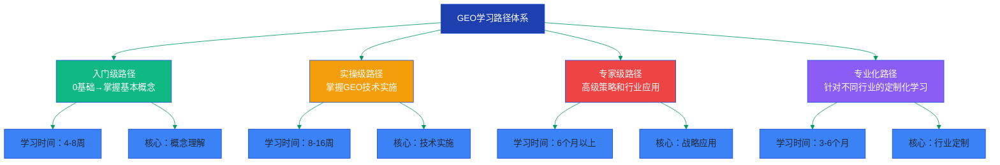
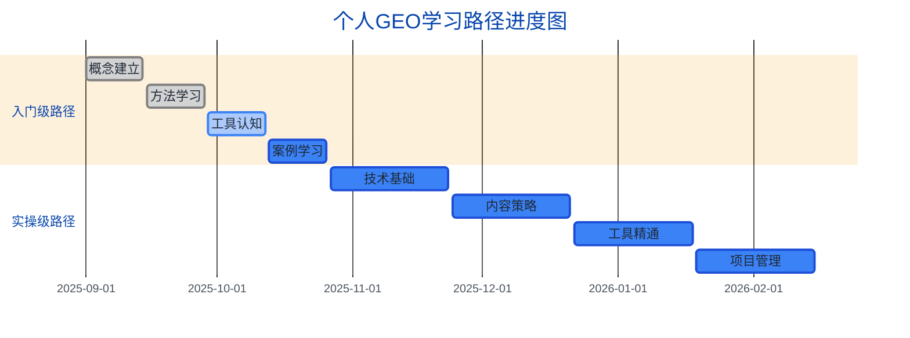

# GEO（Generative Engine Optimization）完整学习路径体系

**作者：** MiniMax Agent  
**版本：** 1.0  
**更新日期：** 2025年9月6日  
**基于资源：** 权威学术研究、专家指南、工具平台调研、社区资源分析

---

## 📋 目录

1. [学习路径概述](#学习路径概述)
2. [入门级路径：GEO基础认知](#入门级路径geo基础认知)
3. [实操级路径：技术实施掌握](#实操级路径技术实施掌握)
4. [专家级路径：高级策略应用](#专家级路径高级策略应用)
5. [专业化路径：行业定制学习](#专业化路径行业定制学习)
6. [学习支撑体系](#学习支撑体系)
7. [学习路径选择指南](#学习路径选择指南)

---

## 学习路径概述

### 🎯 总体目标

本学习路径体系旨在培养全面掌握GEO（Generative Engine Optimization，生成式引擎优化）的专业人才，从0基础的概念理解到行业专家级的策略应用，建立系统性、实用性、前瞻性的知识技能体系。

### 📊 核心价值主张

基于权威研究数据，GEO已被证实具有极高的商业价值：
- **转化效果**：AI来源访客转化率高达27%（vs传统搜索2.1%）
- **投资回报**：成功案例显示4,162%的流量增长和32%的优质销售线索
- **竞争优势**：先发优势窗口期仅剩12-18个月，早期掌握者将构建难以逾越的竞争壁垒

### 🏗️ 学习路径架构



### 🎖️ 能力等级定义

| 等级 | 技能特征 | 工作能力 | 薪资范围（年薪） |
|------|----------|----------|------------------|
| **入门级** | 理解GEO基本概念，能识别优化机会 | 协助执行基础GEO任务 | $40K-60K |
| **实操级** | 独立实施GEO项目，掌握主流工具 | 负责企业GEO策略执行 | $60K-100K |
| **专家级** | 制定高级策略，解决复杂问题 | 领导GEO团队，指导企业战略 | $100K-180K |
| **专业化** | 特定行业深度专业知识 | 行业GEO顾问，专业服务 | $120K-250K+ |

---

## 入门级路径：GEO基础认知

### 🎯 学习目标

**主要目标**：从零基础到全面理解GEO概念、价值和基本方法，具备基础的优化意识和判断能力。

**具体目标**：
- 深入理解GEO与传统SEO的根本差异
- 掌握AI搜索引擎的工作原理（RAG架构）
- 熟悉9种核心优化方法的基本应用
- 能够进行基础的GEO现状评估
- 建立正确的GEO思维框架

### 📚 必修内容

#### 第一阶段：概念建立（第1-2周）

**核心理论学习**
1. **GEO基础概念**
   - GEO定义：基于普林斯顿大学权威研究
   - 发展历程：从语义网到生成式AI的演进
   - 市场现状：AI搜索引擎市场格局分析
   - 商业价值：转化率提升与ROI数据解读

2. **技术原理理解**
   - RAG（检索增强生成）架构详解
   - AI搜索引擎工作流程：检索→增强→生成
   - 各大AI平台特点：ChatGPT、Perplexity、Google Gemini
   - 内容索引与引用机制

**必读资源**：
- 📖 [GEO: Generative Engine Optimization](https://arxiv.org/pdf/2311.09735) - 普林斯顿大学原始论文
- 📖 [Neil Patel GEO指南](https://neilpatel.com/blog/generative-engine-optimization-geo/) - 实践入门
- 📖 Medium GEO白皮书3.0版 - 最前沿概念

#### 第二阶段：方法学习（第3-4周）

**9种核心优化方法**
1. **高效方法掌握**（提升30-40%）
   - 引用语句：如何整合专家观点
   - 统计数据：量化信息的价值
   - 引用来源：建立权威性的方法
   - 流畅性优化：语言质量提升技巧
   - 易于理解：简化表达的艺术

2. **辅助方法了解**（提升15-30%）
   - 技术术语的适当使用
   - 独特词汇的价值
   
3. **避坑指南**
   - 为什么权威性语调无效
   - 关键词堆砌的负面影响

**实践练习**：
- 对比分析：选择5个网页，应用9种方法进行优化改写
- 效果预测：使用免费工具（如Geoptie）评估优化效果

#### 第三阶段：工具认知（第5-6周）

**免费工具掌握**
1. **Geoptie全套工具**
   - 免费GEO审计使用
   - 内容检查器应用
   - 关键词查找器使用
   - 排名跟踪器基础操作

2. **Chrome插件**
   - Detailed SEO Extension安装配置
   - Keyword Surfer关键词研究
   - ContentShake AI内容优化

**付费工具了解**
- MarketMuse、Semrush AI工具包功能概览
- 工具选择决策框架
- 成本效益分析方法

#### 第四阶段：案例学习（第7-8周）

**成功案例深度分析**
1. **Xponent21案例**：4,162%流量增长的系统化框架
2. **Broworks案例**：B2B SaaS的90天转型
3. **财富500强案例**：6周获取32%优质线索

**失败案例警示**
- 常见错误：过度优化、忽视用户价值
- 风险识别：算法变化、平台依赖

### 🔧 推荐资源

#### 免费资源（优先级最高）
| 资源名称 | 类型 | 预估学习时间 | 价值评级 |
|----------|------|--------------|----------|
| Geoptie免费工具包 | 在线工具 | 10小时 | ⭐⭐⭐⭐⭐ |
| HubSpot AEO Grader | 评估工具 | 2小时 | ⭐⭐⭐⭐ |
| r/GenEngineOptimization | Reddit社区 | 持续关注 | ⭐⭐⭐⭐ |
| Local Search Forum | 专业论坛 | 每周2小时 | ⭐⭐⭐⭐⭐ |

#### 付费资源（可选升级）
| 资源名称 | 价格 | 学习价值 | 推荐指数 |
|----------|------|----------|----------|
| MarketMuse Optimize | $99/月 | 内容优化指导 | ⭐⭐⭐⭐ |
| Traffic Think Tank | $99/月 | 高质量社区 | ⭐⭐⭐⭐⭐ |
| Coursera Plus | $59/月 | 系统性课程 | ⭐⭐⭐ |

### ⏱️ 学习时间安排

**总时长**：4-8周（根据个人基础和投入时间）

**每周时间分配**：
- **全职学习**：25-30小时/周，4周完成
- **业余学习**：10-15小时/周，8周完成
- **轻度学习**：5-8小时/周，12周完成

**每日学习建议**：
- 理论学习：1-2小时
- 实践操作：1-2小时
- 社区交流：30分钟
- 资讯关注：30分钟

### 📋 考核标准

#### 知识测试（40%）
**基础概念测试**
- GEO与SEO差异分析（满分25分）
- RAG架构原理解释（满分25分）
- 9种优化方法应用场景（满分25分）
- AI平台特点对比（满分25分）

**通过标准**：80分以上（满分100分）

#### 实践技能（40%）
**实际操作评估**
- 使用Geoptie完成网站GEO审计（满分30分）
- 应用3种高效方法优化指定内容（满分40分）
- Chrome插件熟练使用演示（满分30分）

**通过标准**：75分以上（满分100分）

#### 案例分析（20%）
**综合应用能力**
- 分析给定网站的GEO优化机会（满分50分）
- 制定基础的GEO优化计划（满分50分）

**通过标准**：70分以上（满分100分）

### 🎯 前置技能要求

**必需技能**：
- 基础互联网知识（了解搜索引擎工作原理）
- 基础英语阅读能力（大部分权威资源为英文）
- 基础计算机操作能力

**建议技能**：
- 传统SEO基础知识（有助于理解差异）
- 内容创作经验（有助于理解优化价值）
- 营销基础知识（有助于理解商业价值）

### 🏁 学习里程碑

**第1周里程碑**：
- [ ] 完成GEO基础概念学习
- [ ] 通过基础知识自测
- [ ] 注册必要的免费工具账户

**第2周里程碑**：
- [ ] 理解RAG技术架构
- [ ] 完成AI平台对比分析
- [ ] 开始关注专业社区

**第4周里程碑**：
- [ ] 掌握9种核心优化方法
- [ ] 完成至少3个实践练习
- [ ] 使用免费工具完成首次GEO审计

**第6周里程碑**：
- [ ] 熟练使用2-3个主要工具
- [ ] 完成工具对比分析
- [ ] 建立个人学习资源库

**第8周里程碑**：
- [ ] 深度分析3个成功案例
- [ ] 通过入门级考核
- [ ] 制定进阶学习计划

### 🚀 实战项目

#### 项目1：个人网站GEO优化（第5-6周）
**项目目标**：将学到的理论知识应用到实际网站优化中

**项目内容**：
1. 选择一个个人或测试网站
2. 使用Geoptie进行全面GEO审计
3. 应用5种优化方法改进内容
4. 使用Chrome插件监控优化效果
5. 撰写项目总结报告

**交付成果**：
- GEO审计报告
- 优化前后对比
- 项目学习总结

#### 项目2：竞争对手分析（第7-8周）
**项目目标**：分析行业竞争对手的GEO策略

**项目内容**：
1. 选择3个同行业竞争对手
2. 分析其在AI平台中的可见性
3. 识别其GEO策略的优势和不足
4. 制定超越策略建议
5. 制作分析报告PPT

**交付成果**：
- 竞争对手分析报告
- 策略建议方案
- 分析方法总结

---

## 实操级路径：技术实施掌握

### 🎯 学习目标

**主要目标**：从理论理解到技术实施，具备独立执行GEO项目的能力，掌握主流工具和平台，能够为企业制定和实施完整的GEO策略。

**具体目标**：
- 熟练掌握Schema标记等技术实施
- 精通3-5个主流GEO工具平台
- 能够建立完整的GEO监控体系
- 具备内容策略制定和执行能力
- 掌握A/B测试和效果优化方法

### 📚 必修内容

#### 第一阶段：技术基础建设（第1-4周）

**1. Schema标记与结构化数据**
- Schema.org标准深度学习
- 核心Schema类型部署：Article、FAQPage、Organization、Product、Service
- JSON-LD格式编写与验证
- 结构化数据测试工具使用
- 常见错误排查与修复

**2. 网站技术优化**
- Core Web Vitals优化
- 页面加载速度提升
- 移动端适配优化
- HTTPS安全配置
- 网站可抓取性检查

**3. E-E-A-T信号建设**
- 专业作者信息完善
- 权威性证明展示
- 信任信号建立
- 专业资质认证
- 外部权威链接获取

#### 第二阶段：内容策略制定（第5-8周）

**1. 对话式内容架构**
- 答案优先架构设计
- 问题意图分析方法
- 长尾对话查询研究
- 内容层次结构优化
- 可引用内容块制作

**2. 语义覆盖策略**
- 主题集群构建
- 语义关键词研究
- 内容关联性建设
- 知识图谱优化
- 实体关系映射

**3. 多模态内容优化**
- 图片ALT标签优化
- 视频内容结构化
- 音频内容转录
- 图表数据标记
- 多媒体整合策略

#### 第三阶段：工具平台精通（第9-12周）

**1. 专业工具掌握**
- MarketMuse深度使用：内容规划、竞争分析、优化建议
- Semrush AI工具包：可见性监控、关键词研究、竞争情报
- Ahrefs Brand Radar：品牌提及跟踪、声音份额分析
- BrightEdge平台：企业级SEO管理（如可获得试用）

**2. 监控分析体系**
- GEO KPI体系建立
- 多平台数据整合
- 自动化报告设置
- 异常检测与警报
- ROI计算与分析

**3. A/B测试实施**
- 测试假设制定
- 实验设计方法
- 统计显著性分析
- 结果解读与应用
- 迭代优化流程

#### 第四阶段：项目管理与协作（第13-16周）

**1. GEO项目管理**
- 项目规划与里程碑
- 资源分配与预算
- 团队协作与沟通
- 风险识别与控制
- 项目成果评估

**2. 跨部门协作**
- 与内容团队协作
- 与技术开发协作
- 与市场营销协作
- 与管理层汇报
- 外部供应商管理

### 🔧 推荐资源

#### 核心工具平台（必需）
| 工具名称 | 月费用 | 主要功能 | 学习优先级 |
|----------|--------|----------|------------|
| MarketMuse Optimize | $99 | 内容优化分析 | ⭐⭐⭐⭐⭐ |
| Semrush AI Toolkit | $139 | 综合GEO监控 | ⭐⭐⭐⭐⭐ |
| Ahrefs标准计划 | $129 | 品牌监控分析 | ⭐⭐⭐⭐ |
| Otterly.AI Standard | $189 | AI可见性跟踪 | ⭐⭐⭐⭐ |

#### 学习资源
| 资源类型 | 具体资源 | 学习时间 | 价值评级 |
|----------|----------|----------|----------|
| 技术文档 | Schema.org官方文档 | 20小时 | ⭐⭐⭐⭐⭐ |
| 专业课程 | Traffic Think Tank完整版 | $119/月 | ⭐⭐⭐⭐⭐ |
| 行业报告 | BrightLocal年度报告 | 5小时 | ⭐⭐⭐⭐ |
| 专家博客 | Ahrefs、Moz技术博客 | 每周3小时 | ⭐⭐⭐⭐ |

### ⏱️ 学习时间安排

**总时长**：8-16周

**学习强度选择**：
- **密集型**：30-40小时/周，8周完成
- **标准型**：20-25小时/周，12周完成
- **延展型**：15-20小时/周，16周完成

**每周学习结构**：
- 理论学习：30%（6-12小时）
- 实践操作：50%（10-20小时）
- 项目实施：15%（3-6小时）
- 交流总结：5%（1-2小时）

### 📋 考核标准

#### 技术实施能力（50%）

**Schema标记测试**（满分30分）
- 正确部署5种Schema类型（20分）
- 通过Google结构化数据测试（5分）
- 解决技术问题能力（5分）

**网站优化测试**（满分20分）
- Core Web Vitals达标（10分）
- 技术问题识别与解决（10分）

#### 工具应用能力（30%）

**工具操作测试**（满分30分）
- MarketMuse熟练使用（10分）
- Semrush AI工具包应用（10分）
- 监控体系建立（10分）

#### 项目实施能力（20%）

**综合项目评估**（满分20分）
- 项目规划合理性（5分）
- 执行过程规范性（10分）
- 成果质量与效果（5分）

**通过标准**：总分75分以上（满分100分）

### 🎯 前置技能要求

**必需技能**：
- 完成入门级路径学习
- 基础HTML/CSS知识
- 数据分析基础能力
- 项目管理基础概念

**建议技能**：
- JavaScript基础（有助于Schema实施）
- Google Analytics使用经验
- Excel/数据处理能力
- 内容创作或营销经验

### 🏁 学习里程碑

**第2周里程碑**：
- [ ] 完成Schema标记理论学习
- [ ] 成功部署第一个JSON-LD标记
- [ ] 通过Google结构化数据测试

**第4周里程碑**：
- [ ] 完成网站技术优化检查表
- [ ] 建立E-E-A-T信号评估体系
- [ ] 完成技术基础建设项目

**第8周里程碑**：
- [ ] 制定完整内容策略框架
- [ ] 完成对话式内容改写项目
- [ ] 建立多模态内容优化流程

**第12周里程碑**：
- [ ] 精通3个主流GEO工具
- [ ] 建立完整监控分析体系
- [ ] 完成第一个A/B测试项目

**第16周里程碑**：
- [ ] 独立完成端到端GEO项目
- [ ] 通过实操级考核
- [ ] 建立个人专业作品集

### 🚀 实战项目

#### 项目1：企业网站GEO全面优化（第5-8周）
**项目规模**：中型企业网站（50-100页面）

**项目内容**：
1. **技术审计阶段**
   - 完整网站GEO技术审计
   - Schema标记现状评估
   - 技术问题识别与优先级排序

2. **优化实施阶段**
   - 部署5种核心Schema类型
   - 优化页面加载速度
   - 完善E-E-A-T信号

3. **内容策略阶段**
   - 制定内容优化计划
   - 改写20个重点页面
   - 建立可引用内容库

4. **监控设置阶段**
   - 配置GEO监控工具
   - 建立KPI追踪体系
   - 设置自动化报告

**交付成果**：
- 技术审计报告
- 优化实施记录
- 监控仪表板
- 项目效果评估

#### 项目2：竞争对手深度分析与策略制定（第9-12周）
**项目规模**：行业前5名竞争对手分析

**项目内容**：
1. **竞争情报收集**
   - 使用专业工具分析竞争对手
   - 识别其GEO策略特点
   - 评估其技术实施水平

2. **差距分析**
   - 对比自身与竞争对手差距
   - 识别优化机会点
   - 制定超越策略

3. **策略制定**
   - 制定6个月GEO策略
   - 资源需求与预算规划
   - 风险评估与应对措施

**交付成果**：
- 竞争对手分析报告
- 差距分析图表
- 策略规划文档
- 执行路线图

#### 项目3：A/B测试优化项目（第13-16周）
**项目规模**：5个不同类型的优化测试

**项目内容**：
1. **测试设计**
   - 制定测试假设
   - 设计实验方案
   - 确定成功指标

2. **测试执行**
   - 实施5个A/B测试
   - 监控测试过程
   - 收集数据结果

3. **结果分析**
   - 统计显著性检验
   - 效果量化分析
   - 优化建议制定

**交付成果**：
- 测试设计文档
- 实验执行记录
- 数据分析报告
- 优化建议清单

---

## 专家级路径：高级策略应用

### 🎯 学习目标

**主要目标**：从技术执行者转变为战略制定者，具备领导GEO团队、制定企业级策略、解决复杂问题的能力，成为行业内的GEO专家。

**具体目标**：
- 制定企业级GEO战略和长期规划
- 领导跨职能团队实施复杂GEO项目
- 预测和应对AI算法变化趋势
- 建立行业影响力和专业声誉
- 掌握前沿技术和新兴机会

### 📚 必修内容

#### 第一阶段：战略思维培养（第1-8周）

**1. 企业级GEO战略制定**
- 业务目标与GEO策略对齐
- ROI模型建立与优化
- 资源分配与预算规划
- 风险评估与风险管理
- 长期规划与里程碑设定

**2. 行业趋势分析**
- AI技术发展趋势跟踪
- 搜索行为变化预测
- 竞争格局演变分析
- 新兴机会识别
- 威胁评估与应对

**3. 数据科学应用**
- 高级分析方法论
- 机器学习在GEO中的应用
- 预测模型建立
- 因果关系分析
- 复杂数据可视化

#### 第二阶段：领导力与团队管理（第9-16周）

**1. 团队建设与管理**
- GEO团队架构设计
- 人才招聘与培养
- 绩效管理体系
- 团队协作优化
- 知识管理与传承

**2. 跨部门协作领导**
- 与C级管理层沟通
- 跨部门项目协调
- 供应商关系管理
- 外部合作伙伴协作
- 变革管理实施

**3. 专业影响力建设**
- 思想领导力建立
- 行业会议演讲
- 专业文章发表
- 媒体关系管理
- 社区建设与维护

#### 第三阶段：前沿技术掌握（第17-24周）

**1. AI代理优化**
- 自主AI代理工作原理
- AI代理优化策略
- 人机协作模式
- 自动化决策系统
- 智能优化算法

**2. 多模态优化高级应用**
- 视觉内容AI优化
- 音频内容结构化
- 虚拟现实内容优化
- 增强现实应用
- 交互式内容优化

**3. 新兴平台适配**
- 垂直AI搜索引擎
- 行业专用AI平台
- 新兴社交媒体AI
- 语音搜索优化
- 智能助手优化

### 🔧 推荐资源

#### 企业级工具平台
| 工具名称 | 价格范围 | 主要功能 | 适用场景 |
|----------|----------|----------|----------|
| BrightEdge Enterprise | $3000+/月 | 企业级GEO管理 | 大型企业 |
| Profound Enterprise | $1000+/月 | 深度AI分析 | 专业服务 |
| 定制化解决方案 | $5000+/月 | 个性化需求 | 特大企业 |

#### 高级学习资源
| 资源类型 | 具体资源 | 投资水平 | 价值评级 |
|----------|----------|----------|----------|
| 行业会议 | BrightonSEO、SMX | $2000-5000 | ⭐⭐⭐⭐⭐ |
| 专业认证 | Google AI认证、行业证书 | $500-2000 | ⭐⭐⭐⭐ |
| 咨询服务 | 顶级专家一对一指导 | $200-500/小时 | ⭐⭐⭐⭐⭐ |
| 研究订阅 | Forrester、Gartner报告 | $5000+/年 | ⭐⭐⭐⭐ |

### ⏱️ 学习时间安排

**总时长**：6个月以上

**学习模式**：
- **全职转型**：6个月密集学习
- **在职提升**：12-18个月渐进学习
- **持续发展**：长期持续更新

**时间分配**：
- 战略学习：30%
- 实战项目：40%
- 行业交流：20%
- 前沿研究：10%

### 📋 考核标准

#### 战略制定能力（40%）

**企业GEO战略案例**（满分40分）
- 为真实企业制定完整GEO战略（20分）
- 包含ROI预测和资源规划（10分）
- 风险评估和应对措施（10分）

#### 领导力展示（30%）

**团队项目领导**（满分30分）
- 领导跨职能团队完成项目（15分）
- 有效沟通和协调能力（10分）
- 解决复杂问题能力（5分）

#### 行业影响力（30%）

**专业贡献评估**（满分30分）
- 发表专业文章或演讲（10分）
- 社区建设和知识分享（10分）
- 行业认可度和影响力（10分）

**通过标准**：总分80分以上，各单项不低于70%

### 🎯 前置技能要求

**必需技能**：
- 完成实操级路径学习
- 3年以上相关工作经验
- 团队管理经验
- 高级数据分析能力
- 企业战略理解能力

**建议技能**：
- MBA或相关高级学位
- 咨询或管理经验
- 行业深度专业知识
- 国际化视野和经验

### 🏁 学习里程碑

**第2个月里程碑**：
- [ ] 完成企业级战略框架学习
- [ ] 制定个人专业发展计划
- [ ] 建立行业专家网络

**第4个月里程碑**：
- [ ] 完成第一个企业级战略项目
- [ ] 开始建立专业影响力
- [ ] 掌握高级分析方法

**第6个月里程碑**：
- [ ] 领导完成大型GEO项目
- [ ] 发表第一篇专业文章
- [ ] 获得行业认可和推荐

**第12个月里程碑**：
- [ ] 成为公认的GEO专家
- [ ] 建立稳定的专业声誉
- [ ] 开始指导其他专业人员

### 🚀 实战项目

#### 项目1：企业级GEO转型项目（第1-4个月）
**项目规模**：大型企业（1000+页面网站）

**项目内容**：
1. **现状评估与战略制定**
   - 企业数字资产全面审计
   - 竞争环境深度分析
   - 3年GEO发展战略制定
   - ROI模型建立

2. **组织架构设计**
   - GEO团队架构设计
   - 职责分工与KPI设定
   - 培训计划制定
   - 协作流程建立

3. **技术架构升级**
   - 企业级工具选型
   - 系统集成方案设计
   - 自动化流程建立
   - 监控体系构建

4. **执行管理**
   - 分阶段实施计划
   - 项目进度管理
   - 质量控制体系
   - 效果评估与优化

**交付成果**：
- 企业GEO转型策略
- 组织架构设计方案
- 技术实施路线图
- 项目管理体系

#### 项目2：行业研究与白皮书发布（第3-6个月）
**项目规模**：行业级深度研究

**项目内容**：
1. **研究设计**
   - 确定研究主题和范围
   - 设计研究方法论
   - 制定数据收集计划
   - 建立分析框架

2. **数据收集与分析**
   - 一手数据调研
   - 二手数据收集
   - 专家访谈
   - 深度数据分析

3. **洞察提炼**
   - 趋势识别与预测
   - 最佳实践总结
   - 创新机会发现
   - 实用建议制定

4. **成果发布**
   - 白皮书撰写
   - 行业会议发布
   - 媒体推广
   - 社区讨论引导

**交付成果**：
- 行业研究白皮书
- 演讲材料
- 媒体传播方案
- 行业影响力评估

---

## 专业化路径：行业定制学习

### 🎯 学习目标

**主要目标**：在特定行业内建立深度专业知识，成为该行业的GEO权威专家，能够为行业企业提供定制化的专业服务。

**具体目标**：
- 深度理解特定行业的GEO特点和挑战
- 掌握行业专用工具和方法
- 建立行业专业网络和声誉
- 开发行业特定的GEO解决方案
- 成为行业GEO标准的制定者和推动者

### 📚 行业细分专业路径

#### 🏢 B2B SaaS行业路径

**行业特点**：
- 产品功能复杂，需要详细比较
- 决策周期长，涉及多个决策者
- 技术导向，专业术语丰富
- 集成需求强，生态系统重要

**专业课程内容**：

**1. SaaS产品优化策略**
- 功能特性结构化描述
- 集成能力展示优化
- 技术文档AI优化
- 案例研究内容建设
- ROI计算器优化

**2. B2B决策流程优化**
- 多角色内容策略
- 决策树内容设计
- 比较表格优化
- 试用转化路径优化
- 销售支持内容

**3. 技术集成内容**
- API文档优化
- SDK文档结构化
- 开发者社区建设
- 技术博客策略
- 白皮书系列规划

**成功案例学习**：
- Visily：11倍流量增长案例深度分析
- Broworks：90天转型策略解析
- 典型SaaS企业GEO实施框架

**行业专用工具**：
- G2、Capterra优化
- 产品比较平台优化
- 开发者社区工具
- 技术文档平台

**预期成果**：
- SaaS GEO获客成本：$249（行业最低）
- 平均转化周期：23天
- 线索质量评分：8.5/10

#### 🏥 医疗健康行业路径

**行业特点**：
- 严格的合规要求
- 高度的专业性和权威性需求
- 用户生命周期价值极高
- 信任建设至关重要

**专业课程内容**：

**1. 医疗合规优化**
- HIPAA合规内容策略
- FDA指导原则应用
- 医学循证内容建设
- 专业免责声明优化
- 医学审核流程建立

**2. 专业权威建设**
- 医学专家作者体系
- 同行评议内容流程
- 医学期刊引用策略
- 学术会议内容优化
- 专业认证展示

**3. 患者教育内容**
- 症状描述优化
- 治疗选项对比
- 副作用信息透明化
- 康复指导内容
- 预防保健建议

**合规工具与资源**：
- 医学内容审核工具
- 合规检查清单
- 专业术语库
- 引用管理系统

**预期成果**：
- 医疗行业GEO获客成本：$687
- 线索质量评分：8.9/10（最高）
- 合规风险：最小化

#### 💰 金融服务行业路径

**行业特点**：
- 监管环境复杂
- 信任要求极高
- 个性化需求强
- 风险控制严格

**专业课程内容**：

**1. 金融监管合规**
- SEC/FINRA合规要求
- 金融广告规范
- 风险披露优化
- 合规审核流程
- 监管报告自动化

**2. 信任权威建设**
- 金融资质展示
- 专业认证突出
- 客户案例优化
- 安全保障展示
- 透明度建设

**3. 个性化服务内容**
- 风险评估工具
- 投资建议个性化
- 产品比较优化
- 费用结构透明化
- 服务流程说明

**行业工具特色**：
- 合规内容检查
- 风险评估工具
- 客户适用性分析
- 监管报告生成

**预期成果**：
- 金融服务GEO获客成本：$772
- 客户终身价值：最高
- 合规风险：完全控制

#### 🎓 高等教育行业路径

**行业特点**：
- 决策周期极长
- 多利益相关者参与
- 声誉影响巨大
- 地理因素重要

**专业课程内容**：

**1. 教育项目优化**
- 课程描述结构化
- 师资力量展示
- 就业数据优化
- 校友成功案例
- 认证资质突出

**2. 多受众内容策略**
- 学生导向内容
- 家长关注点优化
- 雇主视角内容
- 学术界认可展示
- 社会影响力展示

**3. 地理定位优化**
- 校园生活内容
- 地理位置优势
- 当地就业机会
- 社区关系展示
- 校园安全信息

**教育行业工具**：
- 学生信息系统集成
- 排名数据优化
- 申请流程优化
- 虚拟校园体验

**预期成果**：
- 教育行业GEO获客成本：$1,014（最高，但LTV也最高）
- 决策周期：平均8个月
- 声誉影响：长期品牌价值提升

#### 🛒 电子商务行业路径

**行业特点**：
- 产品种类繁多
- 价格敏感度高
- 决策速度快
- 用户体验关键

**专业课程内容**：

**1. 产品信息优化**
- 产品描述结构化
- 规格参数优化
- 用户评价整合
- 价格比较优化
- 库存状态展示

**2. 购买决策支持**
- 产品比较工具
- 推荐算法优化
- 购买指南内容
- 售后服务说明
- 退换货政策

**3. 用户体验优化**
- 搜索功能优化
- 导航结构优化
- 移动端体验
- 支付流程优化
- 物流信息透明

**电商专用工具**：
- 产品信息管理
- 价格监控工具
- 用户行为分析
- 转化率优化

**预期成果**：
- 电商GEO获客成本：$387
- 转化周期：11天（最短）
- 复购率：显著提升

### 🔧 行业专用资源配置

#### 共同基础工具
| 工具类型 | 推荐工具 | 月费用 | 适用所有行业 |
|----------|----------|--------|--------------|
| 核心监控 | Semrush AI Toolkit | $139 | ✅ |
| 内容优化 | MarketMuse | $249 | ✅ |
| 竞争分析 | Ahrefs | $129 | ✅ |

#### 行业专用工具
| 行业 | 专用工具 | 功能特色 | 月费用 |
|------|----------|----------|--------|
| B2B SaaS | G2 Optimization Suite | 产品比较优化 | $299 |
| 医疗健康 | HealthcareSEO Pro | 合规内容检查 | $499 |
| 金融服务 | FinanceCompliance AI | 监管合规自动化 | $699 |
| 高等教育 | EduRank Optimizer | 教育排名优化 | $399 |
| 电子商务 | E-commerce AI Suite | 产品数据优化 | $199 |

### ⏱️ 学习时间安排

**总时长**：3-6个月

**学习阶段**：
- **基础专业化**（第1个月）：行业特点和挑战理解
- **深度专业化**（第2-3个月）：行业工具和方法掌握
- **实战专业化**（第4-5个月）：行业项目实施
- **专家专业化**（第6个月）：行业影响力建设

**每周时间分配**：
- 行业研究：40%
- 工具实践：30%
- 项目实施：20%
- 网络建设：10%

### 📋 考核标准

#### 行业专业知识（40%）
- 行业特点深度理解（20分）
- 合规要求掌握（20分）

#### 工具应用能力（30%）
- 行业专用工具熟练使用（30分）

#### 项目实施效果（30%）
- 行业项目成功案例（30分）

### 🎯 前置技能要求

**通用前置技能**：
- 完成实操级路径学习
- 相关行业工作经验
- 行业基础知识

**行业特定要求**：
- **医疗健康**：医学背景或健康产业经验
- **金融服务**：金融知识或相关资质
- **高等教育**：教育背景或高教经验
- **B2B SaaS**：技术背景或SaaS经验
- **电子商务**：零售或电商经验

### 🏁 学习里程碑

**第1个月里程碑**：
- [ ] 完成行业深度研究
- [ ] 识别行业特定挑战
- [ ] 建立行业专家联系

**第3个月里程碑**：
- [ ] 掌握行业专用工具
- [ ] 完成行业案例分析
- [ ] 开发行业解决方案

**第6个月里程碑**：
- [ ] 完成行业专业项目
- [ ] 建立行业专业声誉
- [ ] 获得行业认可推荐

### 🚀 实战项目

#### 行业标杆项目
每个行业都需要完成一个标杆级的GEO项目，展示对该行业的深度理解和专业能力。

**项目要求**：
- 解决该行业的典型GEO挑战
- 运用行业专用工具和方法
- 达到或超过行业平均效果
- 可作为行业案例进行分享

**交付成果**：
- 行业项目完整案例
- 行业最佳实践总结
- 行业工具使用指南
- 行业专业声誉建立

---

## 学习支撑体系

### 📚 学习资源库

#### 权威文献资源

**学术研究**（优先级最高）
| 资源名称 | 作者/机构 | 发布时间 | 价值评级 |
|----------|-----------|----------|----------|
| GEO: Generative Engine Optimization | 普林斯顿大学 | 2024年8月 | ⭐⭐⭐⭐⭐ |
| The GEO White Paper 3.0 | Shane Thomas | 2025年8月 | ⭐⭐⭐⭐⭐ |
| GEO Strategy Guide | First Page Sage | 2025年7月 | ⭐⭐⭐⭐⭐ |

**专家指南**
| 资源名称 | 作者 | 平台 | 更新频率 |
|----------|------|------|----------|
| What Is GEO? | Neil Patel | neilpatel.com | 季度更新 |
| GEO Analytics Guide | Ahrefs | ahrefs.com | 月度更新 |
| SearchGPT Optimization | BrightEdge | brightedge.com | 月度更新 |

#### 工具平台资源

**免费工具**（学习必备）
| 工具名称 | 功能 | 使用限制 | 学习价值 |
|----------|------|----------|----------|
| Geoptie | 完整GEO工具套件 | 无限制 | ⭐⭐⭐⭐⭐ |
| HubSpot AEO Grader | 快速评估 | 无限制 | ⭐⭐⭐⭐ |
| Mangools AI Grader | AI可见性评分 | 基础功能 | ⭐⭐⭐ |

**付费工具**（能力提升）
| 工具名称 | 月费用 | 主要功能 | 适用阶段 |
|----------|--------|----------|----------|
| MarketMuse Optimize | $99 | 内容优化 | 实操级+ |
| Semrush AI Toolkit | $139 | 综合监控 | 实操级+ |
| BrightEdge Enterprise | $3000+ | 企业级管理 | 专家级 |

#### 社区学习资源

**专业社区**
| 社区名称 | 平台 | 成员规模 | 活跃度 |
|----------|------|----------|--------|
| r/GenEngineOptimization | Reddit | 5K+ | 高 |
| Local Search Forum | 独立论坛 | 8K+ | 极高 |
| Traffic Think Tank | 付费社区 | 1K+ | 极高 |

**专家网络**
| 专家姓名 | 专业领域 | 关注平台 | 价值评级 |
|----------|----------|----------|----------|
| Joy Hawkins | Local SEO | LinkedIn | ⭐⭐⭐⭐⭐ |
| Andrew Shotland | Multi-location SEO | Twitter | ⭐⭐⭐⭐⭐ |
| Shane Thomas | GEO Strategy | Medium | ⭐⭐⭐⭐⭐ |

### 📊 学习进度追踪系统

#### 能力评估框架

**知识维度评估**
```mermaid
%%{init: {'theme':'base', 'themeVariables': {'primaryColor': '#059669', 'primaryTextColor': '#1f2937', 'primaryBorderColor': '#047857', 'lineColor': '#dc2626', 'sectionBkColor': '#ecfdf5', 'altSectionBkColor': '#d1fae5'}}}%%
radar
    title 学习者能力雷达图
    Concept Understanding|基础概念理解
    Technical Skills|技术实施能力
    Tool Proficiency|工具应用熟练度
    Strategic Thinking|战略思维能力
    Industry Knowledge|行业专业知识
    Leadership|领导力素养
```

**技能等级标准**
| 等级 | 描述 | 评分标准 |
|------|------|----------|
| 1-初识 | 了解基本概念 | 理论测试60-70分 |
| 2-入门 | 能够基础应用 | 理论测试70-80分 + 基础实践 |
| 3-熟练 | 独立完成任务 | 理论测试80-90分 + 项目实施 |
| 4-精通 | 解决复杂问题 | 理论测试90分+ + 复杂项目 |
| 5-专家 | 创新和领导 | 行业认可 + 思想贡献 |

#### 学习路径可视化

**个人学习仪表板**


### 💡 学习方法建议

#### 高效学习策略

**1. 理论与实践并重**
- 理论学习后立即进行实践验证
- 每学习一个概念就找一个实际案例应用
- 建立"学习-实践-反思-改进"的循环

**2. 项目驱动学习**
- 选择真实项目作为学习载体
- 通过解决实际问题来掌握知识技能
- 项目复杂度与学习阶段相匹配

**3. 社区协作学习**
- 积极参与专业社区讨论
- 寻找学习伙伴进行互相督促
- 分享学习成果获得反馈

**4. 持续跟踪更新**
- 关注行业最新发展动态
- 定期更新知识和技能
- 保持对新工具和方法的敏感度

#### 学习资源优化配置

**预算有限方案**（月预算<$100）
- 优先使用免费资源和工具
- 重点关注Reddit、免费博客等社区
- 通过试用版体验付费工具

**标准学习方案**（月预算$100-500）
- 订阅1-2个核心付费工具
- 加入1个付费专业社区
- 参加在线课程和网络研讨会

**高级学习方案**（月预算$500+）
- 使用企业级工具和平台
- 参加线下会议和培训
- 聘请专业导师指导

### 🎯 学习成效评估

#### 定量指标

**技能掌握度指标**
- 理论测试得分趋势
- 实践项目完成质量
- 工具使用熟练程度
- 问题解决速度

**学习效率指标**
- 单位时间知识获取量
- 学习目标达成率
- 知识保持率
- 应用转化率

#### 定性指标

**专业能力发展**
- 思维模式转变程度
- 问题分析深度
- 解决方案创新性
- 行业洞察力

**职业发展影响**
- 工作职责扩展
- 薪资水平提升
- 行业认可度
- 职业机会增加

### 📈 持续学习机制

#### 知识更新体系

**定期更新内容**
- 每月技术发展汇总
- 每季度行业趋势分析
- 每年学习路径评估与调整

**新兴技术跟踪**
- AI算法更新对GEO的影响
- 新平台和工具的出现
- 行业标准和规范的变化

#### 学习社区建设

**内部学习小组**
- 按学习阶段组建小组
- 定期交流和讨论
- 共同完成学习项目

**外部专业网络**
- 参与行业会议和活动
- 建立专家联系网络
- 贡献开源项目和社区

---

## 学习路径选择指南

### 🎯 个人背景评估

#### 职业角色匹配

**营销专员/数字营销经理**
- **推荐路径**：入门级 → 实操级
- **学习重点**：概念理解、工具应用、项目执行
- **时间安排**：6-12个月达到实操级水平
- **预期收益**：薪资提升20-40%，职业机会显著增加

**SEO专家/技术人员**
- **推荐路径**：快速入门级 → 实操级 → 专家级
- **学习重点**：技术迁移、高级策略、团队领导
- **时间安排**：3-6个月达到实操级，12-18个月达到专家级
- **预期收益**：从传统SEO转型为GEO专家，避免技能淘汰

**企业管理者/决策者**
- **推荐路径**：入门级概念 → 专家级战略
- **学习重点**：战略理解、投资决策、团队建设
- **时间安排**：2-4周理解概念，3-6个月掌握战略
- **预期收益**：为企业制定正确的GEO战略，获得竞争优势

**技术开发者**
- **推荐路径**：入门级 → 实操级技术 → 专业化（B2B SaaS）
- **学习重点**：技术实现、工具开发、API优化
- **时间安排**：4-8周理解GEO，3-6个月技术精通
- **预期收益**：开发GEO相关产品，进入高增长市场

**自由职业者/咨询师**
- **推荐路径**：入门级 → 实操级 → 专业化（特定行业）
- **学习重点**：全栈能力、客户服务、专业定位
- **时间安排**：6-12个月建立基础能力，12-24个月建立专业声誉
- **预期收益**：建立新的服务领域，获得高价值客户

#### 行业背景分析

**技术行业背景**
- **优势**：对AI技术理解深入，学习技术概念快速
- **挑战**：需要加强商业思维和营销知识
- **建议**：重点学习商业应用和ROI分析

**营销行业背景**
- **优势**：对营销概念理解深入，容易把握商业价值
- **挑战**：技术实施能力相对较弱
- **建议**：重点学习技术实施和工具使用

**传统行业背景**
- **优势**：行业经验丰富，了解行业痛点
- **挑战**：对数字化和AI概念相对陌生
- **建议**：从基础概念开始，逐步建立技术理解

### 📊 学习能力评估

#### 自我评估问卷

**技术基础评估**
1. 我对HTML/CSS有基础了解 □是 □否
2. 我使用过Google Analytics等分析工具 □是 □否
3. 我理解什么是API和数据结构 □是 □否
4. 我能够阅读英文技术文档 □是 □否

**营销基础评估**
1. 我理解SEO的基本概念 □是 □否
2. 我有内容营销的经验 □是 □否
3. 我了解客户获取成本(CAC)等指标 □是 □否
4. 我有数据分析和报告的经验 □是 □否

**学习能力评估**
1. 我能够每周投入10+小时学习 □是 □否
2. 我喜欢通过实践项目学习 □是 □否
3. 我擅长自主学习和时间管理 □是 □否
4. 我愿意参与社区讨论和分享 □是 □否

**评估结果指导**：
- **是答案8个以上**：适合快速进阶路径
- **是答案5-7个**：标准学习路径
- **是答案4个以下**：建议延长学习时间，加强基础

### 🏃‍♂️ 快速启动指南

#### 第一周行动清单

**Day 1-2：基础认知建立**
- [ ] 阅读GEO基础概念（普林斯顿论文摘要）
- [ ] 观看Neil Patel的GEO介绍视频
- [ ] 注册免费工具账户（Geoptie、HubSpot）

**Day 3-4：工具体验**
- [ ] 使用Geoptie审计自己的网站或测试网站
- [ ] 使用HubSpot AEO Grader进行快速评估
- [ ] 安装Chrome插件（Detailed SEO Extension）

**Day 5-7：社区参与**
- [ ] 加入Reddit r/GenEngineOptimization社区
- [ ] 关注5个GEO专家的LinkedIn或Twitter
- [ ] 阅读3篇最新的GEO案例研究

#### 第一个月目标

**知识目标**
- 清晰理解GEO与SEO的差异
- 掌握9种核心优化方法
- 了解主要AI搜索平台特点

**实践目标**
- 完成第一个网站GEO审计
- 尝试应用3种优化方法
- 建立学习资源收藏夹

**网络目标**
- 参与至少5次社区讨论
- 建立10个专业联系
- 分享1次学习心得

### 💰 投资规划建议

#### 学习投资预算

**免费学习方案**（适合探索阶段）
- **成本**：$0
- **资源**：免费工具、社区、文档
- **时间成本**：额外50%的学习时间
- **适用人群**：预算有限、初步了解需求

**基础投资方案**（适合系统学习）
- **月预算**：$100-300
- **包含**：1-2个付费工具、课程或社区
- **预期效果**：学习效率提升100%
- **适用人群**：认真学习、有基础预算

**专业投资方案**（适合职业发展）
- **月预算**：$300-1000
- **包含**：多个专业工具、会议、培训
- **预期效果**：快速建立专业能力
- **适用人群**：职业转型、企业培训

**企业级投资方案**（适合团队建设）
- **月预算**：$1000+
- **包含**：企业工具、团队培训、咨询服务
- **预期效果**：建立企业级GEO能力
- **适用人群**：企业团队、大规模实施

#### ROI预期分析

**个人职业发展ROI**
| 投资水平 | 学习周期 | 薪资提升 | 投资回收期 |
|----------|----------|----------|------------|
| 免费方案 | 12-18个月 | 20-30% | 24个月 |
| 基础方案 | 6-12个月 | 30-50% | 12个月 |
| 专业方案 | 3-6个月 | 50-100% | 6个月 |

**企业实施ROI**
| 企业规模 | 投资成本 | 预期收益 | 回收周期 |
|----------|----------|----------|----------|
| 小型企业 | $5K-20K | 50-200%流量增长 | 6-12个月 |
| 中型企业 | $20K-100K | 100-500%线索增长 | 8-15个月 |
| 大型企业 | $100K+ | 战略竞争优势 | 12-24个月 |

### 🎓 认证与资格

#### 学习认证体系

**入门级认证**
- **颁发条件**：完成入门级路径，通过考核
- **认证价值**：证明基础概念掌握
- **有效期**：1年（需持续学习更新）

**实操级认证**
- **颁发条件**：完成实操级路径，完成项目
- **认证价值**：证明实际操作能力
- **有效期**：2年（需项目案例更新）

**专家级认证**
- **颁发条件**：行业认可、专业贡献
- **认证价值**：行业专家身份认证
- **有效期**：长期有效（需持续贡献）

#### 行业资格发展

**短期目标**（1-2年）
- 建立个人专业品牌
- 获得初步行业认可
- 积累实战项目经验

**中期目标**（3-5年）
- 成为特定领域专家
- 建立专业影响力
- 获得行业权威认证

**长期目标**（5-10年）
- 成为行业思想领袖
- 推动行业标准发展
- 建立长期专业声誉

---

## 🎯 总结与行动建议

### 核心洞察

GEO学习路径的设计基于一个核心认知：我们正处在从"点击经济"向"引用经济"转变的历史关头。这不仅仅是一次技术升级，更是商业模式和思维方式的根本性变革。

**关键数据回顾**：
- AI来源访客转化率27% vs 传统搜索2.1%
- 成功案例显示4,162%的流量增长潜力
- 先发优势窗口期仅剩12-18个月
- 技术发展周期从13年缩短至4年

### 立即行动计划

#### 第1周：快速启动
1. **评估现状**：使用Geoptie等免费工具评估当前GEO表现
2. **建立基础**：注册必要工具账户，关注核心专家
3. **制定计划**：根据个人背景选择适合的学习路径

#### 第1个月：建立基础
1. **理论学习**：完成入门级核心概念学习
2. **实践探索**：应用基础优化方法到实际项目
3. **网络建设**：参与专业社区，建立学习联系

#### 第3个月：能力提升
1. **技能深化**：进入实操级学习，掌握专业工具
2. **项目实施**：完成第一个完整的GEO项目
3. **成果评估**：量化学习效果，调整学习策略

### 成功关键因素

**1. 持续学习心态**
GEO领域变化极快，需要建立终身学习的心态和机制。

**2. 实践导向方法**
理论学习必须与实际项目相结合，通过解决真实问题来掌握技能。

**3. 社区协作精神**
积极参与专业社区，既获取知识也贡献经验，建立专业网络。

**4. 数据驱动决策**
所有优化工作都应基于数据分析，建立测量、分析、优化的闭环。

**5. 长期战略视野**
将GEO学习作为长期投资，关注未来趋势，提前布局新兴机会。

### 风险防范建议

**技术风险**：AI算法快速变化，需要保持学习敏感度
**投资风险**：合理控制学习投资，避免过度投入
**竞争风险**：尽早开始学习，避免错过先发优势窗口
**应用风险**：注重实际效果，避免过度理论化

### 最终寄语

GEO不仅是一项技术技能，更是未来数字世界的通行证。在AI重塑信息分发格局的时代，掌握GEO就是掌握了影响力和话语权。无论你是营销专员、技术开发者、企业管理者还是自由职业者，GEO都能为你的职业发展和商业成功提供强大支撑。

**现在就开始行动，未来属于那些今天就开始学习的人。**

---

**文档更新说明**：
- 本学习路径将根据GEO领域发展动态持续更新
- 建议每季度检查更新内容，保持知识的时效性
- 欢迎学习者反馈使用效果，共同优化学习体系

**联系与反馈**：
- 学习过程中如遇问题，建议先查阅社区资源
- 重大问题可通过专业社区寻求专家建议
- 学习成果和经验分享有助于整个社区发展

**版权声明**：
本学习路径基于公开资源整理，旨在促进知识传播和技能发展。使用时请注意尊重原始资源的版权和使用条款。

---

*© 2025 MiniMax Agent. 本文档在Creative Commons协议下发布，允许非商业用途的分享和修改。*