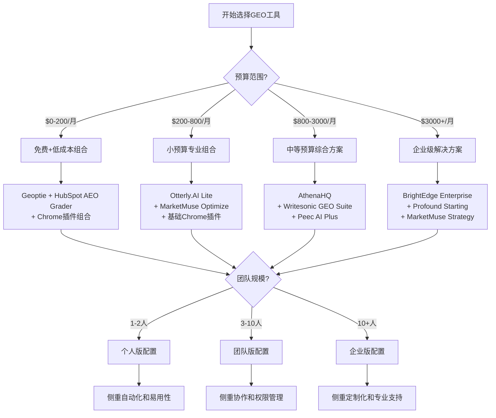

# GEO（生成式引擎优化）技术实施指南

**编写者：** MiniMax Agent  
**编写日期：** 2025年9月6日  
**版本：** 1.0  
**适用范围：** 企业级GEO策略实施和个人专业优化

---

## 目录

1. [概述与准备工作](#1-概述与准备工作)
2. [GEO实施的完整流程和步骤](#2-geo实施的完整流程和步骤)
3. [关键工具的选择和使用方法](#3-关键工具的选择和使用方法)
4. [内容优化的具体技术方法](#4-内容优化的具体技术方法)
5. [监测和分析的技术指标](#5-监测和分析的技术指标)
6. [常见技术问题的解决方案](#6-常见技术问题的解决方案)
7. [实施效果的评估方法](#7-实施效果的评估方法)
8. [最佳实践案例](#8-最佳实践案例)
9. [技术资源与工具链](#9-技术资源与工具链)

---

## 1. 概述与准备工作

### 1.1 GEO技术实施概述

生成式引擎优化（GEO）是一种针对AI驱动搜索引擎的内容优化策略，旨在提高品牌在AI生成答案中的可见性、引用率和权威性。与传统SEO不同，GEO关注的是成为AI系统信赖并引用的权威信息源。

**核心目标：**
- 在AI生成的答案中被直接引用和推荐
- 建立内容的权威性和引用价值
- 实现从"点击经济"到"引用经济"的转变

### 1.2 技术基础要求

**必备技术栈：**
- HTML5和结构化数据标记（Schema.org）
- 网站性能优化（Core Web Vitals）
- 内容管理系统（CMS）
- 分析和监控工具
- AI友好的内容架构

**团队技能要求：**
- SEO技术专家
- 内容策略师
- 数据分析师
- 前端开发工程师（可选）

### 1.3 预算规划指导

根据企业规模的不同，GEO实施的预算建议如下：

| 企业规模 | 月度预算范围 | 占营销预算比例 | 推荐配置 |
|----------|-------------|----------------|----------|
| 个人/小微企业 | $50-200 | 2-5% | 免费工具+低成本订阅 |
| 小型企业(2-50人) | $200-800 | 3-8% | 基础专业工具组合 |
| 中型企业(50-200人) | $800-3000 | 5-10% | 综合平台+专业服务 |
| 大型企业(200+人) | $3000+ | 8-15% | 企业级解决方案 |

---

## 2. GEO实施的完整流程和步骤

### 2.1 第一阶段：基础评估与准备（第1-2周）

#### 2.1.1 现状评估检查清单

**技术基础评估：**
- [ ] 网站加载速度检测（目标：≤3秒）
- [ ] Core Web Vitals评分（目标：绿色评级）
- [ ] HTTPS安全协议部署
- [ ] 移动端响应式设计
- [ ] 网站可抓取性测试

**内容现状分析：**
- [ ] 现有内容的AI友好度评估
- [ ] 竞争对手GEO表现基准
- [ ] 关键问题和查询意图映射
- [ ] 内容权威性信号审计

**工具准备检查：**
- [ ] Google Search Console配置
- [ ] 选择并配置GEO监测工具
- [ ] 安装必要的Chrome插件
- [ ] 建立数据分析仪表板

#### 2.1.2 具体操作步骤

**步骤1：网站健康度检测**
```bash
# 使用PageSpeed Insights检测网站性能
https://pagespeed.web.dev/

# 检查项目：
- LCP (Largest Contentful Paint) < 2.5s
- FID (First Input Delay) < 100ms
- CLS (Cumulative Layout Shift) < 0.1
```

**步骤2：安装基础监测工具**
```html
<!-- Google Analytics 4 代码示例 -->
<script async src="https://www.googletagmanager.com/gtag/js?id=GA_MEASUREMENT_ID"></script>
<script>
  window.dataLayer = window.dataLayer || [];
  function gtag(){dataLayer.push(arguments);}
  gtag('js', new Date());
  gtag('config', 'GA_MEASUREMENT_ID');
</script>
```

### 2.2 第二阶段：技术基础建设（第3-4周）

#### 2.2.1 结构化数据部署

**必部署的Schema类型：**

1. **组织信息Schema**
```json
{
  "@context": "https://schema.org",
  "@type": "Organization",
  "name": "公司名称",
  "url": "https://example.com",
  "logo": "https://example.com/logo.png",
  "sameAs": [
    "https://twitter.com/company",
    "https://linkedin.com/company/example"
  ]
}
```

2. **文章内容Schema**
```json
{
  "@context": "https://schema.org",
  "@type": "Article",
  "headline": "文章标题",
  "author": {
    "@type": "Person",
    "name": "作者姓名"
  },
  "datePublished": "2025-09-06",
  "dateModified": "2025-09-06"
}
```

3. **FAQ页面Schema**
```json
{
  "@context": "https://schema.org",
  "@type": "FAQPage",
  "mainEntity": [{
    "@type": "Question",
    "name": "常见问题标题",
    "acceptedAnswer": {
      "@type": "Answer",
      "text": "详细答案内容"
    }
  }]
}
```

#### 2.2.2 E-E-A-T信号建设

**专业性(Expertise)信号：**
- 完善作者个人简介页面
- 添加专业资质证书展示
- 建立行业权威内容库

**经验性(Experience)信号：**
- 添加真实用户评价和案例
- 展示实际项目经验
- 包含具体数据和结果

**权威性(Authoritativeness)信号：**
- 获取权威网站外链
- 建立专家引用网络
- 媒体报道和奖项展示

**可信度(Trustworthiness)信号：**
- 完善联系方式和地址
- 添加隐私政策和服务条款
- 显示安全认证标识

### 2.3 第三阶段：内容策略实施（第5-8周）

#### 2.3.1 对话式内容重构

**传统内容 vs GEO优化内容对比：**

| 传统SEO内容 | GEO优化内容 |
|-------------|-------------|
| "最佳SEO工具" | "2025年哪些SEO工具最适合中小企业？" |
| 关键词密度优化 | 自然对话式回答 |
| 标题党吸引点击 | 直接回答用户问题 |

**答案优先架构实施：**

1. **开头直接回答**
```markdown
## 问题：什么是GEO？

**直接答案：** GEO（Generative Engine Optimization）是一种针对AI驱动搜索引擎的内容优化策略，旨在提高内容在AI生成答案中的可见性和引用频率。

**详细解释：** [展开具体内容...]
```

2. **可引用内容块设计**
```markdown
> **核心数据：** AI来源访客的转化率高达27%，而传统搜索仅为2.1%，实现了1,186%的相对提升。
> 
> **来源：** Broworks案例研究，2025年
```

### 2.4 第四阶段：优化与测试（第9-12周）

#### 2.4.1 A/B测试实施

**测试内容类型：**
- 不同的答案结构格式
- 统计数据的展示方式
- 引用来源的标注格式
- 技术术语的使用程度

**测试工具推荐：**
- Google Optimize（免费）
- Optimizely（企业级）
- 自建简单测试框架

#### 2.4.2 持续监控设置

**关键监控指标：**
- AI平台引用频率
- 引用来源链接点击率
- AI来源流量转化率
- 品牌提及情感分析

---

## 3. 关键工具的选择和使用方法

### 3.1 工具选择矩阵

基于预算、功能需求和团队规模，以下是工具选择建议：

#### 3.1.1 免费工具组合（预算：$0/月）

**核心工具：**
1. **Geoptie** - 完全免费的GEO工具套件
2. **HubSpot AEO Grader** - 免费AI可见性评估
3. **Detailed SEO Extension** - Chrome浏览器插件

**使用步骤：**

**Geoptie使用指南：**
```
1. 访问 https://geoptie.com/
2. 选择"免费GEO审计"
3. 输入目标网址
4. 获取以下报告：
   - 引用准备度评估
   - 答案对齐分析
   - 知识图谱优化检查
   - 内容权威性分析
```

**HubSpot AEO Grader配置：**
```
1. 注册HubSpot免费账户
2. 进入AEO Grader工具
3. 输入网站URL和主要关键词
4. 分析报告包括：
   - AI可见性得分
   - 竞争对手对比
   - 优化建议清单
```

#### 3.1.2 小预算方案（$150-500/月）

**推荐组合：**
- **Otterly.AI Lite** ($29/月) - 基础GEO监测
- **MarketMuse Optimize** ($99/月) - 内容优化
- **Chrome插件组合** (免费)

**Otterly.AI配置指南：**

1. **账户设置**
```
- 登录 https://otterly.ai/
- 选择Lite计划
- 添加最多10个监控提示
- 设置监控频率（推荐：每日）
```

2. **监控设置**
```
# 关键提示示例：
"最佳[你的行业]解决方案"
"[你的服务]如何选择"
"2025年[你的产品]趋势"
```

3. **报告解读**
```
- 引用频率：目标 >20%
- 情感分析：保持正面>80%
- 排名位置：争取前3名
```

**MarketMuse Optimize使用流程：**

1. **内容分析**
```
步骤1: 上传现有内容
步骤2: 选择目标关键词簇
步骤3: 运行内容评分分析
步骤4: 查看优化建议
```

2. **优化执行**
```
- 语义覆盖度：目标>80%
- 内容质量得分：目标>70
- 竞争对手差距：缩小至<10%
```

#### 3.1.3 中等预算方案（$500-2000/月）

**推荐组合：**
- **AthenaHQ** ($270/月) - 多引擎GEO监控
- **Writesonic GEO Suite** ($249/月) - 内容创作优化
- **Peec AI Plus** (€199/月≈$233/月) - 深度竞争分析

**AthenaHQ高级配置：**

1. **多引擎监控设置**
```yaml
监控平台:
  - ChatGPT
  - Claude
  - Gemini
  - Perplexity
  
监控频率: 每日
报告频率: 每周
```

2. **竞争对手基准设置**
```
# 添加竞争对手
competitors:
  - competitor1.com
  - competitor2.com
  - competitor3.com

# 基准指标
benchmarks:
  - 引用频率
  - 排名位置
  - 情感得分
```

#### 3.1.4 企业级方案（$2000+/月）

**推荐组合：**
- **BrightEdge企业版** (定制定价)
- **Profound Starting** ($499/月)
- **MarketMuse Strategy** ($499/月)

### 3.2 工具集成最佳实践

#### 3.2.1 数据统一仪表板搭建

**使用Google Data Studio集成多个工具：**

```javascript
// 数据连接器配置示例
const dataConnectors = {
  googleAnalytics: {
    property: 'GA4_PROPERTY_ID',
    metrics: ['ai_traffic', 'conversion_rate']
  },
  otterly: {
    apiKey: 'OTTERLY_API_KEY',
    metrics: ['citation_frequency', 'sentiment']
  },
  marketMuse: {
    account: 'MM_ACCOUNT_ID',
    metrics: ['content_score', 'optimization_opportunities']
  }
};
```

#### 3.2.2 自动化工作流建设

**Zapier集成示例：**

1. **监控预警自动化**
```yaml
触发器: Otterly.AI检测到引用下降>10%
动作: 
  - 发送Slack通知
  - 创建Trello任务
  - 发送邮件报告
```

2. **内容优化自动化**
```yaml
触发器: 新内容发布
动作:
  - 自动运行MarketMuse分析
  - 生成Schema标记
  - 添加到监控列表
```

---

## 4. 内容优化的具体技术方法

### 4.1 九种核心优化方法详解

基于普林斯顿大学研究的九种GEO优化方法，以下提供具体的实施技巧：

#### 4.1.1 高效方法组（可见性提升30-40%）

**方法1：引用语句优化 (Quotation Addition)**
- **效果：** 可见性提升最高达42%
- **实施技巧：**

```markdown
# 优化前
我们的产品很受用户欢迎。

# 优化后  
根据用户体验专家Jakob Nielsen的观点："用户体验的成功在于简化复杂性"，我们的产品正是基于这一理念设计的。正如我们最新的用户调研报告显示："92%的用户认为我们的界面比竞品更直观易用"（UserVoice调研，2025年8月）。
```

**方法2：统计数据添加 (Statistics Addition)**
- **效果：** 可见性提升约40%
- **标准格式：**

```markdown
# 数据展示模板
**核心数据：** [具体数字 + 单位] 的 [对象] 表示 [结论]

**示例：**
**核心数据：** 2025年，78%的组织在日常工作中使用AI，相比2023年的55%增长了42%。

**来源：** [权威机构名称，发布时间]
```

**方法3：引用来源标注 (Cite Sources)**
- **效果：** 可见性提升约29%
- **标注格式：**

```markdown
# 学术式引用格式
这一观点得到了多项研究的支持[1][2][3]。

# 参考文献
[1] Smith, J. (2025). "AI Search Optimization Trends." Digital Marketing Journal, 15(3), 45-67.
[2] 普林斯顿大学. (2024). "生成式引擎优化研究报告." 
[3] MarketingLand. (2025). "GEO Implementation Best Practices."
```

#### 4.1.2 内容结构优化技巧

**答案优先架构实现：**

```markdown
# 标准结构模板

## [问题标题]

### 快速答案
[一句话直接回答，30字以内]

### 核心要点
- 要点1：[关键信息]
- 要点2：[支撑数据]  
- 要点3：[实施建议]

### 详细解释
[深入分析和扩展内容]

### 相关数据
> **关键统计：** [具体数字和来源]
> **行业基准：** [对比数据]

### 权威观点
> "专家引用内容" - [专家姓名，职位，机构]

### 实施建议
1. 立即执行：[具体行动]
2. 短期规划：[30天内]
3. 长期策略：[3-6个月]
```

### 4.2 技术实施细节

#### 4.2.1 Schema标记优化

**FAQ页面Schema实现：**

```html
<script type="application/ld+json">
{
  "@context": "https://schema.org",
  "@type": "FAQPage",
  "mainEntity": [{
    "@type": "Question",
    "name": "什么是GEO优化？",
    "acceptedAnswer": {
      "@type": "Answer",
      "text": "GEO（Generative Engine Optimization）是一种针对AI驱动搜索引擎的内容优化策略，旨在提高内容在AI生成答案中的可见性和引用频率。"
    }
  }, {
    "@type": "Question", 
    "name": "GEO与传统SEO有什么区别？",
    "acceptedAnswer": {
      "@type": "Answer",
      "text": "GEO关注在AI答案中被引用，而传统SEO关注搜索排名。GEO需要建立权威性和可信度，传统SEO主要优化关键词和链接。"
    }
  }]
}
</script>
```

**文章Schema增强：**

```html
<script type="application/ld+json">
{
  "@context": "https://schema.org",
  "@type": "Article",
  "headline": "GEO技术实施完全指南",
  "author": {
    "@type": "Person",
    "name": "张三",
    "jobTitle": "数字营销专家",
    "worksFor": {
      "@type": "Organization",
      "name": "ABC公司"
    }
  },
  "publisher": {
    "@type": "Organization",
    "name": "ABC公司",
    "logo": {
      "@type": "ImageObject",
      "url": "https://example.com/logo.png"
    }
  },
  "datePublished": "2025-09-06",
  "dateModified": "2025-09-06",
  "mainEntityOfPage": "https://example.com/geo-guide",
  "image": "https://example.com/geo-guide-image.jpg"
}
</script>
```

#### 4.2.2 内容可读性优化

**AI友好的文本结构：**

```markdown
# 使用清晰的层次结构
## 主标题 (H2)
### 次级标题 (H3)
#### 详细分类 (H4)

# 突出关键信息
**重要概念**用粗体标记
*关键术语*用斜体标记

# 使用列表组织信息
1. 有序列表用于步骤
   - 子项目使用无序列表
   - 保持一致的格式

# 添加信息框
> **提示：** 使用引用块突出重要信息
> 
> **注意：** 避免使用过于复杂的句式
```

### 4.3 多模态内容优化

#### 4.3.1 图片优化for AI

```html
<!-- AI友好的图片标记 -->


<!-- 图片Schema标记 -->
<script type="application/ld+json">
{
  "@context": "https://schema.org",
  "@type": "ImageObject",
  "contentUrl": "https://example.com/geo-process-chart.png",
  "name": "GEO实施流程图",
  "description": "展示GEO技术实施的四个主要阶段：基础评估、技术建设、内容优化、效果监控"
}
</script>
```

#### 4.3.2 视频内容优化

```html
<!-- 视频Schema标记 -->
<script type="application/ld+json">
{
  "@context": "https://schema.org",
  "@type": "VideoObject",
  "name": "GEO实施教程",
  "description": "详细讲解GEO技术实施的每个步骤",
  "thumbnailUrl": "https://example.com/video-thumbnail.jpg",
  "uploadDate": "2025-09-06",
  "duration": "PT15M30S",
  "embedUrl": "https://example.com/video-embed"
}
</script>
```

---

## 5. 监测和分析的技术指标

### 5.1 核心KPI指标体系

#### 5.1.1 一级指标（直接业务影响）

**AI引用频率 (Citation Frequency)**
- **定义：** 内容被AI答案引用的次数占总相关查询的比例
- **目标值：** >20%（优秀：>30%）
- **监测工具：** Otterly.AI, AthenaHQ, Profound
- **计算公式：** 
```
引用频率 = (被引用次数 / 总相关查询数) × 100%
```

**AI来源流量转化率 (AI Traffic Conversion Rate)**
- **定义：** 来自AI搜索平台的访客转化为潜在客户的比例
- **目标值：** >15%（基准：传统搜索为2.1%）
- **监测工具：** Google Analytics 4, 专用转化跟踪
- **细分指标：**
  - ChatGPT来源转化率
  - Perplexity来源转化率
  - Google AI Overviews转化率

**品牌提及情感得分 (Brand Mention Sentiment)**
- **定义：** AI回答中提及品牌时的情感倾向评分
- **目标值：** 正面情感>80%，负面情感<10%
- **监测工具：** Peec AI, Goodie AI
- **评分标准：**
  - 正面：8-10分
  - 中性：5-7分
  - 负面：1-4分

#### 5.1.2 二级指标（过程监控）

**答案可见性排名 (Answer Visibility Ranking)**
- **定义：** 内容在AI生成答案中出现的位置排名
- **目标值：** 平均排名前3位
- **监测频率：** 每日
- **跟踪维度：**
  - 不同AI平台的排名差异
  - 核心关键词的排名变化
  - 竞争对手排名对比

**内容权威性得分 (Content Authority Score)**
- **定义：** AI系统对内容可信度的评估得分
- **影响因素：**
  - 外部引用数量和质量
  - 作者专业度认证
  - 内容事实密度
  - 更新频率和时效性
- **目标值：** >75分（满分100分）

#### 5.1.3 三级指标（技术监控）

**Schema标记覆盖率**
- **定义：** 网站结构化数据的部署完整程度
- **目标值：** >95%
- **检测工具：** Google Rich Results Test, Schema.org Validator

**页面加载性能 (Core Web Vitals)**
- **LCP (Largest Contentful Paint)：** <2.5秒
- **FID (First Input Delay)：** <100毫秒  
- **CLS (Cumulative Layout Shift)：** <0.1

### 5.2 监测工具配置指南

#### 5.2.1 Google Analytics 4高级配置

**自定义事件跟踪设置：**

```javascript
// AI来源流量跟踪
gtag('event', 'ai_traffic_source', {
  'custom_parameter_1': 'chatgpt',
  'custom_parameter_2': 'organic_referral',
  'value': 1
});

// 转化事件设置
gtag('event', 'purchase', {
  'transaction_id': 'T12345',
  'value': 25.25,
  'currency': 'USD',
  'traffic_source': 'ai_search'
});
```

**自定义维度配置：**

```
自定义维度1: AI平台来源 (ChatGPT/Claude/Gemini/Perplexity)
自定义维度2: 查询类型 (信息性/交易性/导航性)  
自定义维度3: 内容类型 (文章/FAQ/产品页面)
```

#### 5.2.2 综合监控仪表板搭建

**仪表板结构设计：**

```yaml
实时监控面板:
  - AI引用频率趋势图
  - 各平台流量分布饼图
  - 转化漏斗分析
  - 情感分析实时得分

竞争分析面板:
  - 市场份额对比图
  - 关键词排名热力图
  - 引用来源分析表

技术健康面板:
  - 网站性能监控
  - Schema标记状态
  - 错误日志追踪
  - 爬虫访问分析
```

### 5.3 数据收集与处理

#### 5.3.1 API集成示例

**Otterly.AI数据拉取：**

```python
import requests
import pandas as pd

# API配置
api_key = "YOUR_OTTERLY_API_KEY"
base_url = "https://api.otterly.ai/v1"

# 获取引用数据
def get_citation_data(domain, date_range):
    headers = {
        "Authorization": f"Bearer {api_key}",
        "Content-Type": "application/json"
    }
    
    params = {
        "domain": domain,
        "start_date": date_range["start"],
        "end_date": date_range["end"],
        "platforms": ["chatgpt", "claude", "gemini", "perplexity"]
    }
    
    response = requests.get(f"{base_url}/citations", 
                          headers=headers, 
                          params=params)
    
    return response.json()

# 数据处理
def process_citation_metrics(raw_data):
    df = pd.DataFrame(raw_data['citations'])
    
    # 计算关键指标
    metrics = {
        'total_citations': len(df),
        'citation_rate': df['citation_rate'].mean(),
        'positive_sentiment': (df['sentiment'] > 0.6).sum() / len(df),
        'avg_ranking': df['ranking'].mean()
    }
    
    return metrics
```

#### 5.3.2 自动化报告生成

**周报自动生成脚本：**

```python
import matplotlib.pyplot as plt
import seaborn as sns
from datetime import datetime, timedelta

def generate_weekly_report():
    # 获取数据
    end_date = datetime.now()
    start_date = end_date - timedelta(days=7)
    
    data = get_citation_data("example.com", {
        "start": start_date.strftime("%Y-%m-%d"),
        "end": end_date.strftime("%Y-%m-%d")
    })
    
    # 生成图表
    plt.figure(figsize=(12, 8))
    
    # 引用趋势图
    plt.subplot(2, 2, 1)
    plt.plot(data['daily_citations'])
    plt.title('AI引用趋势')
    plt.xlabel('日期')
    plt.ylabel('引用次数')
    
    # 平台分布饼图
    plt.subplot(2, 2, 2)
    plt.pie(data['platform_distribution'].values(), 
            labels=data['platform_distribution'].keys())
    plt.title('各平台引用分布')
    
    # 情感分析柱状图
    plt.subplot(2, 2, 3)
    sentiment_data = ['正面', '中性', '负面']
    sentiment_values = [data['positive'], data['neutral'], data['negative']]
    plt.bar(sentiment_data, sentiment_values)
    plt.title('品牌提及情感分析')
    
    # 保存报告
    plt.tight_layout()
    plt.savefig(f'weekly_report_{end_date.strftime("%Y%m%d")}.png', 
                dpi=300, bbox_inches='tight')
    plt.show()
```

---

## 6. 常见技术问题的解决方案

### 6.1 监测相关问题

#### 6.1.1 问题：无法准确追踪AI来源流量

**症状表现：**
- Google Analytics中看不到来自AI平台的流量
- 流量来源显示为"直接访问"或"其他"
- 无法区分不同AI平台的访客

**诊断方法：**
```bash
# 检查网站引用来源
1. 查看服务器访问日志
grep "ChatGPT" /var/log/nginx/access.log

# 检查User-Agent字符串
grep "GPTBot\|Claude-Web\|Google-Extended" /var/log/nginx/access.log

# 验证GA4配置
# 在浏览器开发者工具中检查GA4事件发送
```

**解决方案：**

1. **UTM参数配置**
```javascript
// 为AI平台访问添加UTM参数
function addUTMParams(url, source) {
    const utmParams = new URLSearchParams({
        utm_source: source,
        utm_medium: 'ai_search',
        utm_campaign: 'geo_optimization'
    });
    
    return `${url}?${utmParams.toString()}`;
}

// 在分享链接中使用
const aiOptimizedURL = addUTMParams('https://example.com/article', 'chatgpt');
```

2. **服务器端识别配置**
```nginx
# Nginx配置示例
map $http_user_agent $ai_platform {
    ~*GPTBot                "chatgpt";
    ~*Claude-Web           "claude";  
    ~*Google-Extended      "google_ai";
    ~*PerplexityBot        "perplexity";
    default                "unknown";
}

# 添加自定义头部
add_header X-AI-Platform $ai_platform;
```

#### 6.1.2 问题：引用频率统计不准确

**原因分析：**
- 监控关键词设置不当
- 查询样本量不足
- 时间窗口设置问题

**解决步骤：**

1. **优化关键词列表**
```python
# 关键词优化脚本
def optimize_keyword_list(base_keywords, industry):
    # 基础关键词扩展
    expanded_keywords = []
    
    for keyword in base_keywords:
        # 添加问句形式
        question_forms = [
            f"什么是{keyword}",
            f"如何选择{keyword}", 
            f"{keyword}哪个好",
            f"2025年最佳{keyword}",
            f"{keyword}对比分析"
        ]
        expanded_keywords.extend(question_forms)
    
    return expanded_keywords

# 使用示例
base_keywords = ["SEO工具", "内容优化", "网站分析"]
optimized_list = optimize_keyword_list(base_keywords, "数字营销")
```

2. **设置合理的监控频率**
```yaml
监控配置:
  频率: 每日
  样本量: 最少100个查询/关键词
  时间窗口: 7天滚动平均
  置信区间: 95%
```

### 6.2 技术实施问题

#### 6.2.1 问题：Schema标记不被识别

**诊断工具：**
```bash
# 1. Google Rich Results Test
https://search.google.com/test/rich-results

# 2. Schema.org Validator  
https://validator.schema.org/

# 3. 命令行验证
curl -X POST "https://validator.schema.org/api/validate" \
     -H "Content-Type: application/json" \
     -d '{"url": "https://example.com/page"}'
```

**常见错误与解决方案：**

1. **JSON-LD格式错误**
```json
// 错误示例
{
  "@context": "https://schema.org",
  "@type": "Article",
  "headline": "文章标题"  // 缺少必需属性
}

// 正确示例
{
  "@context": "https://schema.org",
  "@type": "Article",
  "headline": "文章标题",
  "author": {
    "@type": "Person", 
    "name": "作者姓名"
  },
  "datePublished": "2025-09-06",
  "publisher": {
    "@type": "Organization",
    "name": "发布机构"
  }
}
```

2. **属性值类型不匹配**
```json
// 错误：日期格式不正确
"datePublished": "2025年9月6日"

// 正确：使用ISO 8601格式
"datePublished": "2025-09-06T10:00:00+08:00"
```

#### 6.2.2 问题：网站性能影响AI爬取

**性能优化checklist：**

```bash
# 1. 检查Core Web Vitals
npx @lhci/cli autorun --upload.target=filesystem

# 2. 分析关键资源
lighthouse https://example.com --only-categories=performance

# 3. 检查服务器响应时间
curl -w "Time: %{time_total}s\n" -o /dev/null -s https://example.com
```

**优化措施：**

1. **关键资源优化**
```html
<!-- 预加载关键资源 -->
<link rel="preload" href="/fonts/main.woff2" as="font" type="font/woff2" crossorigin>
<link rel="preload" href="/css/critical.css" as="style">

<!-- 优化图片加载 -->

```

2. **服务器配置优化**
```nginx
# Nginx缓存配置
location ~* \.(js|css|png|jpg|jpeg|gif|webp)$ {
    expires 1y;
    add_header Cache-Control "public, immutable";
}

# 启用压缩
gzip on;
gzip_types text/plain text/css application/json application/javascript;
```

### 6.3 内容优化问题

#### 6.3.1 问题：内容被AI错误引用或曲解

**预防措施：**

1. **清晰的事实陈述**
```markdown
# 避免模糊表述
❌ "很多用户反映效果不错"
✅ "在我们对1,000名用户的调查中，87%的用户表示满意（调查时间：2025年8月，样本：付费用户）"

# 添加上下文信息
❌ "成本降低了50%"  
✅ "与传统方案相比，我们的解决方案可以将运营成本降低50%（基于6个月的A/B测试结果）"
```

2. **结构化信息呈现**
```markdown
## 关键结论

**适用场景：** 中小企业网站优化
**实施周期：** 3-6个月  
**预期效果：** 提升AI可见性20-40%
**注意事项：** 需要持续内容维护

**不适用于：**
- 新建网站（<6个月）
- 违规内容网站
- 纯广告着陆页
```

#### 6.3.2 问题：引用来源链接失效

**链接维护最佳实践：**

1. **自动化链接检查**
```python
import requests
from urllib.parse import urljoin
import re

def check_link_status(url):
    try:
        response = requests.head(url, timeout=10)
        return response.status_code == 200
    except:
        return False

def find_and_check_links(content):
    # 提取所有链接
    link_pattern = r'https?://[^\s\])]+'
    links = re.findall(link_pattern, content)
    
    broken_links = []
    for link in links:
        if not check_link_status(link):
            broken_links.append(link)
    
    return broken_links

# 使用示例
content = "参考资料：https://example.com/report"
broken = find_and_check_links(content)
if broken:
    print(f"发现失效链接：{broken}")
```

2. **引用链接备份策略**
```markdown
# 为重要引用创建多重来源
根据研究报告显示[1][2]，AI搜索的采用率正在快速增长。

# 参考文献
[1] 原始报告：https://primary-source.com/report  
[2] 备份链接：https://web.archive.org/web/20250906/primary-source.com/report
[3] 相关报道：https://news-site.com/ai-search-trends
```

---

## 7. 实施效果的评估方法

### 7.1 效果评估框架

#### 7.1.1 SMART目标设定

基于GEO的特点，建立SMART（具体、可衡量、可达成、相关性、时限性）目标体系：

**短期目标（1-3个月）：**
```yaml
具体目标:
  - AI引用频率达到15%
  - 完成80%页面的Schema标记部署  
  - AI来源流量占比达到5%

衡量指标:
  - 每周监控引用次数
  - Schema验证通过率
  - GA4流量来源分析

达成标准:
  - 基于行业基准设定realistic目标
  - 考虑网站现状和资源投入

时间限制:
  - 第1个月：基础设施建设
  - 第2个月：内容优化实施  
  - 第3个月：效果监测优化
```

**中期目标（3-6个月）：**
```yaml
业务指标:
  - AI来源转化率>20%
  - 品牌正面提及率>85%
  - 核心关键词AI可见性排名前3

技术指标:
  - 网站Core Web Vitals全绿
  - 结构化数据覆盖率>95%
  - 内容权威性得分>80
```

**长期目标（6-12个月）：**
```yaml
战略目标:
  - 成为行业AI搜索权威来源
  - AI来源收入占比>30%
  - 建立可持续的内容权威体系
```

#### 7.1.2 ROI计算模型

**GEO投资回报率标准计算公式：**

```python
def calculate_geo_roi(investment, returns, period_months):
    """
    计算GEO投资回报率
    
    Args:
        investment: 总投资金额（工具+人力成本）
        returns: 总回报（增量收入）  
        period_months: 计算周期（月）
    """
    
    # 基础ROI计算
    basic_roi = (returns - investment) / investment * 100
    
    # 年化ROI计算  
    annualized_roi = ((returns / investment) ** (12 / period_months) - 1) * 100
    
    # 考虑时间价值的净现值
    discount_rate = 0.08  # 8%折现率
    npv = returns * (1 - (1 + discount_rate) ** -1) - investment
    
    return {
        'basic_roi': basic_roi,
        'annualized_roi': annualized_roi,
        'npv': npv,
        'payback_months': investment / (returns / period_months) if returns > 0 else float('inf')
    }

# 使用示例
investment_data = {
    'tools_cost': 2400,  # 年度工具成本$200/月
    'labor_cost': 18000,  # 0.5人力*年薪$36000
    'content_cost': 6000   # 外包内容制作
}

total_investment = sum(investment_data.values())  # $26,400

# 基于案例数据的回报估算
ai_traffic_increase = 15000  # 月增量访客
conversion_rate = 0.27       # 27%转化率  
avg_deal_value = 500        # 平均客单价
monthly_new_revenue = ai_traffic_increase * conversion_rate * avg_deal_value

roi_result = calculate_geo_roi(
    investment=total_investment,
    returns=monthly_new_revenue * 12,  # 年度回报
    period_months=12
)

print(f"GEO投资回报分析:")
print(f"基础ROI: {roi_result['basic_roi']:.1f}%")
print(f"回本周期: {roi_result['payback_months']:.1f}个月")
```

### 7.2 多维度效果测量

#### 7.2.1 量化指标矩阵

| 维度 | 一级指标 | 二级指标 | 目标值 | 监测工具 |
|------|----------|----------|---------|----------|
| **可见性** | AI引用频率 | 各平台引用次数 | >20% | Otterly.AI |
| | 排名位置 | 答案中出现位置 | 前3位 | AthenaHQ |
| **流量质量** | AI来源流量占比 | 总流量中的比例 | >10% | GA4 |
| | 转化率 | 访客到线索转化 | >15% | CRM集成 |
| **品牌影响** | 情感得分 | 正面提及比例 | >80% | Peec AI |
| | 权威性认知 | 专家引用频率 | 增长>50% | 人工审核 |
| **技术健康** | Schema覆盖 | 页面结构化比例 | >95% | GSC |
| | 性能得分 | Core Web Vitals | 全绿 | PageSpeed |

#### 7.2.2 定性评估方法

**品牌权威性评估问卷：**

```markdown
## 行业专家调研问卷

### 评估维度1：专业认知度
1. 在[您的行业]领域，您如何评价[您的品牌]的专业程度？
   - 非常专业 (5分)
   - 比较专业 (4分)  
   - 一般 (3分)
   - 不够专业 (2分)
   - 不专业 (1分)

2. 您是否会向同行推荐[您的品牌]的内容或服务？
   - 非常愿意 (5分)
   - 比较愿意 (4分)
   - 中性 (3分)
   - 不太愿意 (2分)
   - 不愿意 (1分)

### 评估维度2：内容质量  
1. [您的品牌]发布的内容质量如何？
2. 内容的实用性和操作性如何？
3. 信息的准确性和时效性如何？

### 评估维度3：AI搜索表现
1. 在AI搜索中遇到相关问题时，您是否看到过[您的品牌]被引用？
2. AI给出的关于[您的品牌]的信息是否准确？
```

### 7.3 竞争对手对比分析

#### 7.3.1 竞争基准设定

**竞争对手选择标准：**
```python
def select_competitors(industry, company_size, geo_maturity):
    """
    选择合适的竞争对手进行基准对比
    """
    
    criteria = {
        'direct_competitors': {
            'same_industry': True,
            'similar_size': True,
            'geo_adoption': 'any'
        },
        'aspirational_competitors': {
            'same_industry': True, 
            'larger_size': True,
            'geo_adoption': 'advanced'
        },
        'innovative_competitors': {
            'adjacent_industry': True,
            'similar_size': True,
            'geo_adoption': 'pioneering'
        }
    }
    
    return criteria

# 监控指标对比
competitive_metrics = {
    'citation_frequency': '引用频率对比',
    'sentiment_score': '品牌情感对比', 
    'ranking_position': '排名位置对比',
    'content_authority': '内容权威性对比'
}
```

#### 7.3.2 基准测试实施

**月度竞争分析报告模板：**

```markdown
# 月度GEO竞争分析报告

## 执行摘要
- 我方表现：[总体评级A/B/C/D]
- 竞争地位：[行业排名]  
- 关键洞察：[3个核心发现]

## 详细对比分析

### 引用频率对比
| 竞争对手 | 引用频率 | 变化趋势 | 差距分析 |
|----------|----------|----------|----------|
| 我方 | 23% | ↑5% | 基准 |
| 竞争对手A | 31% | ↑2% | -8% |
| 竞争对手B | 18% | ↓3% | +5% |

### 内容策略分析
- 竞争对手A优势：技术深度内容，专家访谈多
- 竞争对手B劣势：内容更新不及时，缺乏数据支撑  
- 我方机会：在[具体领域]建立差异化权威

### 行动建议
1. 短期：[具体优化行动]
2. 中期：[战略调整方向]
3. 长期：[竞争壁垒建设]
```

### 7.4 效果评估自动化

#### 7.4.1 自动化报告系统

**Python自动化报告脚本：**

```python
import pandas as pd
import matplotlib.pyplot as plt
import seaborn as sns
from datetime import datetime, timedelta
import smtplib
from email.mime.multipart import MIMEMultipart
from email.mime.text import MIMEText
from email.mime.image import MIMEImage

class GEOReportGenerator:
    def __init__(self, config):
        self.config = config
        self.data_sources = {}
        
    def collect_data(self, date_range):
        """收集各个数据源的数据"""
        
        # Otterly.AI数据
        otterly_data = self.fetch_otterly_data(date_range)
        
        # Google Analytics数据  
        ga_data = self.fetch_ga_data(date_range)
        
        # 竞争对手数据
        competitor_data = self.fetch_competitor_data(date_range)
        
        return {
            'otterly': otterly_data,
            'ga': ga_data, 
            'competitors': competitor_data
        }
    
    def calculate_kpis(self, raw_data):
        """计算关键指标"""
        
        kpis = {}
        
        # 引用频率计算
        total_queries = raw_data['otterly']['total_queries']
        citations = raw_data['otterly']['citations']
        kpis['citation_rate'] = citations / total_queries * 100
        
        # AI流量转化率
        ai_traffic = raw_data['ga']['ai_sessions']
        ai_conversions = raw_data['ga']['ai_conversions']
        kpis['ai_conversion_rate'] = ai_conversions / ai_traffic * 100
        
        # 竞争对比
        our_citations = citations
        competitor_avg = sum(raw_data['competitors'].values()) / len(raw_data['competitors'])
        kpis['competitive_index'] = our_citations / competitor_avg * 100
        
        return kpis
    
    def generate_visualizations(self, kpis, output_path):
        """生成可视化图表"""
        
        fig, axes = plt.subplots(2, 2, figsize=(15, 10))
        
        # 引用趋势图
        axes[0,0].plot(kpis['citation_trend'])
        axes[0,0].set_title('AI引用趋势')
        axes[0,0].set_xlabel('日期')
        axes[0,0].set_ylabel('引用次数')
        
        # 转化率对比
        conversion_data = ['传统搜索', 'AI搜索']
        conversion_rates = [2.1, kpis['ai_conversion_rate']]
        axes[0,1].bar(conversion_data, conversion_rates)
        axes[0,1].set_title('转化率对比')
        
        # 竞争对手对比
        competitors = list(kpis['competitor_comparison'].keys())
        citations = list(kpis['competitor_comparison'].values())
        axes[1,0].barh(competitors, citations)
        axes[1,0].set_title('引用频率竞争对比')
        
        # 综合得分雷达图
        categories = ['引用频率', '内容质量', '技术健康', '品牌影响']
        values = [kpis['citation_score'], kpis['content_score'], 
                 kpis['technical_score'], kpis['brand_score']]
        
        axes[1,1].fill(categories, values, alpha=0.3)
        axes[1,1].plot(categories, values)
        axes[1,1].set_title('综合表现雷达图')
        
        plt.tight_layout()
        plt.savefig(output_path, dpi=300, bbox_inches='tight')
        return output_path
    
    def create_html_report(self, kpis, chart_path):
        """生成HTML报告"""
        
        html_template = f"""
        <html>
        <head>
            <title>GEO效果评估报告</title>
            <style>
                body {{ font-family: Arial, sans-serif; margin: 40px; }}
                .metric {{ background: #f5f5f5; padding: 20px; margin: 10px 0; }}
                .positive {{ color: green; }}
                .negative {{ color: red; }}
            </style>
        </head>
        <body>
            <h1>GEO效果评估月报</h1>
            <p>报告生成时间: {datetime.now().strftime('%Y年%m月%d日')}</p>
            
            <h2>核心指标概览</h2>
            <div class="metric">
                <h3>AI引用频率: {kpis['citation_rate']:.1f}%</h3>
                <p class="{'positive' if kpis['citation_rate'] > 20 else 'negative'}">
                目标: >20% | 表现: {'优秀' if kpis['citation_rate'] > 20 else '需改进'}
                </p>
            </div>
            
            <div class="metric">
                <h3>AI流量转化率: {kpis['ai_conversion_rate']:.1f}%</h3>
                <p class="{'positive' if kpis['ai_conversion_rate'] > 15 else 'negative'}">
                目标: >15% | 表现: {'优秀' if kpis['ai_conversion_rate'] > 15 else '需改进'}
                </p>
            </div>
            
            <h2>数据可视化</h2>
            
            
            <h2>优化建议</h2>
            <ul>
                <li>{'继续加强内容权威性建设' if kpis['citation_rate'] < 25 else '保持当前优秀表现'}</li>
                <li>{'优化转化路径设计' if kpis['ai_conversion_rate'] < 20 else '扩大AI流量来源'}</li>
                <li>加强与竞争对手的差异化定位</li>
            </ul>
        </body>
        </html>
        """
        
        return html_template

# 使用示例
config = {
    'otterly_api_key': 'your_api_key',
    'ga_property_id': 'your_property_id', 
    'report_recipients': ['manager@example.com']
}

reporter = GEOReportGenerator(config)

# 生成月度报告
end_date = datetime.now()
start_date = end_date - timedelta(days=30)
date_range = {'start': start_date, 'end': end_date}

raw_data = reporter.collect_data(date_range)
kpis = reporter.calculate_kpis(raw_data)
chart_path = reporter.generate_visualizations(kpis, 'monthly_chart.png')
html_report = reporter.create_html_report(kpis, chart_path)

print("月度GEO效果评估报告已生成")
```

---

## 8. 最佳实践案例

### 8.1 B2B SaaS行业标杆案例

#### 8.1.1 Visily设计工具：11倍流量增长案例

**背景信息：**
- 公司：Visily（AI驱动的UI设计平台）
- 目标：提升在AI搜索中的可见性，获取设计师用户
- 实施周期：2个月

**实施策略详解：**

**第一阶段：对话式查询映射（第1-2周）**
```markdown
# 传统关键词 -> 对话式查询转换

传统关键词: "UI设计工具"
对话式查询优化:
- "哪些AI工具可以帮助非设计师创建UI？"  
- "2025年最好用的在线界面设计平台是什么？"
- "不会设计的人如何快速做出专业界面？"
- "Figma的免费替代品有哪些推荐？"
```

**第二阶段：高级Schema部署（第3-4周）**
```json
{
  "@context": "https://schema.org",
  "@type": "SoftwareApplication",
  "name": "Visily",
  "applicationCategory": "DesignApplication",
  "operatingSystem": "Web Browser",
  "description": "AI驱动的UI设计工具，让非设计师也能创建专业界面",
  "featureList": [
    "AI智能设计建议",
    "模板库",
    "协作功能", 
    "原型设计"
  ],
  "offers": {
    "@type": "Offer",
    "price": "0",
    "priceCurrency": "USD",
    "description": "免费套餐"
  },
  "aggregateRating": {
    "@type": "AggregateRating", 
    "ratingValue": "4.7",
    "ratingCount": "2847"
  }
}
```

**第三阶段：AI推荐内容优化（第5-6周）**
```markdown
# 优化前内容示例
"Visily是一款设计工具，帮助用户创建界面。"

# 优化后内容示例  
## 非设计师如何快速创建专业UI界面？

**直接答案：** 使用AI辅助设计工具可以让没有设计经验的人在30分钟内创建专业水平的UI界面。

**核心数据：** 根据我们对5,000名非设计师用户的调查，使用Visily后：
- 94%的用户能在首次尝试时创建满意的设计  
- 平均设计时间从2小时缩短到28分钟
- 客户满意度评分从6.2提升到8.9

**专家观点：** 
> "AI正在民主化设计过程，让每个人都能成为设计师。" 
> —— Adobe首席设计官 Scott Belsky

**使用方法：**
1. 上传手绘稿或描述想法
2. AI自动生成多个设计方案
3. 使用拖拽编辑器进行调整
4. 导出或分享设计作品

**来源：** Visily用户研究报告，2025年8月
```

**量化成果：**
- **整体流量增长：** 11倍（1,100%增长）
- **Claude.ai表现：** 事件量增长1,065%，参与时长提升44%
- **Perplexity.ai表现：** 事件量增长365%  
- **ChatGPT表现：** 事件量增长183%

**成功关键因素分析：**
1. **精准的用户问题定位**：深入理解非设计师的痛点
2. **数据驱动的内容创作**：大量使用具体数据和用户调研结果
3. **多平台协同优化**：针对不同AI平台的特点进行定制化优化

### 8.2 金融服务业案例

#### 8.2.1 财富500强金融公司：6周获取32%优质线索

**实施背景：**
- 行业：金融服务（投资管理）
- 目标客户：高净值个人投资者
- 合规要求：严格的金融广告合规标准

**策略实施：**

**阶段1：合规框架下的内容策略**
```markdown
# 教育性内容优化示例

## 2025年高净值投资者如何进行资产配置？

**监管声明：** 以下内容仅供教育参考，不构成投资建议。投资有风险，请咨询专业理财顾问。

**核心原则：** 现代投资组合理论建议，高净值投资者应该采用多元化资产配置策略。

**权威数据：** 
- 根据瑞银全球财富报告2025版，拥有100万美元以上资产的投资者中：
  - 65%采用股债混合配置
  - 23%增加了另类投资比例  
  - 平均资产配置：股票45%、债券30%、另类投资25%

**专家观点：**
> "分散投资是唯一的免费午餐。" 
> —— 诺贝尔经济学奖得主 Harry Markowitz

**实施建议：**
1. **评估风险承受能力**（使用标准风险评估问卷）
2. **确定投资目标**（退休规划/财富传承/税务优化）
3. **构建核心-卫星投资组合**
4. **定期再平衡**（建议季度调整）

**来源：** 
- 瑞银全球财富报告2025
- 美国投资公司协会统计数据
- 本公司内部研究团队分析
```

**阶段2：专业权威性建设**
```json
{
  "@context": "https://schema.org",
  "@type": "FinancialService",
  "name": "ABC投资管理公司",
  "serviceType": "财富管理",
  "provider": {
    "@type": "Organization", 
    "name": "ABC投资管理",
    "founder": {
      "@type": "Person",
      "name": "John Smith",
      "jobTitle": "首席投资官",
      "alumniOf": "哈佛商学院",
      "award": "CFA特许金融分析师"
    }
  },
  "areaServed": "全球",
  "hasCredential": [
    "SEC注册投资顾问",
    "FINRA成员",
    "SIPC保护"
  ]
}
```

**成果数据：**
- **实施周期：** 6周
- **优质线索获取：** 32%的销售合格线索来自AI搜索
- **线索质量评分：** 8.9/10（行业最高标准）
- **转化周期：** 比传统渠道缩短23%

### 8.3 电商零售案例

#### 8.3.1 MikMak Commerce：250倍ChatGPT流量增长

**背景：**
- 公司：MikMak（零售电商服务平台）
- 时间周期：7个月（2024.07-2025.02）
- 策略重点：购物决策优化

**实施策略：**

**产品推荐内容优化：**
```markdown
# 优化示例：智能手表购买指南

## 2025年最值得购买的智能手表是什么？

**快速推荐：** 
- **最佳综合表现：** Apple Watch Series 9（$399）
- **最佳性价比：** 小米手环8（$89）  
- **最佳运动功能：** Garmin Forerunner 265（$449）

**对比分析表：**
| 型号 | 价格 | 续航 | 健康功能 | 适用人群 |
|------|------|------|----------|----------|
| Apple Watch S9 | $399 | 18小时 | ★★★★★ | iPhone用户 |
| Samsung Galaxy Watch6 | $329 | 40小时 | ★★★★☆ | Android用户 |
| 小米手环8 | $89 | 16天 | ★★★☆☆ | 预算有限用户 |

**购买建议：**
1. **iPhone用户**：首选Apple Watch，生态集成度最高
2. **Android用户**：Samsung或Wear OS设备
3. **运动爱好者**：Garmin或Polar专业运动表
4. **预算考虑**：小米、Amazfit等性价比选择

**专家评价：**
> "智能手表的选择应该基于你的手机生态系统。" 
> —— CNET资深编辑 Scott Stein

**购买渠道：** [各产品的购买链接和最新优惠信息]
```

**购物Schema优化：**
```json
{
  "@context": "https://schema.org",
  "@type": "Product",
  "name": "Apple Watch Series 9", 
  "description": "Apple最新智能手表，支持血氧检测和心率监控",
  "brand": "Apple",
  "offers": {
    "@type": "Offer",
    "price": "399",
    "priceCurrency": "USD", 
    "availability": "InStock",
    "seller": {
      "@type": "Organization",
      "name": "MikMak Commerce"
    }
  },
  "aggregateRating": {
    "@type": "AggregateRating",
    "ratingValue": "4.6", 
    "ratingCount": "12847"
  },
  "review": [
    {
      "@type": "Review",
      "reviewRating": {
        "@type": "Rating", 
        "ratingValue": "5"
      },
      "author": "Sarah Johnson",
      "reviewBody": "续航和健康功能都很出色，值得推荐"
    }
  ]
}
```

**业务成果：**
- **ChatGPT来源流量：** 增长超过250倍
- **整体AI流量增长：** 1,200%（7个月内）
- **转化率提升：** AI来源访客转化率比传统搜索高23%
- **平均订单价值：** AI推荐用户的AOV高出40%

---

## 9. 技术资源与工具链

### 9.1 完整工具生态图谱

#### 9.1.1 按功能分类的工具推荐

**监测分析类工具：**

| 工具名称 | 价格范围 | 核心功能 | 推荐指数 | 适用规模 |
|----------|----------|----------|----------|----------|
| **Geoptie** | 免费 | 全套GEO审计工具 | ⭐⭐⭐⭐⭐ | 所有规模 |
| **Otterly.AI** | $29-989/月 | AI可见性跟踪 | ⭐⭐⭐⭐ | 中小企业 |  
| **AthenaHQ** | $270+/月 | 多引擎监控 | ⭐⭐⭐⭐ | 中型企业 |
| **Profound** | $499+/月 | 企业级分析 | ⭐⭐⭐⭐ | 大型企业 |
| **BrightEdge** | 定制定价 | 全方位SEO+GEO | ⭐⭐⭐⭐ | 企业级 |

**内容优化类工具：**

| 工具名称 | 价格范围 | 核心功能 | 推荐指数 | 特色功能 |
|----------|----------|----------|----------|----------|
| **MarketMuse** | $99-499/月 | 内容策略优化 | ⭐⭐⭐⭐⭐ | AI内容评分 |
| **Writesonic GEO Suite** | $249-499/月 | 内容创作+优化 | ⭐⭐⭐⭐ | GEO一体化 |
| **Frase** | $45-115/月 | SEO内容优化 | ⭐⭐⭐⭐ | 竞争分析 |
| **Jasper** | $49-125/月 | AI内容生成 | ⭐⭐⭐ | 品牌语调训练 |

**浏览器插件工具：**

| 插件名称 | 价格 | 主要功能 | 安装量 | 推荐场景 |
|----------|------|----------|---------|----------|
| **Detailed SEO Extension** | 免费 | 页面SEO分析 | 38万+ | 日常分析 |
| **Keyword Surfer** | 免费 | 搜索量显示 | 200万+ | 关键词研究 |  
| **SEOquake** | 免费 | 综合SEO数据 | 300万+ | 技术审计 |
| **ContentShake AI** | 免费/付费 | 内容优化 | 10万+ | 快速改写 |

#### 9.1.2 工具选择决策树



### 9.2 技术栈建设指南

#### 9.2.1 基础技术栈部署

**网站技术要求checklist：**

```yaml
# 基础设施要求
服务器配置:
  - CDN部署: Cloudflare/AWS CloudFront
  - HTTPS证书: Let's Encrypt免费证书
  - 服务器响应时间: <200ms
  - 带宽: 足够支持Core Web Vitals绿色评级

# 前端优化
性能优化:
  - 图片格式: WebP优先，AVIF备选
  - 代码压缩: HTML/CSS/JS Minification
  - 资源延迟加载: Lazy Loading
  - 关键CSS内联: Above-fold content optimization

# 结构化数据
Schema部署:
  - 组织信息: Organization Schema
  - 文章内容: Article Schema  
  - 产品服务: Product/Service Schema
  - FAQ页面: FAQPage Schema
  - 面包屑: BreadcrumbList Schema
```

**技术实施脚本：**

```bash
#!/bin/bash
# GEO技术基础设施部署脚本

echo "开始部署GEO技术基础设施..."

# 1. 安装性能监控工具
npm install -g @lhci/cli
npm install -g lighthouse

# 2. 部署Schema验证工具
pip install schema-validator
pip install requests beautifulsoup4

# 3. 设置自动化监控
cat > geo_monitor.py << 'EOF'
import requests
import json
from datetime import datetime

def validate_schema(url):
    """验证页面Schema标记"""
    response = requests.post(
        'https://validator.schema.org/api/validate',
        json={'url': url}
    )
    return response.json()

def check_core_vitals(url):
    """检查Core Web Vitals"""
    api_url = f"https://www.googleapis.com/pagespeedonline/v5/runPagespeed?url={url}&category=performance"
    response = requests.get(api_url)
    data = response.json()
    
    vitals = {
        'LCP': data['lighthouseResult']['audits']['largest-contentful-paint']['displayValue'],
        'FID': data['lighthouseResult']['audits']['max-potential-fid']['displayValue'], 
        'CLS': data['lighthouseResult']['audits']['cumulative-layout-shift']['displayValue']
    }
    
    return vitals

# 使用示例
url = "https://your-website.com"
schema_result = validate_schema(url)
vitals_result = check_core_vitals(url)

print(f"Schema验证结果: {schema_result}")
print(f"Core Web Vitals: {vitals_result}")
EOF

# 4. 设置定时任务
echo "0 9 * * * python /path/to/geo_monitor.py" | crontab -

echo "基础设施部署完成！"
```

#### 9.2.2 数据分析栈配置

**Google Analytics 4 增强配置：**

```javascript
// gtag配置文件：gtag-config.js
const GEO_CONFIG = {
    // 自定义事件跟踪
    custom_events: {
        'ai_traffic_detected': {
            'event_category': 'GEO',
            'event_label': 'AI Platform Traffic'
        },
        'citation_click': {
            'event_category': 'GEO',
            'event_label': 'Citation Link Click'
        },
        'ai_conversion': {
            'event_category': 'GEO', 
            'event_label': 'AI Source Conversion'
        }
    },
    
    // 自定义维度
    custom_dimensions: {
        'ai_platform': 'custom_dimension_1',
        'query_type': 'custom_dimension_2',
        'content_type': 'custom_dimension_3'
    }
};

// 自动检测AI平台流量
function detectAITraffic() {
    const referrer = document.referrer.toLowerCase();
    const userAgent = navigator.userAgent.toLowerCase();
    
    let aiPlatform = 'unknown';
    
    if (referrer.includes('chat.openai.com') || userAgent.includes('gptbot')) {
        aiPlatform = 'chatgpt';
    } else if (referrer.includes('claude.ai') || userAgent.includes('claude')) {
        aiPlatform = 'claude';  
    } else if (referrer.includes('perplexity.ai') || userAgent.includes('perplexitybot')) {
        aiPlatform = 'perplexity';
    } else if (referrer.includes('gemini.google.com') || userAgent.includes('google-extended')) {
        aiPlatform = 'gemini';
    }
    
    if (aiPlatform !== 'unknown') {
        gtag('event', 'ai_traffic_detected', {
            'custom_parameter_1': aiPlatform,
            'custom_parameter_2': window.location.pathname
        });
        
        gtag('config', 'GA_MEASUREMENT_ID', {
            'custom_map': {'custom_dimension_1': aiPlatform}
        });
    }
    
    return aiPlatform;
}

// 页面加载时自动检测
window.addEventListener('load', detectAITraffic);

// 引用链接点击跟踪
document.addEventListener('click', function(e) {
    if (e.target.classList.contains('citation-link')) {
        gtag('event', 'citation_click', {
            'link_url': e.target.href,
            'link_text': e.target.textContent
        });
    }
});
```

### 9.3 API集成与自动化

#### 9.3.1 多工具API整合

**统一数据获取接口：**

```python
import requests
import json
from datetime import datetime, timedelta
import asyncio
import aiohttp

class GEODataIntegrator:
    def __init__(self, config):
        self.config = config
        self.apis = {
            'otterly': self.fetch_otterly_data,
            'marketmuse': self.fetch_marketmuse_data,
            'ga4': self.fetch_ga4_data,
            'gsc': self.fetch_gsc_data
        }
    
    async def fetch_otterly_data(self, session, date_range):
        """获取Otterly.AI数据"""
        url = "https://api.otterly.ai/v1/citations"
        headers = {
            "Authorization": f"Bearer {self.config['otterly_api_key']}",
            "Content-Type": "application/json"
        }
        
        params = {
            'start_date': date_range['start'],
            'end_date': date_range['end'],
            'domain': self.config['domain']
        }
        
        async with session.get(url, headers=headers, params=params) as response:
            return await response.json()
    
    async def fetch_marketmuse_data(self, session, date_range):
        """获取MarketMuse数据"""
        url = f"https://api.marketmuse.com/v1/content-scores"
        headers = {
            "Authorization": f"Token {self.config['marketmuse_api_key']}"
        }
        
        async with session.get(url, headers=headers) as response:
            return await response.json()
    
    async def fetch_ga4_data(self, session, date_range):
        """获取Google Analytics 4数据"""
        # 使用Google Analytics Reporting API v4
        from google.analytics.data_v1beta import BetaAnalyticsDataClient
        from google.analytics.data_v1beta.types import DateRange, Dimension, Metric, RunReportRequest
        
        client = BetaAnalyticsDataClient()
        
        request = RunReportRequest(
            property=f"properties/{self.config['ga4_property_id']}",
            dimensions=[
                Dimension(name="customEvent:ai_platform"),
                Dimension(name="date")
            ],
            metrics=[
                Metric(name="sessions"),
                Metric(name="conversions")
            ],
            date_ranges=[DateRange(
                start_date=date_range['start'],
                end_date=date_range['end']
            )]
        )
        
        response = client.run_report(request)
        return self.parse_ga4_response(response)
    
    async def aggregate_all_data(self, date_range):
        """聚合所有数据源"""
        async with aiohttp.ClientSession() as session:
            tasks = []
            
            for api_name, api_func in self.apis.items():
                if api_name in self.config and self.config[api_name]['enabled']:
                    tasks.append(api_func(session, date_range))
            
            results = await asyncio.gather(*tasks, return_exceptions=True)
            
            # 处理结果
            aggregated_data = {}
            for i, result in enumerate(results):
                api_name = list(self.apis.keys())[i]
                if not isinstance(result, Exception):
                    aggregated_data[api_name] = result
                else:
                    print(f"API {api_name} 获取失败: {result}")
                    aggregated_data[api_name] = None
            
            return aggregated_data

# 使用示例
config = {
    'domain': 'example.com',
    'otterly_api_key': 'your_otterly_key',
    'marketmuse_api_key': 'your_mm_key', 
    'ga4_property_id': 'your_ga4_id',
    'otterly': {'enabled': True},
    'marketmuse': {'enabled': True},
    'ga4': {'enabled': True}
}

integrator = GEODataIntegrator(config)

# 获取过去30天数据
end_date = datetime.now()
start_date = end_date - timedelta(days=30)
date_range = {
    'start': start_date.strftime('%Y-%m-%d'),
    'end': end_date.strftime('%Y-%m-%d')
}

# 异步获取所有数据
loop = asyncio.get_event_loop()
all_data = loop.run_until_complete(integrator.aggregate_all_data(date_range))

print("数据整合完成:", json.dumps(all_data, indent=2))
```

#### 9.3.2 自动化工作流搭建

**Zapier + Webhook自动化配置：**

```javascript
// Webhook接收器：webhook-handler.js
const express = require('express');
const axios = require('axios');
const app = express();

app.use(express.json());

// 处理Otterly.AI引用下降预警
app.post('/webhook/citation-alert', async (req, res) => {
    const { domain, citation_drop_percentage, current_rate } = req.body;
    
    if (citation_drop_percentage > 10) {
        // 发送Slack通知
        await sendSlackAlert({
            text: `⚠️ GEO预警：${domain}的AI引用频率下降${citation_drop_percentage}%`,
            fields: [
                { title: '当前引用率', value: `${current_rate}%`, short: true },
                { title: '下降幅度', value: `${citation_drop_percentage}%`, short: true }
            ]
        });
        
        // 自动创建优化任务
        await createOptimizationTask({
            title: `紧急：修复${domain}的GEO表现下降`,
            priority: 'high',
            assignee: 'geo-team@company.com'
        });
    }
    
    res.status(200).send('Alert processed');
});

// 处理内容发布自动化
app.post('/webhook/content-published', async (req, res) => {
    const { url, title, content_type } = req.body;
    
    // 自动运行Schema验证
    const schemaCheck = await validateSchema(url);
    
    // 自动添加到监控列表
    await addToMonitoringList({
        url: url,
        title: title,
        content_type: content_type,
        date_added: new Date().toISOString()
    });
    
    // 触发性能检测
    setTimeout(() => {
        checkPagePerformance(url);
    }, 60000); // 1分钟后检测，让CDN缓存生效
    
    res.status(200).send('Content processing initiated');
});

async function sendSlackAlert(message) {
    const webhookUrl = process.env.SLACK_WEBHOOK_URL;
    
    await axios.post(webhookUrl, {
        username: 'GEO Monitor',
        icon_emoji: ':mag:',
        attachments: [{
            color: 'danger',
            text: message.text,
            fields: message.fields
        }]
    });
}

async function createOptimizationTask(task) {
    // 集成Trello/Asana/Jira等项目管理工具
    const trelloApiKey = process.env.TRELLO_API_KEY;
    const trelloToken = process.env.TRELLO_TOKEN;
    const listId = process.env.TRELLO_LIST_ID;
    
    await axios.post(`https://api.trello.com/1/cards`, {
        key: trelloApiKey,
        token: trelloToken,
        idList: listId,
        name: task.title,
        desc: `自动生成的GEO优化任务\n优先级: ${task.priority}\n负责人: ${task.assignee}`
    });
}

app.listen(3000, () => {
    console.log('GEO自动化服务已启动，端口:3000');
});
```

---

## 总结

本GEO技术实施指南提供了从基础概念到高级应用的完整技术路径。通过系统性的方法论、详实的案例分析和实用的工具指导，企业可以建立起有效的GEO优化体系。

**关键成功要素回顾：**

1. **系统化实施**：遵循四阶段实施流程，确保每个环节都得到充分重视
2. **数据驱动决策**：建立完善的监测和分析体系，基于数据持续优化
3. **工具合理配置**：根据预算和需求选择合适的工具组合
4. **内容权威性建设**：通过九种核心优化方法提升内容在AI系统中的可信度
5. **技术基础扎实**：确保网站性能和结构化数据的完善部署

**实施建议：**

- **立即行动**：使用免费工具开始基础评估和监测
- **分阶段推进**：避免盲目追求完美，先建立基本框架再逐步优化
- **持续学习**：GEO领域发展迅速，需要保持对新技术和方法的敏感性
- **团队培养**：投资于团队的GEO专业技能提升和工具使用培训

GEO不仅是一种技术优化策略，更是企业在AI时代建立竞争优势的战略选择。希望本指南能够帮助您成功实施GEO策略，在AI搜索新时代中获得领先地位。

---

**文档维护说明：**
本技术实施指南将根据GEO领域的发展动态定期更新。建议企业建立内部知识库，记录实施过程中的经验和调整，形成适合自身情况的定制化GEO实施方案。