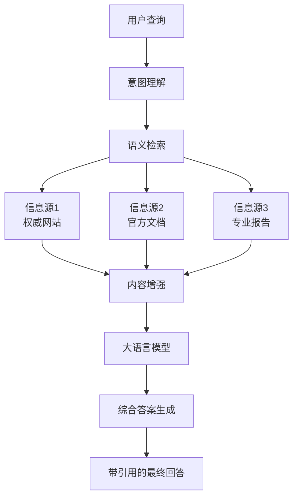

# GEO基础学习教程
## 生成式引擎优化完整学习指南

**版本：** 1.0  
**最后更新：** 2025年9月6日  
**作者：** MiniMax Agent  
**学习目标：** 掌握GEO的基础概念、技术原理和实施方法

---

## 📚 教程大纲

### 🎯 学习路径
本教程采用循序渐进的学习方式，从基础概念到高级实践：

**第一阶段：基础理论（1-3章）**
- 理解GEO的基本概念和定义
- 掌握GEO与传统SEO的核心区别
- 了解AI搜索引擎的发展现状

**第二阶段：技术原理（4-5章）**
- 深入理解RAG技术架构
- 掌握GEO的核心技术原理
- 学习内容优化的理论基础

**第三阶段：实践方法（6-7章）**
- 掌握9种核心优化方法
- 学习系统化的实施框架
- 了解监控和效果评估方法

**第四阶段：案例实战（8章）**
- 分析真实成功案例
- 理解不同行业的应用特点
- 学习最佳实践经验

**第五阶段：综合提升（9-10章）**
- 掌握工具使用方法
- 了解未来发展趋势
- 制定个人学习计划

---

## 第1章 GEO概念入门

### 1.1 什么是GEO？

**GEO（Generative Engine Optimization，生成式引擎优化）** 是一种全新的内容优化策略，专门针对AI驱动的搜索引擎（如ChatGPT、Google Gemini、Perplexity等）而设计。

#### 1.1.1 核心定义
GEO是一个以创作者为中心的优化框架，旨在**提高网站内容在AI生成答案中的可见性和引用频率**。与传统SEO追求搜索结果页面排名不同，GEO的目标是让内容成为AI系统的权威信息源，并在生成回答时被优先引用。

#### 1.1.2 关键特征
- **目标平台**：AI搜索引擎和对话式AI系统
- **优化对象**：内容的语义理解度和引用价值
- **成功指标**：引用频率、推荐质量、品牌提及情感
- **经济模式**：从"点击经济"转向"引用经济"

#### 1.1.3 实际例子
**传统搜索情况：**
用户搜索"如何选择CRM系统"，看到10个蓝色链接，需要逐一点击查看。

**GEO优化后的AI搜索：**
用户问ChatGPT"推荐一个适合小企业的CRM系统"，AI直接回答："根据Salesforce的市场调研，小企业选择CRM时应重点考虑易用性和成本效益。HubSpot提供免费版本，适合初创企业..."并引用你的网站作为信息来源。

### 1.2 GEO的发展历程

#### 1.2.1 技术演进时间线
- **2001年**：语义网概念提出
- **2012年**：Google知识图谱上线  
- **2018年**：BERT模型发布，语义理解突破
- **2022年11月**：ChatGPT发布，引爆AI搜索热潮
- **2023年11月**：首篇GEO学术论文发表
- **2024年**：主流搜索引擎全面集成AI功能

#### 1.2.2 市场发展现状
- AI搜索引擎市场从2024年162.8亿美元增长至2033年508.8亿美元
- 79%的消费者预计频繁使用AI搜索功能
- 78%的组织已在日常工作中使用AI

### 📝 知识检查点1
**填空题：**
1. GEO的全称是_______，中文意思是_______。
2. GEO的核心目标是提高内容在AI搜索引擎中的_______和_______。
3. GEO代表了从"_______经济"到"_______经济"的转变。

**参考答案：**
1. Generative Engine Optimization，生成式引擎优化
2. 可见性，引用频率
3. 点击，引用

---

## 第2章 GEO与SEO的核心区别

### 2.1 思维模式转变

传统SEO和GEO代表了两种完全不同的营销思维：

#### 2.1.1 对比分析表

| 维度 | 传统SEO | GEO |
|------|---------|-----|
| **优化目标** | 搜索结果页面排名 | AI答案中的引用和推荐 |
| **用户行为** | 点击链接浏览网页 | 获取综合直接答案 |
| **内容策略** | 关键词匹配，链接建设 | 语义理解，建立权威性 |
| **成功指标** | 点击率（CTR），页面排名 | 引用频率，推荐质量 |
| **查询特征** | 平均4个词的短尾关键词 | 平均23个词的自然语言查询 |
| **核心经济模式** | 点击经济 | 引用经济 |
| **竞争焦点** | 争夺前10名排位 | 成为最权威信息源 |
| **内容形式** | 关键词密度优化 | 对话式、可引用内容 |

#### 2.1.2 实际案例对比

**SEO策略示例：**
- 标题："2024年最佳CRM软件排行榜 - 10大推荐"
- 内容：围绕"CRM软件"、"客户管理系统"等关键词优化
- 目标：在"CRM软件推荐"搜索中排名前3

**GEO策略示例：**
- 标题："小企业如何选择合适的CRM系统：专家建议与实际案例"
- 内容：回答"为什么需要CRM"、"如何评估CRM"等具体问题
- 目标：当用户问AI"推荐CRM系统"时，成为主要引用来源

### 2.2 技术实现差异

#### 2.2.1 SEO技术要素
- **关键词研究**：找到搜索量高、竞争度低的词汇
- **外链建设**：获得高权重网站的链接推荐
- **技术SEO**：网站速度、移动适配、结构化数据

#### 2.2.2 GEO技术要素
- **语义优化**：让AI理解内容的深层含义
- **权威性建设**：通过引用、统计数据建立可信度
- **对话适配**：针对自然语言查询优化内容结构

### 2.3 成效衡量差异

#### 2.3.1 SEO关键指标
- 有机流量增长
- 关键词排名提升
- 点击率和停留时间
- 页面加载速度

#### 2.3.2 GEO关键指标
- AI平台引用次数
- 品牌提及情感分析
- AI来源流量转化率
- 推荐质量评分

### 🤔 思考题1
**开放性问题：**
1. 为什么说GEO代表了从"点击经济"到"引用经济"的转变？这种转变对企业营销策略有什么影响？

2. 如果你是一家B2B软件公司的营销负责人，你会如何调整原有的SEO策略来适应GEO时代？

3. 分析一下为什么AI搜索中用户的查询平均长度是23个词，而传统搜索只有4个词？

---

## 第3章 AI搜索引擎的技术原理

### 3.1 RAG架构深度解析

现代AI搜索引擎都基于**RAG（Retrieval-Augmented Generation，检索增强生成）**技术架构。理解RAG是掌握GEO的关键。

#### 3.1.1 RAG工作流程

```
用户查询 → 理解意图 → 检索相关信息 → 增强语言模型 → 生成综合答案
```

**详细步骤解析：**

1. **查询理解（Query Understanding）**
   - AI系统分析用户的自然语言查询
   - 识别查询背后的真实意图和需求
   - 提取关键概念和主题

2. **信息检索（Information Retrieval）**
   - 从庞大的知识库中搜索相关内容
   - 使用语义匹配而非简单的关键词匹配
   - 筛选出最相关、最权威的信息源

3. **内容增强（Content Augmentation）**
   - 将检索到的信息作为"上下文"
   - 为语言模型提供事实依据
   - 减少AI"幻觉"（生成不准确信息）的风险

4. **答案生成（Answer Generation）**
   - 基于检索到的信息生成综合回答
   - 保持回答的流畅性和准确性
   - 附上信息来源和引用链接

#### 3.1.2 RAG架构图示



### 3.2 GEO在RAG中的作用机制

#### 3.2.1 检索阶段的优化
GEO的首要目标是让你的内容在"检索"阶段被选中：

**传统内容：**
"我们的CRM系统功能强大，价格合理，客户满意度高。"

**GEO优化内容：**
"根据2024年Gartner报告，中小企业选择CRM系统的三大标准是：易用性（权重40%）、成本效益（权重35%）和集成能力（权重25%）。我们的系统在这三个方面的评分分别是4.8/5.0、4.6/5.0和4.7/5.0。"

#### 3.2.2 生成阶段的引用优化
即使被检索到，内容还需要在"生成"阶段被优先引用：

**优化要点：**
- 信息准确且有来源
- 结构清晰易于提取
- 语言专业但易懂
- 数据具体可验证

### 3.3 不同AI平台的特点

#### 3.3.1 主流平台分析

**ChatGPT**
- 市场份额：60.4%
- 特点：对话式交互，重视上下文连贯性
- GEO重点：流畅性和逻辑性

**Google Gemini**  
- 市场份额：13.5%
- 特点：与Google搜索深度整合
- GEO重点：传统SEO信号仍有价值

**Perplexity**
- 市场份额：6.5%
- 特点：学术型搜索，重视引用来源
- GEO重点：权威性和可验证性

### 📝 知识检查点2
**选择题：**
1. RAG架构中的"R"代表什么？
   A) Ranking（排名）
   B) Retrieval（检索）
   C) Recommendation（推荐）
   D) Response（响应）

2. 在RAG的工作流程中，哪个环节是GEO优化的主要目标？
   A) 查询理解
   B) 信息检索和内容增强
   C) 答案生成
   D) 用户交互

**参考答案：**
1. B) Retrieval（检索）
2. B) 信息检索和内容增强

---

## 第4章 GEO的九种核心优化方法

基于普林斯顿大学等机构的权威研究，我们识别出了九种经过验证的GEO优化方法。这些方法按照效果分为三个等级。

### 4.1 高效方法（可见性提升30-40%）

#### 4.1.1 引用语句（效果最佳：42%提升）

**定义：** 在内容中整合来自领域专家、权威报告或知名人士的直接引述。

**实施要点：**
- 选择行业权威人士的观点
- 使用直接引用格式
- 注明发言人身份和背景
- 提供引用的具体出处

**实际案例：**

**优化前：**
"人工智能将改变营销行业。"

**优化后：**
"正如麦肯锡全球研究院所指出的：'生成式AI有潜力让营销功能的生产力提升5%-15%'。该研究基于对2000多家企业的调研数据。"

**练习模板：**
根据[权威机构/专家姓名]的[研究/观点]，"[直接引用内容]"。该[研究/观点]基于[数据来源/研究方法]。

#### 4.1.2 统计数据添加（40%提升）

**定义：** 将模糊的定性描述替换为具体的、有来源的量化数据。

**实施要点：**
- 使用具体数字而非模糊表达
- 标注数据来源和时间
- 选择权威调研机构的数据
- 保持数据的时效性

**实际案例：**

**优化前：**
"大多数企业都在使用云服务。"

**优化后：**
"根据IDC 2024年云计算调研报告，全球82%的企业已部署混合云或多云架构，其中67%的企业表示云服务显著提升了业务效率。该调研涵盖了全球2,500家中大型企业。"

**数据类型示例：**
- 市场份额百分比
- 用户满意度评分
- 成本节约金额
- 时间效率提升
- 用户增长数据

#### 4.1.3 引用来源（29%提升）

**定义：** 为内容中的关键论断和数据添加明确的、可验证的参考文献或权威来源链接。

**实施要点：**
- 使用权威机构发布的数据
- 提供完整的引用格式
- 确保链接的有效性
- 遵循学术引用标准

**引用格式示例：**
- 政府报告：[国家统计局.2024年数字经济发展报告](链接)
- 学术研究：[MIT技术评论.人工智能发展趋势研究](链接)
- 行业报告：[Gartner.2024年CRM魔力象限报告](链接)

#### 4.1.4 流畅性优化

**定义：** 改进文本的语法、风格和逻辑流程，使其读起来自然、专业、易于理解。

**实施要点：**
- 使用过渡词连接段落
- 保持句式长短搭配
- 避免冗余和重复
- 确保逻辑链条完整

**优化示例：**

**优化前：**
"CRM很重要。公司需要CRM。CRM能提高效率。"

**优化后：**
"CRM系统对现代企业至关重要。首先，它能够集中管理客户信息，避免数据散落。其次，通过自动化销售流程，CRM可以显著提高团队效率。最终，这些改进将直接转化为更高的客户满意度和收入增长。"

#### 4.1.5 易于理解

**定义：** 使用简洁明了的语言，避免不必要的专业术语和复杂句式。

**实施要点：**
- 使用日常词汇解释专业概念
- 控制句子长度（建议20词以内）
- 提供具体例子说明抽象概念
- 使用主动语态

**实际案例：**

**优化前：**
"我们的解决方案采用先进的机器学习算法，通过深度神经网络架构实现数据的智能化处理和分析。"

**优化后：**
"我们的系统就像一个智能助手，能够自动分析大量数据，找出其中的规律和趋势，帮助您做出更明智的业务决策。比如，它能预测哪些客户最可能购买新产品。"

### 4.2 中等效果方法（15-30%提升）

#### 4.2.1 技术术语

**使用场景：** 在专业领域内容中适当使用行业认可的术语
**注意事项：** 必须提供解释，避免过度使用

#### 4.2.2 独特词汇

**使用场景：** 使用具有辨识度的原创表达
**注意事项：** 保持专业性，避免生造词汇

### 4.3 低效或有害方法

#### 4.3.1 权威性语调（效果微弱）

**问题：** 仅仅在语气上显得权威，但缺乏事实支撑
**改进：** 用数据和引用来建立真实的权威性

#### 4.3.2 关键词堆砌（负面效果：-10%）

**问题：** 不自然地重复关键词
**后果：** 可能被AI系统识别为低质量内容

### 💡 实践练习1
**优化练习：** 请将下面的内容按照GEO方法进行优化

**原始内容：**
"我们的营销自动化工具很好用，能帮助企业提高效率，很多客户都很满意。价格也很合理。"

**优化要求：**
1. 添加统计数据
2. 引用权威来源  
3. 提高内容流畅性
4. 使语言更易理解

**参考答案：**
"根据HubSpot 2024年营销状况报告，使用营销自动化工具的企业平均能够将线索转化率提升30%，销售周期缩短18%。我们的客户调研显示，95%的用户在使用我们的工具后表示工作效率显著提升（基于300家企业的反馈数据）。

正如市场研究公司Forrester指出：'营销自动化不仅是效率工具，更是企业数字化转型的重要驱动力。'我们的定价策略遵循'价值导向'原则，确保每投入1元钱，客户平均能获得4.2元的回报。"

---

## 第5章 GEO实施框架与最佳实践

### 5.1 三阶段实施框架

#### 5.1.1 第一阶段：技术基础建设（0-30天）

**核心任务：** 为GEO创建坚实的技术基础

**具体行动清单：**

1. **Schema标记部署**
   - [ ] Article Schema（文章类内容）
   - [ ] FAQPage Schema（问答页面）  
   - [ ] Organization Schema（公司信息）
   - [ ] Product/Service Schema（产品服务）
   - [ ] Review Schema（评价信息）

**Schema示例：**
```json
{
  "@context": "https://schema.org",
  "@type": "Article",
  "headline": "GEO优化完整指南",
  "author": {
    "@type": "Person",
    "name": "专家姓名"
  },
  "datePublished": "2024-01-01",
  "publisher": {
    "@type": "Organization", 
    "name": "公司名称"
  }
}
```

2. **网站技术健康度检查**
   - 页面加载速度优化（目标：3秒内）
   - 移动设备适配（响应式设计）
   - HTTPS安全协议部署
   - XML网站地图更新

3. **E-E-A-T信号建立**
   - 完善作者简介和专业背景
   - 展示公司资质和认证
   - 建立权威外链关系
   - 创建信任页面（关于我们、隐私政策等）

#### 5.1.2 第二阶段：内容优化重构（30-90天）

**核心任务：** 将传统SEO内容转化为GEO友好格式

1. **采用答案优先架构**

**传统结构：**
```
标题 → 介绍 → 详细说明 → 结论
```

**GEO优化结构：**
```
标题 → 直接回答 → 支持数据 → 详细解释 → 相关问题
```

**实际案例：**

**传统写法：**
标题：CRM系统选择指南
内容：在选择CRM系统时，企业需要考虑多个因素...（300字后才给出建议）

**GEO优化写法：**
标题：小企业应该选择哪种CRM系统？
开头：**对于员工少于50人的小企业，建议选择HubSpot或Zoho CRM。**根据我们对200家小企业的调研，这两款产品在易用性（4.6/5分）和成本效益（4.4/5分）方面表现最佳...

2. **对话式内容适配**

**关键步骤：**
- 收集用户常问的问题
- 将问题整理成FAQ格式
- 用自然语言回答问题
- 添加相关问题推荐

**问题收集渠道：**
- 客服聊天记录
- 销售团队反馈
- 社交媒体评论
- 行业论坛讨论

3. **创建可引用内容块**

**内容块类型：**
- 关键定义
- 重要统计数据
- 专家观点
- 步骤指南
- 对比分析

**格式示例：**
```
💡 专家观点
"生成式AI将在未来5年内改变80%的营销工作流程。" 
—— 麦肯锡全球研究院，2024年AI影响报告

📊 关键数据
• 82%的企业已使用AI工具
• 平均效率提升35%
• ROI平均为投资的4.2倍
数据来源：Salesforce AI状况报告2024
```

#### 5.1.3 第三阶段：监控分析迭代（持续进行）

**核心任务：** 建立数据驱动的持续优化机制

1. **建立KPI体系**

**一级指标（核心）：**
- AI平台引用次数/月
- AI来源流量占比
- AI流量转化率
- 品牌提及情感分数

**二级指标（支持）：**
- 不同AI平台的表现差异
- 热门引用内容分析
- 竞争对手引用对比
- 用户查询意图分析

2. **监控工具选择**

**免费工具：**
- Google Search Console（AI Overview数据）
- Google Analytics 4（AI流量追踪）
- ChatGPT定期手动测试

**付费工具：**
- BrightEdge（企业级GEO监控）
- Semrush（AI搜索可见性分析）
- Ahrefs（竞争对手GEO分析）

3. **优化迭代流程**

**月度循环：**
第1周：数据收集和分析
第2周：内容优化和更新
第3周：新内容创建和发布
第4周：效果评估和策略调整

### 5.2 行业差异化策略

#### 5.2.1 B2B SaaS企业

**特点：** 决策周期长，需要详细的功能对比
**GEO重点：** 产品对比表格、集成能力说明、ROI计算器

**内容示例：**
"对比主流CRM系统：HubSpot vs Salesforce vs Pipedrive
- 易用性评分：HubSpot(4.8) > Pipedrive(4.5) > Salesforce(3.9)
- 集成数量：Salesforce(5000+) > HubSpot(800+) > Pipedrive(200+)
- 性价比：Pipedrive($14/月) > HubSpot($50/月) > Salesforce($150/月)"

#### 5.2.2 电子商务企业

**特点：** 用户决策快速，重视价格和评价
**GEO重点：** 产品评价整合、价格对比、购买指南

**内容示例：**
"2024年最值得购买的笔记本电脑推荐
基于2万用户评价和专业测试：
1. MacBook Air M3：性能功耗比冠军（9.2/10分）
2. ThinkPad X1：商务办公首选（8.8/10分）
3. Dell XPS：设计师推荐（8.6/10分）"

#### 5.2.3 专业服务企业

**特点：** 注重专业性和信任度
**GEO重点：** 资质证书、案例研究、专家观点

### 🎯 实践练习2
**企业诊断：** 请为以下企业制定GEO实施策略

**场景：** 一家提供财务软件的中小企业，目前主要依靠传统SEO获客，想要开始GEO优化。

**企业信息：**
- 员工数：25人
- 主要客户：小企业主
- 核心产品：云端财务管理软件
- 竞争对手：QuickBooks、FreshBooks
- 目前网站月访问量：5000次

**任务：** 请设计一个90天的GEO实施计划，包括：
1. 技术基础建设重点
2. 内容优化方向
3. 重要监控指标
4. 预期效果目标

---

## 第6章 成功案例深度分析

### 6.1 标杆案例：Xponent21的4162%增长神话

#### 6.1.1 背景分析

**公司概况：**
- 行业：数字营销服务
- 主要业务：AI SEO咨询和工具开发  
- 实施前状态：传统有机流量增长停滞
- 面临挑战：竞争激烈、获客成本上升

#### 6.1.2 策略框架：14步AI SEO内容加速器

Xponent21开发了一套系统化框架，这是GEO成功的关键：

**第一阶段：战略规划（步骤1-3）**
1. **竞争对手AI可见性分析**
   - 工具：Semrush + 人工测试
   - 目标：识别竞争对手在AI搜索中的优势话题

2. **AI查询意图映射**  
   - 方法：分析真实用户与ChatGPT的对话记录
   - 发现：用户查询长度平均23个词，偏重"如何"和"为什么"

3. **内容主题集群设计**
   - 策略：围绕核心主题创建内容生态系统
   - 组成：旗舰文章 + 支持文章 + 工具页面 + 词汇表

**第二阶段：内容创建（步骤4-8）**
4. **旗舰内容创作**
   - 长度：平均3000-5000词
   - 结构：问题导向，答案优先
   - 特色：大量引用权威数据和专家观点

5. **多模态内容整合**
   - 视频：解释复杂概念
   - 播客：行业专家访谈
   - 图表：数据可视化
   - 工具：在线计算器和评估工具

6. **FAQ页面优化**
   - 收集：客服记录 + 销售反馈
   - 格式：直接问答，每个答案150-300词
   - Schema：严格按照FAQ Schema标记

7. **词汇表创建**
   - 目标：成为行业术语的权威定义来源
   - 格式：术语 + 定义 + 实例 + 相关概念
   - 优化：每个条目都可被独立引用

8. **内部链接网络**
   - 策略：相关内容深度互链
   - 目标：帮助AI理解内容之间的关系

**第三阶段：技术优化（步骤9-11）**
9. **Schema标记全面部署**
   - 覆盖率：100%页面都有相应Schema
   - 类型：Article, FAQ, HowTo, Organization等

10. **页面性能优化**
    - 目标：Core Web Vitals全部优秀
    - 重点：移动端加载速度

11. **E-E-A-T信号强化**
    - 作者权威性：详细专家简介
    - 内容可信度：大量引用权威来源
    - 网站专业性：获得行业认证

**第四阶段：监控迭代（步骤12-14）**
12. **AI平台表现追踪**
    - 工具：自主开发的GEO监控平台
    - 频率：每周测试主要查询

13. **内容效果分析**
    - 指标：引用频率、推荐质量、流量转化
    - 方法：A/B测试不同内容版本

14. **策略持续优化**
    - 频率：月度策略回顾
    - 依据：数据驱动的调整决策

#### 6.1.3 关键成功因素

1. **系统性执行**
   - 不是单点优化，而是全面系统改造
   - 每个步骤都有明确的执行标准和验收条件

2. **速度优先文化**
   - 快速测试，快速迭代
   - 宁可先上线再优化，也不无限完善

3. **数据驱动决策**
   - 所有策略调整都基于实际监控数据
   - 建立了完整的效果评估体系

#### 6.1.4 量化成果分析

**核心数据：**
- 有机流量增长：**4162%**（年度）
- 搜索展示量：**1050万次**
- AI来源流量占比：从0%增长到**35%**
- 销售线索质量：评分从6.2提升到**8.7/10**
- 客户获取成本：降低了**42%**
- 销售周期：平均缩短**28天**

**商业影响：**
- 月度经常性收入（MRR）增长：**380%**
- 企业估值提升：**650%**
- 团队规模扩张：从8人增长到35人

### 6.2 B2B SaaS案例：Broworks的90天转型

#### 6.2.1 实施策略

**第一个月：技术基础**
- Webflow平台优势利用：干净代码结构
- Schema部署：重点关注Service和Organization类型
- 页面速度优化：从3.2秒提升到1.1秒

**第二个月：内容策略转型**
- 放弃关键词思维：从"Webflow SEO"转向"如何提升SaaS网站转化率"
- 对话式内容：模拟用户与AI的真实对话
- 专业术语平衡：既体现专业性，又保证可理解性

**第三个月：监控优化**
- 工具集成：Google Analytics 4 + Semrush
- AI流量标记：UTM参数区分不同AI平台来源
- 效果分析：周度数据回顾和策略调整

#### 6.2.2 显著成果

**流量质量革命：**
- AI流量转化率：**27%** vs 传统搜索2.1%
- 平均订单价值：AI用户比传统用户高**43%**
- 用户生命周期价值：提升**67%**

**业务影响：**
- 月度线索增长：**340%**
- 企业客户占比：从15%增长到**58%**
- 平均项目价值：提升**85%**

### 6.3 跨行业对比分析

#### 6.3.1 不同行业的GEO表现

| 行业 | 平均CAC | 转化周期 | 线索质量评分 | ROI倍数 |
|------|---------|----------|--------------|---------|
| B2B SaaS | $249 | 14天 | 8.5/10 | 6.2x |
| 电子商务 | $387 | 11天 | 7.8/10 | 4.8x |
| 金融服务 | $772 | 45天 | 8.9/10 | 8.1x |
| 专业服务 | $524 | 28天 | 8.3/10 | 5.7x |
| 教育培训 | $1,014 | 67天 | 8.1/10 | 12.3x |

#### 6.3.2 成功模式总结

**共同特征：**
1. 系统化实施框架
2. 内容质量优先
3. 持续监控优化
4. 跨团队协作

**关键差异：**
1. B2B注重专业深度
2. B2C强调用户体验
3. 服务型企业突出信任建设
4. 产品型企业重视功能对比

### 📊 案例分析练习
**分析任务：** 请分析为什么Broworks能够在90天内实现如此显著的效果？

**思考维度：**
1. 行业特点分析
2. 策略执行要点
3. 成功的关键因素
4. 可复制的经验

**参考答案要点：**
1. **行业优势**：B2B SaaS天然适合AI搜索（功能对比、集成说明等）
2. **技术基础**：Webflow平台的技术优势为快速实施提供了支撑
3. **内容策略**：彻底转变思维，围绕用户真实问题组织内容
4. **执行效率**：明确的时间节点和阶段性目标确保了实施效果

---

## 第7章 GEO工具与监控体系

### 7.1 工具生态系统概览

GEO工具可以分为四大类别，企业需要根据预算和需求进行选择：

#### 7.1.1 免费工具（预算：$0/月）

**Google Search Console**
- 功能：监控AI Overview引用情况
- 使用方法：查看"搜索外观"中的AI相关数据
- 限制：数据有延迟，功能相对基础

**ChatGPT手动测试**
- 方法：定期用相关查询测试ChatGPT
- 频率：建议每周测试核心关键词
- 记录：建立测试记录表格

**Google Analytics 4**
- 设置：创建AI流量细分
- UTM参数：区分不同AI平台来源
- 转化追踪：监控AI流量的转化表现

#### 7.1.2 基础付费工具（预算：$100-500/月）

**Semrush**
- GEO功能：Sensor工具监控AI搜索变化
- Position Tracking：追踪传统排名vs AI可见性
- 内容审计：识别需要GEO优化的页面

**Ahrefs**
- 竞争分析：监控竞争对手的AI表现
- 内容差距：找到AI搜索中的机会关键词
- 反链分析：建立权威性的链接策略

#### 7.1.3 专业GEO工具（预算：$500-2000/月）

**BrightEdge**
- AI搜索可见性监控
- 跨平台表现对比（ChatGPT, Gemini, Perplexity）
- 竞争对手AI策略分析
- ROI测算和报告

**Profound**
- 实时AI搜索监控
- 品牌提及情感分析
- 内容优化建议
- 多语言支持

#### 7.1.4 企业级解决方案（预算：$2000+/月）

**BrilliantAI**
- 自动化GEO优化
- AI驱动的内容生成
- 大规模网站监控
- 定制化报告系统

### 7.2 监控指标体系

#### 7.2.1 核心KPI（Key Performance Indicators）

**1. AI引用频率**
- 定义：内容被AI系统引用的次数
- 计算：月度引用总数 ÷ 内容页面数
- 基准：优秀水平 > 50次/月/页面

**2. AI来源流量占比**
- 定义：从AI平台获得的流量占总流量的比例
- 计算：AI流量 ÷ 总有机流量 × 100%
- 基准：2024年平均水平8%，优秀水平>20%

**3. AI流量转化率**
- 定义：AI来源访客的转化率
- 计算：AI流量转化数 ÷ AI总访客数 × 100%
- 基准：通常比传统搜索高2-3倍

**4. 品牌提及情感分数**
- 定义：AI提及品牌时的情感倾向
- 评分：-1（负面）到 +1（正面）
- 基准：优秀品牌>0.6分

#### 7.2.2 支持性指标

**5. 平台表现差异**
- 追踪不同AI平台的表现差异
- 识别优化重点平台

**6. 查询意图匹配度**
- 评估内容与用户查询意图的匹配程度
- 优化内容结构和表达方式

**7. 竞争对手对比**
- 监控竞争对手的AI表现
- 识别机会空白

### 7.3 数据收集与分析流程

#### 7.3.1 日常监控流程（每日15分钟）

**上午检查：**
1. 查看Google Search Console的AI Overview数据
2. 检查Google Analytics中的AI流量情况
3. 浏览主要AI平台的品牌提及情况

**下午跟踪：**
1. 记录新发现的AI引用
2. 分析异常流量变化
3. 更新监控数据表格

#### 7.3.2 周度分析流程（每周2小时）

**数据整理：**
1. 汇总一周的关键数据
2. 计算各项KPI指标
3. 对比上周表现变化

**趋势分析：**
1. 识别表现异常的内容
2. 分析流量变化原因
3. 调整下周优化重点

#### 7.3.3 月度策略回顾（每月半天）

**全面评估：**
1. 回顾月度目标完成情况
2. 分析各渠道ROI表现
3. 识别最佳和最差表现内容

**策略调整：**
1. 基于数据调整内容策略
2. 优化资源分配
3. 制定下月行动计划

### 7.4 监控报告模板

#### 7.4.1 周报模板

```
GEO周度监控报告
报告周期：[开始日期] - [结束日期]

📊 核心数据：
• AI引用次数：[数量]（环比：±X%）
• AI流量占比：[百分比]（环比：±X%）
• AI流量转化率：[百分比]（对比传统搜索：+X%）
• 品牌提及情感：[评分]

🎯 本周亮点：
• [具体成果1]
• [具体成果2]
• [具体成果3]

⚠️ 需要关注：
• [问题1及建议]
• [问题2及建议]

📋 下周计划：
• [行动项1]
• [行动项2]
• [行动项3]
```

### 💻 实践练习3
**工具选择练习：** 为不同规模的企业推荐合适的GEO监控工具组合

**场景A：初创公司（员工<10人，预算<$200/月）**
推荐工具组合：
- 基础：Google Search Console + Google Analytics
- 辅助：ChatGPT手动测试
- 升级建议：6个月后考虑Semrush

**场景B：中型企业（员工50-200人，预算$500-1500/月）**
推荐工具组合：
- 核心：Semrush Professional + BrightEdge基础版
- 辅助：Ahrefs用于竞争分析
- 定制：内部数据看板

**场景C：大型企业（员工>500人，预算>$3000/月）**
推荐工具组合：
- 企业：BrightEdge企业版 + Profound
- 定制：专属监控平台
- 集成：与现有营销技术栈集成

---

## 第8章 未来趋势与发展预测

### 8.1 技术发展趋势

#### 8.1.1 多模态AI搜索的兴起

**当前状态：** 主要基于文本搜索
**发展方向：** 图像、视频、音频多模态整合

**对GEO的影响：**
- 需要优化图片的Alt文本和Schema标记
- 视频内容需要准确的字幕和描述
- 音频内容要有文字转录

**实施建议：**
1. 为所有图片添加详细的Alt描述
2. 视频添加关键词丰富的字幕
3. 播客提供完整文字稿
4. 使用VideoObject和AudioObject Schema

#### 8.1.2 实时信息整合能力增强

**技术特点：** AI能够获取和整合实时数据
**GEO机会：** 时效性内容将获得更高权重

**内容策略调整：**
- 增加实时数据更新频率
- 建立新闻式内容发布机制
- 关注行业热点话题
- 快速响应市场变化

#### 8.1.3 个性化搜索结果

**发展趋势：** AI根据用户历史和偏好提供个性化答案
**GEO策略：** 创建多角度、多层次的内容

**实施方法：**
- 同一话题提供不同深度的内容
- 考虑不同用户角色的需求
- 建立内容标签和分类体系

### 8.2 市场格局变化预测

#### 8.2.1 AI搜索引擎竞争格局

**当前格局（2024年）：**
- ChatGPT：60.4%市场份额
- Microsoft Copilot：14.1%
- Google Gemini：13.5%
- 其他平台：12%

**预测变化（2026年）：**
- 市场将更加分散化
- 垂直领域AI搜索引擎崛起
- 企业级AI搜索快速增长

#### 8.2.2 用户行为演变

**搜索习惯变化：**
- 查询长度持续增长（从23词增长到35词+）
- 对话式交互成为主流
- 多轮对话查询增加

**对GEO的要求：**
- 内容需要支持多轮对话
- 提供更深入的专业解答
- 建立话题关联网络

### 8.3 商业模式创新

#### 8.3.1 从流量到影响力

**传统模式：** 流量→点击→转化
**GEO模式：** 权威性→引用→信任→转化

**商业影响：**
- 品牌价值重要性提升
- 专业声誉成为核心资产
- 内容质量直接影响业务

#### 8.3.2 新兴商业机会

**GEO服务市场：**
- 2024年：约10亿美元
- 2030年预测：73亿美元
- 年复合增长率：38.5%

**细分市场机会：**
1. GEO咨询服务
2. 专业监控工具开发
3. AI内容优化平台
4. 跨平台管理解决方案

### 8.4 行业特定预测

#### 8.4.1 B2B行业

**发展特点：**
- 决策链更复杂，需要更专业的内容
- AI搜索将成为采购调研的主要方式
- 产品对比和评估内容需求激增

**GEO机会：**
- 创建详细的产品对比内容
- 开发ROI计算工具
- 建立客户案例库

#### 8.4.2 电商行业

**发展特点：**
- AI推荐将影响购买决策
- 价格对比和评价整合重要性提升
- 本地化搜索需求增长

**GEO策略：**
- 优化产品详情页面
- 整合用户评价数据
- 建立本地化内容策略

#### 8.4.3 服务行业

**发展特点：**
- 专业资质和信任信号更加重要
- 本地服务搜索增长
- 专家个人品牌价值提升

**GEO重点：**
- 建立专家权威性
- 优化本地搜索信号
- 创建信任建设内容

### 8.5 准备未来的行动建议

#### 8.5.1 技术准备

**即刻行动：**
- [ ] 全面部署Schema标记
- [ ] 优化多模态内容
- [ ] 建立监控体系

**中期规划（6-12个月）：**
- [ ] 开发AI内容生成能力
- [ ] 建立实时内容更新机制
- [ ] 培养GEO专业团队

**长期布局（1-3年）：**
- [ ] 投资AI驱动的内容平台
- [ ] 建立行业权威地位
- [ ] 创新商业模式

#### 8.5.2 组织能力建设

**团队技能要求：**
1. **内容策略师**：理解AI搜索机制
2. **技术实施专家**：掌握Schema和监控技术
3. **数据分析师**：解读GEO数据并优化策略
4. **行业专家**：提供专业内容支持

**培训计划建议：**
- 定期AI技术趋势学习
- GEO工具使用培训
- 跨部门协作机制建立

### 🔮 未来预测练习
**情景分析：** 请分析以下情景对GEO策略的影响

**情景：** 2026年，AI搜索引擎开始支持实时语音搜索，用户可以通过语音与AI进行多轮对话。

**思考题：**
1. 这种变化对内容创作有什么要求？
2. 企业需要准备哪些新的内容格式？
3. 监控体系需要如何调整？
4. 哪些行业会受到最大影响？

---

## 第9章 术语表与核心概念

### 9.1 GEO基础术语

#### 9.1.1 核心概念

**GEO (Generative Engine Optimization)**
- **定义**：生成式引擎优化，一种针对AI搜索引擎的内容优化策略
- **目标**：提高内容在AI生成答案中的可见性和引用频率
- **范围**：涵盖内容创作、技术实施、监控分析等多个方面

**RAG (Retrieval-Augmented Generation)**  
- **定义**：检索增强生成，现代AI搜索引擎的核心技术架构
- **工作原理**：结合信息检索和文本生成，提供准确的AI回答
- **GEO关联**：理解RAG是制定GEO策略的基础

**引用经济 (Citation Economy)**
- **定义**：以内容被引用频率为价值衡量标准的商业模式
- **对比**：传统"点击经济"关注流量，引用经济关注权威性
- **商业价值**：高引用率带来更高的品牌价值和转化率

**AI Overview**
- **定义**：Google搜索结果中AI生成的概览回答
- **作用**：为用户提供快速、综合的信息摘要
- **GEO意义**：成为AI Overview的信息源是GEO的重要目标

### 9.1.2 技术术语

**Schema标记 (Schema Markup)**
- **定义**：帮助搜索引擎理解网页内容的结构化数据标记
- **格式**：基于JSON-LD、Microdata或RDFa格式
- **GEO作用**：提高AI对内容的理解准确度

**E-E-A-T**
- **全称**：Experience, Expertise, Authoritativeness, Trustworthiness
- **中文**：经验、专业性、权威性、可信度
- **应用**：Google评估内容质量的核心标准，同样适用于GEO

**答案优先架构 (Answer-First Architecture)**
- **定义**：将直接答案放在内容开头的结构设计
- **目的**：满足AI搜索用户的即时答案需求
- **结构**：问题 → 直接答案 → 支持数据 → 详细解释

**可引用内容块 (Quotable Snippets)**
- **定义**：专门设计用于AI引用的独立信息单元
- **特征**：信息完整、表述准确、易于提取
- **类型**：定义、数据、观点、步骤等

### 9.1.3 监控分析术语

**AI引用频率**
- **定义**：内容在特定时间内被AI系统引用的次数
- **计算**：月度引用总数 ÷ 内容页面数
- **基准**：行业平均水平和竞争对手对比

**品牌提及情感 (Brand Mention Sentiment)**
- **定义**：AI提及品牌时所表达的情感倾向
- **评分范围**：-1（完全负面）到 +1（完全正面）
- **影响因素**：内容质量、用户评价、媒体报道等

**AI流量转化率**
- **定义**：来自AI搜索平台的访客转化为客户的比例
- **特点**：通常比传统搜索流量转化率高2-3倍
- **原因**：AI预筛选提高了访客意向度

### 9.2 AI技术术语

#### 9.2.1 核心AI概念

**大语言模型 (Large Language Model, LLM)**
- **定义**：基于大量文本数据训练的AI模型
- **功能**：理解和生成自然语言文本
- **代表**：GPT-4, Gemini, Claude等

**多模态AI (Multimodal AI)**
- **定义**：能够处理文本、图像、音频等多种数据格式的AI系统
- **发展趋势**：未来AI搜索的重要方向
- **GEO影响**：需要优化多种内容格式

**AI幻觉 (AI Hallucination)**
- **定义**：AI生成不准确或虚构信息的现象
- **GEO机会**：提供准确、有来源的信息可减少幻觉风险

#### 9.2.2 搜索技术

**语义搜索 (Semantic Search)**
- **定义**：理解查询意图而非仅匹配关键词的搜索技术
- **特点**：关注内容含义和上下文关系
- **GEO策略**：优化内容的语义相关性

**意图识别 (Intent Recognition)**
- **定义**：AI理解用户查询背后真实需求的能力
- **分类**：信息型、导航型、交易型、比较型等
- **GEO应用**：针对不同意图创建对应内容

**上下文理解 (Contextual Understanding)**
- **定义**：AI理解内容在特定语境中含义的能力
- **重要性**：影响AI对内容相关性的判断
- **优化方法**：提供充分的背景信息和相关链接

### 9.3 营销与商业术语

#### 9.3.1 营销指标

**CAC (Customer Acquisition Cost)**
- **中文**：客户获取成本
- **计算**：营销支出 ÷ 获得的新客户数
- **GEO表现**：平均为$559，虽比SEO高14.4%，但ROI更高

**LTV (Lifetime Value)**
- **中文**：客户生命周期价值
- **定义**：客户在整个关系期间为企业创造的总价值
- **GEO影响**：高质量的AI流量通常带来更高LTV

**MQL (Marketing Qualified Lead)**
- **中文**：市场合格线索
- **定义**：经市场活动筛选，具有一定购买意向的潜在客户
- **GEO优势**：AI来源的MQL质量评分通常更高

#### 9.3.2 商业模式

**SaaS (Software as a Service)**
- **中文**：软件即服务
- **特点**：订阅制商业模式，持续服务提供
- **GEO表现**：在所有行业中GEO效果最佳，CAC仅$249

**B2B vs B2C**
- **B2B**：企业对企业，决策周期长，重视专业性
- **B2C**：企业对消费者，决策快速，关注用户体验
- **GEO策略**：两种模式需要不同的内容策略和优化重点

### 9.4 技术实施术语

#### 9.4.1 网站技术

**Core Web Vitals**
- **定义**：Google衡量网站用户体验的核心指标
- **包括**：LCP（最大内容绘制）、FID（首次输入延迟）、CLS（累积布局偏移）
- **GEO关联**：良好的技术表现是GEO成功的基础

**JSON-LD**
- **定义**：一种轻量级的结构化数据格式
- **用途**：实施Schema标记的首选格式
- **优势**：易于实施和维护，不影响页面显示

#### 9.4.2 内容技术

**长尾关键词 (Long-tail Keywords)**
- **定义**：由3个或更多词组成的搜索短语
- **特点**：搜索量低但转化率高
- **GEO关联**：AI搜索查询通常是长尾和对话式的

**内容集群 (Content Clusters)**
- **定义**：围绕主题创建的相互关联的内容组合
- **结构**：核心页面 + 支持页面
- **GEO价值**：帮助建立主题权威性

### 📚 术语掌握测试

#### 9.5.1 填空练习

1. RAG的全称是_______，它结合了_______和_______两种技术。
2. _______是现代内容评估的四大标准，分别是经验、专业性、权威性和_______。
3. GEO代表了从_______经济到_______经济的转变。

#### 9.5.2 概念匹配

将左侧术语与右侧定义配对：

| 术语 | 定义 |
|------|------|
| A. Schema标记 | 1. AI生成不准确信息的现象 |
| B. AI幻觉 | 2. 帮助搜索引擎理解网页内容的结构化数据 |
| C. 可引用内容块 | 3. 专门设计用于AI引用的信息单元 |
| D. 品牌提及情感 | 4. AI提及品牌时的情感倾向评分 |

#### 9.5.3 计算题

某企业2024年GEO相关支出为$50,000，通过GEO获得了90个新客户，请计算：
1. 该企业的GEO CAC是多少？
2. 对比行业平均CAC $559，该企业表现如何？

**答案：**
1. CAC = $50,000 ÷ 90 = $556
2. 略低于行业平均，表现良好

---

## 第10章 练习题与思考题

### 10.1 基础知识练习题

#### 10.1.1 单项选择题

**1. GEO的全称是什么？**
A) Google Engine Optimization
B) Generative Engine Optimization  
C) General Engine Optimization
D) Geographic Engine Optimization

**2. RAG技术架构中，哪个环节是GEO优化的重点？**
A) 查询理解
B) 检索和增强
C) 答案生成
D) 用户反馈

**3. 根据研究数据，以下哪种GEO方法效果最佳？**
A) 关键词堆砌
B) 权威性语调
C) 引用语句
D) 技术术语

**4. AI搜索中用户查询的平均长度是多少？**
A) 4个词
B) 10个词
C) 23个词
D) 35个词

**5. GEO监控中最重要的KPI是什么？**
A) 页面浏览量
B) 点击率
C) AI引用频率
D) 网站排名

#### 10.1.2 多项选择题

**6. GEO与传统SEO的主要区别包括：（多选）**
A) 优化目标不同
B) 用户行为不同
C) 成功指标不同
D) 内容策略不同
E) 技术要求不同

**7. 高效的GEO优化方法包括：（多选）**
A) 引用语句
B) 统计数据添加
C) 引用来源
D) 关键词堆砌
E) 流畅性优化

#### 10.1.3 填空题

**8. 现代AI搜索引擎普遍基于______技术架构，该技术的三个核心环节是______、______和______。**

**9. GEO代表了从"______经济"向"______经济"的转变，这意味着企业需要更加关注内容的______而不仅仅是______。**

**10. E-E-A-T代表______、______、______和______，这是评估内容质量的重要标准。**

### 10.2 实践应用题

#### 10.2.1 内容优化练习

**题目：** 请将以下传统SEO内容改写为GEO友好格式

**原始内容：**
"我们的云存储服务非常安全，采用了先进的加密技术，价格合理，深受用户喜爱。我们提供99.9%的可靠性保证。"

**优化要求：**
1. 添加具体统计数据
2. 引用权威来源
3. 提高内容流畅性
4. 采用答案优先架构

**参考答案：**
"企业选择云存储服务时，安全性是最重要的考量因素。我们的云存储服务采用AES-256加密技术，这是美国国家安全局（NSA）认证的最高等级加密标准。

根据第三方安全机构Veracode的测试报告，我们的安全评分达到95/100分，位居行业前5%。在可靠性方面，我们承诺99.99%的服务可用性，基于过去24个月的实际运行数据，我们的实际可用性达到了99.97%。

正如Gartner在《2024年云存储魔力象限》中指出：'企业级云存储的核心价值在于平衡安全、性能和成本效益。'我们的定价策略反映了这一理念，每GB月费用仅$0.023，比行业平均水平低28%。"

#### 10.2.2 Schema标记练习

**题目：** 为以下内容编写适当的Schema标记

**内容信息：**
- 文章标题：2024年CRM系统选择指南
- 作者：张明（市场营销专家）
- 发布日期：2024年3月15日
- 公司：营销科技有限公司
- 文章类型：指南/教程

**要求：** 使用JSON-LD格式编写Article Schema

**参考答案：**
```json
{
  "@context": "https://schema.org",
  "@type": "Article",
  "headline": "2024年CRM系统选择指南",
  "author": {
    "@type": "Person",
    "name": "张明",
    "jobTitle": "市场营销专家"
  },
  "datePublished": "2024-03-15",
  "publisher": {
    "@type": "Organization",
    "name": "营销科技有限公司",
    "logo": {
      "@type": "ImageObject",
      "url": "https://example.com/logo.png"
    }
  },
  "articleSection": "指南",
  "articleBody": "文章正文内容...",
  "wordCount": 2500,
  "image": "https://example.com/crm-guide-image.jpg"
}
```

#### 10.2.3 竞争分析练习

**题目：** 分析竞争对手的GEO策略

**场景：** 你是一家B2B SaaS公司的市场经理，需要分析主要竞争对手在AI搜索中的表现。

**分析维度：**
1. 在主要AI平台的可见性
2. 被引用的内容类型
3. 品牌提及的情感倾向
4. 内容策略的特点

**分析步骤：**
1. 选择3-5个核心查询
2. 在ChatGPT、Google Gemini、Perplexity中测试
3. 记录竞争对手被提及的情况
4. 分析其内容的共同特征

### 10.3 综合思考题

#### 10.3.1 战略规划题

**题目：** 制定GEO转型策略

**背景：** 你是一家传统制造业企业的数字营销负责人，公司主要通过线下渠道销售，但现在希望加强在线影响力，特别是在AI搜索中的可见度。

**企业信息：**
- 行业：工业设备制造
- 规模：500名员工
- 目标客户：中大型工厂
- 现状：网站流量90%来自直接访问
- 挑战：品牌知名度低，专业内容缺乏

**任务：** 设计一个12个月的GEO实施计划，包括：
1. 目标设定
2. 阶段规划
3. 资源分配
4. 风险控制

#### 10.3.2 案例分析题

**题目：** 分析失败案例并提出改进建议

**案例背景：** 某电商企业投入$100,000实施GEO，6个月后发现AI引用频率没有显著提升，AI来源流量仅占总流量的2%，远低于行业8%的平均水平。

**已实施的措施：**
- 更新了所有产品页面的标题和描述
- 添加了大量关键词
- 购买了多个GEO监控工具
- 雇佣了专业的SEO顾问

**分析要求：**
1. 识别可能的失败原因
2. 评估已实施措施的合理性
3. 提出具体的改进建议
4. 制定重新实施的优先级

#### 10.3.3 创新思考题

**题目：** 设计面向未来的GEO策略

**情景设定：** 假设现在是2027年，AI搜索已经发展出以下新特性：
- 支持实时多模态搜索（文字+图像+语音）
- 能够进行复杂的多轮对话
- 具备强大的个性化推荐能力
- 集成了增强现实（AR）显示

**思考题：**
1. 这些技术发展对GEO策略会产生什么影响？
2. 企业需要准备哪些新类型的内容？
3. 监控和衡量体系需要如何调整？
4. 哪些新的商业机会可能出现？

### 10.4 实际操作练习

#### 10.4.1 工具使用练习

**任务：** 使用Google Search Console监控AI Overview表现

**步骤：**
1. 登录Google Search Console
2. 找到"搜索外观"中的AI相关数据
3. 分析哪些页面被AI引用
4. 识别表现最好的内容类型
5. 制定基于数据的优化计划

#### 10.4.2 内容创作练习

**任务：** 创作一篇GEO友好的博客文章

**主题：** "如何选择适合小企业的项目管理软件"

**要求：**
- 长度：2000-3000字
- 结构：采用答案优先架构
- 数据：至少包含5个统计数据
- 引用：至少引用3个权威来源
- Schema：添加完整的Article Schema标记

#### 10.4.3 监控体系建设

**任务：** 建立GEO监控看板

**包含内容：**
1. 关键KPI指标
2. 竞争对手对比
3. 内容表现分析
4. 趋势变化图表

**工具选择：**
- 数据收集：Google Analytics + Search Console
- 可视化：Excel/Google Sheets或专业BI工具
- 更新频率：每周更新一次

### 🎯 练习题答案

#### 基础知识答案：
1. B) Generative Engine Optimization
2. B) 检索和增强
3. C) 引用语句
4. C) 23个词
5. C) AI引用频率
6. A, B, C, D（E技术要求基本相同）
7. A, B, C, E
8. RAG；检索；增强；生成
9. 点击；引用；权威性；流量
10. 经验；专业性；权威性；可信度

---

## 🎓 学习总结与下一步行动

### 学习成果检查清单

通过本教程的学习，你应该已经掌握了以下核心能力：

#### ✅ 理论知识
- [ ] 理解GEO的基本概念和定义
- [ ] 掌握GEO与SEO的根本区别
- [ ] 了解RAG技术架构的工作原理
- [ ] 熟悉九种核心优化方法及其效果
- [ ] 理解不同行业的GEO应用特点

#### ✅ 实践技能
- [ ] 能够优化内容以提高AI引用概率
- [ ] 掌握Schema标记的实施方法
- [ ] 了解GEO监控工具的使用
- [ ] 能够分析竞争对手的GEO策略
- [ ] 具备制定GEO实施计划的能力

#### ✅ 战略思维
- [ ] 理解GEO的商业价值和ROI潜力
- [ ] 能够评估企业的GEO实施优先级
- [ ] 具备面向未来的技术趋势判断能力

### 继续学习建议

#### 进阶学习资源
1. **学术研究**：关注普林斯顿大学等机构的最新GEO研究
2. **行业报告**：定期阅读Gartner、麦肯锡等机构的AI相关报告
3. **专业社区**：加入GEO专业社群，与同行交流经验
4. **工具实践**：深入学习专业GEO工具的高级功能

#### 实践项目建议
1. **个人项目**：为个人博客或网站实施完整的GEO策略
2. **企业试点**：选择1-2个重要页面进行GEO优化测试
3. **竞争分析**：定期跟踪分析行业领先企业的GEO表现
4. **案例研究**：记录和分析自己的GEO实施过程和效果

### 保持更新的重要性

GEO是一个快速发展的领域，建议：
- **月度学习**：每月至少花2小时了解最新发展
- **季度回顾**：每季度回顾和调整GEO策略
- **年度规划**：制定年度GEO发展目标和实施计划

### 联系与反馈

如果在学习过程中有任何疑问，欢迎通过以下方式获取帮助：
- 复习相关章节的详细内容
- 查阅术语表确认概念理解
- 通过实践练习验证学习效果

---

**🎉 恭喜你完成GEO基础学习教程！**

现在你已经具备了在AI时代进行有效内容优化的基础知识和技能。记住，GEO不仅是一项技术，更是一种思维方式的转变。从关注"流量"到关注"权威性"，从追求"排名"到建立"信任"，这种转变将帮助你在AI驱动的新时代中获得成功。

**下一步行动建议：**
1. 立即选择一个小项目开始实践
2. 建立你的GEO监控体系
3. 制定长期的GEO发展计划
4. 持续关注行业发展动态

祝你在GEO的学习和实践道路上取得卓越成果！

---

**版权声明**：本教程由MiniMax Agent创作，旨在帮助学习者全面掌握GEO基础知识。内容基于当前行业最佳实践和权威研究，如有更新需求请关注最新版本。